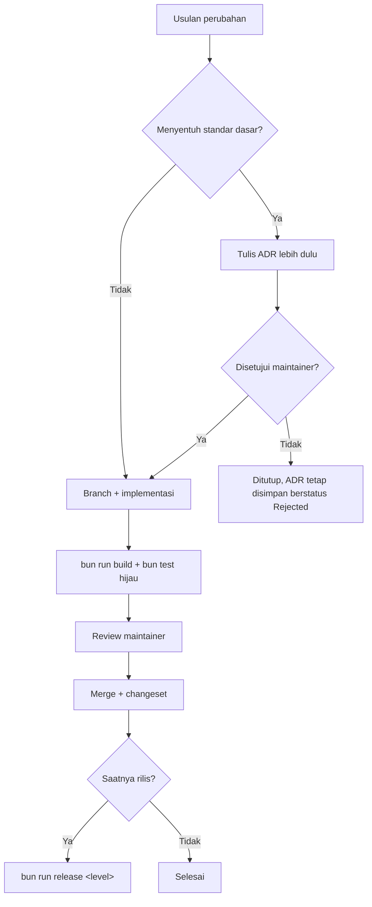

🇮🇩 Bahasa Indonesia · 🇬🇧 [English (source)](GOVERNANCE.md)

<!-- i18n-source-hash: sha256:9835cdd3e32691d376af6355f3aa3fb3886debd17354417963177b3e2f4bb981 -->

# Tata Kelola

## Prinsip yang mengikat semua keputusan

**Cacat di sini tidak muncul sekali.** Repo ini template: setiap keputusannya ikut ke seluruh situs yang lahir darinya. Template ini dibuat untuk situs informasi publik — jenis situs yang isinya bisa berupa tarif resmi, syarat dokumen, atau ancaman sanksi, dan kesalahannya ditanggung pembaca di loket layanan, bukan oleh yang menerbitkannya. Setiap keputusan dinilai dari itu lebih dulu.

Turunannya:

- Aturan baru wajib membawa pemeriksanya. Aturan yang hanya tertulis akan dilanggar, dan yang paling berbahaya adalah aturan yang **tampak** terjaga padahal tidak.
- Nilai bawaan yang khas satu situs lebih buruk daripada nilai kosong.
- Fitur yang mempercantik tetapi mengaburkan sumber informasi ditolak.
- Kecepatan rilis tidak pernah menjadi alasan melewati gerbang.

## Peran

| Peran | Kewenangan |
| --- | --- |
| **Maintainer** | Menyetujui merge, menetapkan ADR, menerbitkan rilis dan tag |
| **Kontributor** | Mengusulkan perubahan template; wajib menyertakan alasan dan pemeriksanya |
| **Penerjemah** | Mengisi dan menyunting katalog locale antarmuka |
| **Agen AI** | Boleh mengerjakan apa pun yang diizinkan `AGENTS.md` |

Sebuah situs yang dibangun dari template ini menetapkan perannya sendiri untuk konten — termasuk siapa yang boleh menyatakan sebuah terjemahan siap tayang. Peran itu milik repo situsnya, bukan repo ini.

## Kapan sebuah perubahan butuh ADR

Wajib ADR bila menyentuh:

- Bentuk URL publik, komposisi tab, atau kontrak `LocalizedArticle` yang dikonsumsi seluruh komponen.
- Cara konten diambil, dipetakan, atau divalidasi — termasuk kontrak dengan `awcms`.
- Stack, runtime, pipeline build, atau **siapa yang menyajikan keluaran build**.
- `output: 'static'` dan setiap rute yang menyatakan `prerender = false`.
- Aturan kepatuhan dan keamanan.
- Positioning repo ini di keluarga AWCMS, dan pembagian peran dengan `awcms`.

Cukup changeset bila: perbaikan bug, perubahan gaya, penambahan komponen yang mengikuti kontrak yang ada, pengisian katalog locale, atau pembaruan dependency rutin.

Format dan daftar ADR: [`docs/adr/README.md`](docs/adr/README.md).

## Alur keputusan

ADR yang ditolak **tetap disimpan** dengan status `Rejected` — kosakata status
ADR repo ini berbahasa Inggris (`Accepted`, `Superseded by`), dan ini ikut ke
sana. Alasan sebuah jalan tidak ditempuh sama berharganya dengan alasan jalan lain ditempuh, dan tanpa catatannya usulan yang sama akan muncul lagi.

## Perubahan yang tidak boleh diambil sendiri

Berikut selalu butuh keputusan maintainer tercatat, tidak peduli sekecil apa pun perubahannya:

- Menambahkan skrip pihak ketiga, analytics, atau form pengumpul data.
- Memakai lambang, logo, atau atribut resmi instansi negara — termasuk sebagai nilai bawaan `SITE_MARK` atau di dalam ilustrasi.
- Membuka jalur HTML mentah dari CMS, dalam bentuk apa pun.
- Menambahkan nilai bawaan yang khas satu situs ke `src/config/site.ts`.
- Melonggarkan sebuah gerbang agar CI hijau. Bila aturannya memang salah, ubah aturannya secara sadar beserta alasannya — jangan tumpulkan pemeriksanya.

## Rilis

Wewenang maintainer, dijalankan `bun run release <level>` (lihat [`scripts/rilis.mjs`](scripts/rilis.mjs)). Arti tiap tingkat versi dan format tag: [`CONTRIBUTING.md`](CONTRIBUTING.md) dan [`docs/awcms-astro/standar-teknis.md`](docs/awcms-astro/standar-teknis.md#versioning).
