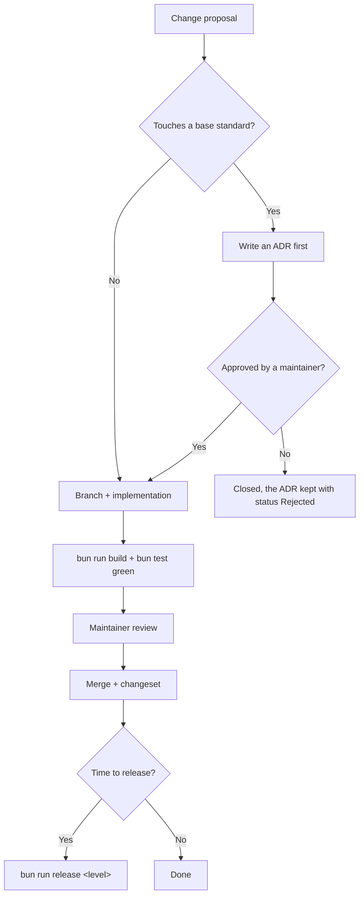

🇬🇧 English (source) · 🇮🇩 [Bahasa Indonesia](GOVERNANCE.id.md)

# Governance

## The principle that binds every decision

**A defect here does not happen once.** This repo is a template: every decision in it travels to every site born from it. This template is built for public information sites — the kind of site whose contents may be official tariffs, document requirements, or a warning of sanctions, and whose mistakes are paid for by a reader at a service counter, not by whoever published them. Every decision is judged against that first.

What follows from it:

- A new rule must bring its own checker. A rule that is merely written will be broken, and the most dangerous kind is a rule that **looks** guarded and is not.
- A default value specific to one site is worse than an empty value.
- A feature that beautifies while obscuring the source of information is refused.
- Release speed is never a reason to skip a gate.

## Roles

| Role | Authority |
| --- | --- |
| **Maintainer** | Approves merges, settles ADRs, publishes releases and tags |
| **Contributor** | Proposes template changes; must include the reasoning and the checker |
| **Translator** | Fills in and edits the interface locale catalogues |
| **AI agent** | May do anything `AGENTS.md` permits |

A site built from this template sets its own roles for content — including who may declare a translation ready to publish. Those roles belong to that site's repo, not to this one.

## When a change needs an ADR

An ADR is required when it touches:

- The shape of a public URL, the composition of tabs, or the `LocalizedArticle` contract every component consumes.
- How content is fetched, mapped, or validated — including the contract with `awcms`.
- The stack, the runtime, the build pipeline, or **who serves the build output**.
- `output: 'static'` and any route declaring `prerender = false`.
- Compliance and security rules.
- This repo's positioning in the AWCMS family, and the division of roles with `awcms`.

A changeset is enough for: a bug fix, a style change, a new component that follows an existing contract, filling in a locale catalogue, or a routine dependency update.

The format and the list of ADRs: [`docs/adr/README.md`](docs/adr/README.md).

## The decision flow

A rejected ADR is **still kept**, with status `Rejected` — the status vocabulary
of this repo's ADRs is English (`Accepted`, `Superseded by`), and this joins it. The reason a road was not taken is worth as much as the reason another was, and without that record the same proposal comes back.

## Changes that may not be made alone

The following always need a recorded maintainer decision, however small the change:

- Adding a third-party script, analytics, or a data-collecting form.
- Using the emblem, logo, or official attributes of a state institution — including as a default value of `SITE_MARK` or inside an illustration.
- Opening a raw HTML path from the CMS, in any form.
- Adding a default value specific to one site to `src/config/site.ts`.
- Loosening a gate to make CI green. If the rule really is wrong, change the rule deliberately and with its reasoning — do not blunt its checker.

## Releases

A maintainer's authority, run through `bun run release <level>` (see [`scripts/rilis.mjs`](scripts/rilis.mjs)). What each version level means and the tag format: [`CONTRIBUTING.md`](CONTRIBUTING.md) and [`docs/awcms-astro/standar-teknis.md`](docs/awcms-astro/standar-teknis.md#versioning).
