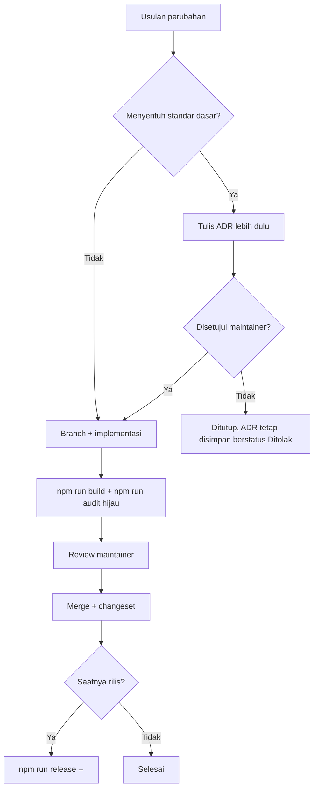

# Tata Kelola

## Prinsip yang mengikat semua keputusan

**Akurasi di atas kelengkapan.** Situs ini memuat tarif resmi, syarat dokumen, dan ancaman denda. Kesalahan isinya ditanggung pembaca langsung di loket layanan atau di jalan. Setiap keputusan — teknis maupun editorial — dinilai dari itu lebih dulu.

Turunannya:

- Informasi yang belum terverifikasi ditulis `TBD` beserta sumber yang harus dicek, tidak ditebak.
- Fitur yang mempercantik tetapi mengaburkan sumber informasi ditolak.
- Kecepatan rilis tidak pernah menjadi alasan melewati verifikasi.

## Peran

| Peran | Kewenangan |
| --- | --- |
| **Maintainer** | Menyetujui merge, menetapkan ADR, menerbitkan rilis dan tag |
| **Kontributor konten** | Mengusulkan artikel dan koreksi; wajib menyertakan sumber resmi |
| **Penutur asli** | Satu-satunya yang boleh menyatakan terjemahan bahasa daerah siap tayang ([ADR-0004](docs/adr/0004-terjemahan-bahasa-daerah-penutur-asli.md)) |
| **Agen AI** | Boleh mengerjakan apa pun yang diizinkan `AGENTS.md`, **kecuali** menyatakan terjemahan bahasa daerah final |

## Kapan sebuah perubahan butuh ADR

Wajib ADR bila menyentuh:

- Bentuk URL publik, urutan atau komposisi tab, kontrak frontmatter `artikelSchema`.
- Cara konten disimpan, diterjemahkan, atau divalidasi.
- Stack, runtime, atau pipeline build.
- Aturan kepatuhan dan keamanan.
- Positioning repo ini di keluarga AWCMS.

Cukup changeset bila: artikel baru, koreksi konten, perbaikan bug, perubahan gaya, atau pembaruan dependency rutin.

Format dan daftar ADR: [`docs/adr/README.md`](docs/adr/README.md).

## Alur keputusan

ADR yang ditolak **tetap disimpan** dengan status `Ditolak`. Alasan sebuah jalan tidak ditempuh sama berharganya dengan alasan jalan lain ditempuh, dan tanpa catatannya usulan yang sama akan muncul lagi.

## Perubahan yang tidak boleh diambil sendiri

Berikut selalu butuh keputusan maintainer tercatat, tidak peduli sekecil apa pun perubahannya:

- Mengubah nominal biaya, denda, atau dasar hukum tanpa sumber resmi yang dilampirkan.
- Menerbitkan terjemahan bahasa daerah tanpa penutur asli.
- Menambahkan skrip pihak ketiga, analytics, atau form pengumpul data.
- Memakai lambang, logo, atau atribut resmi instansi negara.
- Melonggarkan aturan di `scripts/audit-konten.mjs` agar audit hijau.

## Rilis

Wewenang maintainer. Prosedur, arti tingkat versi, dan format tag: [ADR-0009](docs/adr/0009-versioning-semver-dan-changeset.md) dan [`CONTRIBUTING.md`](CONTRIBUTING.md).
