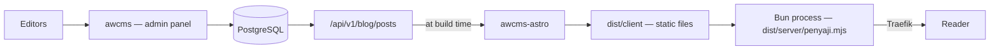

🇬🇧 English (source) · 🇮🇩 [Bahasa Indonesia](README.id.md)

# awcms-astro

The AWCMS family template for **static public sites on Astro**, with
[`ahliweb/awcms`](https://github.com/ahliweb/awcms) as its content backend.

Readers get static files; editors get an admin panel. Nothing waits on a
database, and **this site does not call awcms when a reader asks for a page** —
that is the claim, not that the CMS is hidden. awcms does face the internet:
`/blog/{tenantCode}/**` is its permanent URL vocabulary.

**Public pages are its primary function, and that is the default.** A site may
declare that it also carries an admin surface for **users** — authors,
reviewers, contributors — beside its public pages, through `permukaanAdmin` in
[`src/config/site.ts`](src/config/site.ts). What never lives here is the **main
admin**: `owner` and every screen that manages the system stay in `awcms`'s own
`/admin/*`. The rule, and its gate, are in
[ADR-0034](docs/adr/0034-publik-secara-bawaan-admin-hanya-bila-dinyatakan.md).

## Position in the AWCMS family

| Template          | Mode                    | Database   | Used for                                                                          | Status          |
| ----------------- | ----------------------- | ---------- | --------------------------------------------------------------------------------- | --------------- |
| **`awcms-astro`** | Static (SSG)            | None       | **Public pages** (primary function) + a **USER admin surface** when declared       | **Developed**   |
| `awcms`           | Online-first, superset  | PostgreSQL | Back-office, ERP, multi-tenant, every SYSTEM admin screen — **this repo's backend** | **Developed**   |
| `awcms-micro`     | Fully online, lean      | PostgreSQL | —                                                                                  | **Archive**     |
| `awcms-mini`      | Offline-first hybrid    | PostgreSQL | —                                                                                  | **Archive**     |

The first two rows are the whole developed family, and **the pair of them** is
the general-purpose replacement for all three of the old templates — not either
one alone. The split of screens is not by audience but by **what is managed**:
SYSTEM admin (modules, roles, tenants, audit trail) in `awcms`; a USER admin
surface (writing an article, submitting it for review, one's own profile) may
live here when the site declares it through `permukaanAdmin`
([ADR-0034](docs/adr/0034-publik-secara-bawaan-admin-hanya-bila-dinyatakan.md),
`awcms` ADR-0070). The `owner` role is refused by a gate here.

And that split has a counterpart which decides things **before** any screen is
drawn: **a backend need becomes a MODULE in `awcms`**, never a folder here
([ADR-0038](docs/adr/0038-kebutuhan-backend-menjadi-modul-di-awcms.md)). A
stored contact form, a newsletter subscription, a member directory — all of them
land there, through module admission, with their RLS, permission catalogue,
audit trail, retention descriptor, and data-subject descriptor. This repo
**reads** `awcms` and does not write; all four of its limits are gated by
[`tests/tanpa-backend.test.mjs`](tests/tanpa-backend.test.mjs), including a
dependency that would bring backend capability in through a single `bun add`.

This repo was **held** from 2 to 4 August 2026 until the `awcms` foundation was
finished (ADR-0021). That hold ended because both indicators it set for itself
were met — every `awcms` module has a screen, and §4 of its `PROJECT_STATE` was
exhausted ([ADR-0027](docs/adr/0027-penahanan-adr-0021-selesai.md)). What
replaced it is one question that will not expire: **will this change be
rewritten if `awcms` changes?** If so, it needs an `awcms` instance to be proven
before it lands — and "the endpoint already exists" is not an answer of "no"
([ADR-0023](docs/adr/0023-penahanan-dipersempit-pekerjaan-tanpa-awcms.md)).

Since **2 August 2026** (`awcms` ADR-0055) only two repos are developed: this
one and `awcms`. `awcms-micro` and `awcms-mini` are **archives** — they may be
read as historical reference, but no work is scheduled to be ported from them or
out to them, and the "foundation features are tested in `awcms-mini` first" path
is **withdrawn**, not suspended. The consequences for the workflow are in
[`AGENTS.md`](AGENTS.md#where-work-may-land-in-force-2-august-2026).

This repo is the **reference implementation** of the `awcms-astro` standard. The
standard itself came out of `web-lalulintasmelayani.com`, a six-language site
already running in production; its standard documents came along to
[`docs/awcms-astro/`](docs/awcms-astro/README.md).

## How it works



Content is pulled **at build time**, not at request time. The consequences are
plain and deliberate: the site stays up while awcms is down, there is no
database and no call to awcms at request time, and new content appears after the
next build — not instantly. If instant is what you need, the thing that answers
it is **awcms's own** public surface (`/blog/{tenantCode}/**`), where publishing
goes live without a rebuild. Not `awcms-micro`: that repo has been an **archive**
since 2 August 2026 and must not be recommended to anyone.

What serves those files is a **Bun process**, not nginx (ADR-0016) — so "no
runtime" is not this repo's claim; the claim is no database and no call to the
CMS when a reader asks for a page. Cache rules, five security headers —
including a strict `Content-Security-Policy` and `Permissions-Policy` since
ADR-0019 — and compression live in [`server/penyaji.mjs`](server/penyaji.mjs)
and are guarded by [`tests/penyaji.test.mjs`](tests/penyaji.test.mjs). The
sixth, `Strict-Transport-Security`, is sent **only in production**
([ADR-0029](docs/adr/0029-hsts-digerbangi-produksi-tanpa-includesubdomains.md)) —
because HSTS applies to a HOST and cannot be revoked from the site's side, so a
single local preview that sent it would lock every other project on `localhost`
for a year. The full posture — ten numbered gaps, now all closed, their rows
kept in the table — is in
[`docs/awcms-astro/standar-performa-dan-keamanan.md`](docs/awcms-astro/standar-performa-dan-keamanan.md).

"The next build" does not mean waiting for someone to press a button: awcms
triggers a rebuild by webhook the moment a post is published, so the delay
between an editor pressing *publish* and a reader seeing it is the length of a
build, not the length of someone remembering. The chain is in
[`docs/deploy-coolify.md`](docs/deploy-coolify.md).

## Starting a new site

This repo is a GitHub **template repository**. The **"Use this template"** button
creates a new repo with the whole skeleton and a clean commit history — not a
fork, so your site does not inherit 4 years of template commits.

What comes along and must be emptied first — `.changesets/`, `CHANGELOG.md`,
`docs/adr/`, the identity in `package.json` — along with the order of the steps
that follow, is in
[`checklist-repo-baru.md`](docs/awcms-astro/checklist-repo-baru.md). That order
is deliberate: contract first, content next, appearance last.

## Running it

```bash
cp .env.example .env     # fill in AWCMS_API_URL, the token, and the tenant
bun install
bun run dev              # http://localhost:4321
```

This repo is **Bun-only** (ADR-0015): Bun is both the runtime and the package
manager, its version is pinned in `packageManager`/`engines.bun`, and `bun.lock`
is the only lockfile.

| Command                     | Purpose                                                          |
| --------------------------- | ---------------------------------------------------------------- |
| `bun run dev`               | Astro development server (HMR), `http://localhost:4321`          |
| `bun run check`             | Lockfile gate, then `astro check`                                |
| `bun run check:lockfile`    | The lockfile gate alone — pure file reading                      |
| `bun test`                  | 21 gate files: the `awcms` contract, site roles, no-backend, the `news` vocabulary, feeds, the server, output CSP, translation mirrors |
| `bun run audit:konten`      | Audit gate: image sources, and the build output when it exists   |
| `bun run audit:dokumen`     | Document gate: dead markdown links, the ADR index, the shine-surface list |
| `bun run audit:graf`        | Graph gate: the tracked `graphify-out/` artefacts, and their community names |
| `bun run audit:translation` | Translation gate: stale Indonesian mirrors, and documents with no mirror ([ADR-0039](docs/adr/0039-english-is-the-source-language.md)) |
| `bun run docs:i18n:stamp`   | Writes the language banners and the source-hash markers          |
| `bun run build`             | `check` → `astro build` → bundle the server                      |
| `bun run build:penyaji`     | Bundle the server alone into `dist/server/penyaji.mjs`           |
| `bun run serve`             | Run the production server over the build output (port 8080)      |
| `bun run preview`           | Alias for `serve` — preview uses the same server as production   |
| `bun run start`             | Alias for `serve` — the command the image runs                   |

`bun run dev` runs the Astro development server, and that server is **not** the
production one: it sends neither the five security headers nor the cache rules
in [`server/penyaji.mjs`](server/penyaji.mjs). To see exactly what a reader sees
— headers, cache, compression — run `bun run build && bun run serve`. `preview`
is deliberately mapped to the same server so that "I checked it in preview"
means something.

After changing a dependency, regenerate the lockfile in full:

```bash
rm -rf node_modules bun.lock && bun install
```

In CI and inside the image, installation is always `bun install
--frozen-lockfile` — without it, an install may quietly UPDATE `bun.lock`, and
what gets built stops being what was reviewed.

## Tenant: one variable, and one verified assertion

One awcms instance serves many tenants; one `awcms-astro` site is one tenant.
Since awcms ADR-0049, **the tenant comes from the token**: the build credential
is a machine credential shaped `awcmsm_<32 hex tenant>_<secret>`, and awcms
derives the tenant from it before looking at any header.

So the configuration is one variable:

| Variable | Role |
| --- | --- |
| `AWCMS_API_TOKEN` | The credential **and** the tenant. Must be a machine credential scoped to **two keys**: `blog_content.posts.read` and `media_library.media.read` |
| `AWCMS_TENANT_ID` | **Optional, recommended.** Not a selector — a verified assertion. The build fails if it differs from the token's tenant |

`AWCMS_TENANT_CODE` and `AWCMS_DEFAULT_TENANT_CODE` are gone, and are
**refused** rather than ignored.

**The second key is not optional, and it is not just for images.** `bun run
build` ends in [`scripts/asal-media.mjs`](scripts/asal-media.mjs), which asks
awcms for the origin of public media so the server can send an `img-src` that
allows it. Without `media_library.media.read` that call is answered 403 and the
**build FAILS** — after every page has finished rendering, so it reads like a
broken deployment rather than a missing permission. Even a deployment with no
public media needs it; the answer is then recorded as `configured: false`.

**And one old premise stopped holding on 13 August 2026.** Until that day,
"machine credentials cannot write" was a property of the CLASS. Since awcms
ADR-0092 it is not: a write class exists, with a `create`/`update` action
ceiling in code, mandatory CIDR binding, refusal when the caller's address is
unknown, and a maximum life of 30 days instead of a year. This repo's build
token is **still read-only** — but because it is issued without a single write
action, that is a property of the ROW, not of the class. Keeping it that way is
now an issuing decision that must be maintained, not an inherited guarantee.

**Issuing and revoking one is now a screen**, `/admin/machine-credentials` in
awcms — built the same day, for a plain reason: revoking a leaked token is
something people reach for under pressure, and until that screen existed it was
a `POST` nobody remembered. The plaintext token appears **once**, in the issuing
response; reloading the page burns the credential. Two things must be chosen
correctly there: the **read** class (the form can now mint a write class too),
and a service account belonging to **this site's** tenant — not a partner's
delegated actor, which stops building the day their partnership is suspended
(awcms ADR-0093).

Why the guard moved rather than disappeared: the old chain guarded against "the
build guesses the tenant", a state that is now impossible. What is possible, and
was invisible to everything before, is **another tenant's token installed on
this site** — a green build, a full site, someone else's content. A chain cannot
see that; a verified assertion can. The details are in
[`src/lib/awcms/tenant.ts`](src/lib/awcms/tenant.ts) and
[ADR-0018](docs/adr/0018-kontrak-build-token-mesin-dan-traversal-konten.md).

## What makes this template different

**Readable without JavaScript.** Navigation, the language switcher, the FAQ
accordion, and the whole body of every page work fully without JS. The only
thing that needs JS is the copy-link button — and that button is **hidden** when
JS is off, because a button that does nothing when clicked is worse than a
button that is not there.

**Multi-locale with no lame pages.** The set of slugs is decided by one source
locale, and other locales are paired to it through `translationGroupId`. Every
language always has the same number of pages, there is never a 404 between
languages, and an untranslated article appears in the source language **with a
marker** — not a blank page, and not a raw key name.

**No third-party scripts.** No SDKs, widgets, pixels, or share buttons belonging
to a social provider. Sharing uses ordinary links, so no reader data is sent
before the reader clicks.

**No raw HTML from the CMS.** Content blocks are rendered from structure, not
from an HTML field — [`src/lib/content-blocks.ts`](src/lib/content-blocks.ts)
assembles every element from already-escaped text and fixed tags. An editor
cannot inject markup through any path, whatever they type.

**A strict CSP that is actually sent, not merely "CSP-ready".** The server sets
`default-src 'self'` with `script-src 'self'` and `style-src 'self'` and no
`'unsafe-inline'` (ADR-0019). What makes that possible: there is not one style
or script inside the output HTML — the theme switcher lives in
[`public/tema.js`](public/tema.js), and Astro is forbidden from inlining small
bundles into pages by `vite.build.assetsInlineLimit: 0`. Both are guarded by
[`tests/keluaran-csp.test.mjs`](tests/keluaran-csp.test.mjs), which also proves
the JS did not vanish with them; the policy itself is guarded by
[`tests/penyaji.test.mjs`](tests/penyaji.test.mjs). JSON-LD stays inline and
that is not a loosening: a data block with a non-JavaScript type is never
executed, so `script-src` does not apply to it.

**Gates over what is PUBLISHED, not over what is written.**
[`scripts/audit-konten.mjs`](scripts/audit-konten.mjs) reads `dist/client/` and
refuses six classes of defect that all survive a green build: a page with no
title or description, a lame hreflang group, an `og:image` pointing at a file
this build never published, a dead internal link, a sitemap listing a page that
was not built, and a raw key name shown to a reader as text. That last one is
not hypothetical — this template once published `translation.notice.label` in
both languages, with `astro check` clean. The same script checks image sources:
ratio against `--ratio-visual`, format read from file contents rather than the
extension, SVG XML, and the smallest text size inside them.

## Structure

```
src/
├── components/           # render components + views/ (page bodies across locales)
├── config/site.ts        # locales, tabs, site identity — the only configuration file
├── layouts/              # BaseLayout (SEO, hreflang, share), ArtikelLayout
├── lib/
│   ├── awcms/client.ts   # the ONLY file that talks to awcms
│   ├── awcms/tenant.ts   # tenant from the token + cross assertion
│   ├── content.ts        # adapter: API → LocalizedArticle (the component contract)
│   ├── content-blocks.ts # structured blocks → HTML, with no raw-HTML path
│   ├── po.ts             # the interface string catalogue
│   ├── po-parse.ts       # PO parser, split out so it can be tested without Vite
│   └── schema.ts         # JSON-LD
├── locales/<locale>/messages.po
├── pages/                # default locale at the root, other locales through [lang]/
└── styles/global.css     # design tokens + interaction standards
public/tema.js            # the ONLY JS that must run before paint (ADR-0019)
server/penyaji.mjs        # production server: headers, CSP, cache, compression (ADR-0016/0019)
tests/penyaji.test.mjs    # the serving gate — the rules above are proven, not claimed
tests/keluaran-csp.test.mjs # output gate: zero inline styles and scripts in the HTML
Dockerfile                # build → non-root Bun image, port 8080
```

A build has two parts: `dist/client/` is the site, `dist/server/` is the
adapter entrypoint together with the bundled server. The production image
carries only `dist/client/` and `dist/server/penyaji.mjs` — that bundle is what
lets it need no `node_modules` at all.

## What does not exist yet (an explicit backlog, not an oversight)

- **Pagination for news sections.** The news section itself has existed since
  [ADR-0033](docs/adr/0033-seksi-berita-urutan-dari-tanggal-dan-dua-tanggal-yang-terpisah.md):
  a tab declares `urutanSeksi: "terbaru"`, and its section is ordered by
  `publishedAt` descending, its cards carry dates, its articles are
  `NewsArticle`. **Its feed has landed too**, since
  [ADR-0035](docs/adr/0035-feed-atom-per-seksi-berita-dan-gerbang-atas-xml.md) —
  Atom 1.0 at `/{tab}/feed.xml`, together with the family of gates that reads
  every `.xml` in the output, which is precisely why the feed was deferred for a
  while. And since
  [ADR-0036](docs/adr/0036-news-adalah-kosakata-repo-ini-dan-sebuah-tab-yang-memikulnya.md)
  the **`/news/` prefix is this repo's vocabulary** — a news site names its tab
  `news`, and `/blog/` stays `awcms`'s. Two things remain, and both are deferred
  for reasons checked against the code:

  **Category/tag archives under `/news/`** — this repo has no taxonomy at all:
  there is no category or tag model in
  [`src/lib/content.ts`](src/lib/content.ts), and a section is decided by its
  tab, not by a term. ADR-0036 §5 declares this open rather than promising
  parity with four `awcms` routes that have since **been removed** there — since
  8 August 2026 `/news/**` in `awcms` answers 301 to `/blog/{tenantCode}/**`
  (**except** for a tenant with `legacyTenantRouteEnabled: false`, which has
  already switched off its whole public content surface and is therefore still
  answered 404 rather than given a 301 towards a certain 404 (`awcms` ADR-0071
  §4 item 3)), so there is no parity left to chase. A site that genuinely needs
  category/tag archives brings them through its own ADR here.

  **Pagination** — it changes the shape of routes, which by the criteria in
  [`docs/adr/README.md`](docs/adr/README.md) itself is the class of decision
  that needs an ADR. It also demands a different title per page (the duplicate-
  title gate reddens the same thing, and its usual escape — `noindex` + a
  canonical to page one — is absolutely forbidden by the "two colliding signals"
  gate), an identical page count in every locale so hreflang stays reciprocal,
  and a Lighthouse sample that shifts with it. **Until that lands, a news
  section index renders all of its articles on one page** — weigh that before
  switching on `"terbaru"` for a high-volume site.

- **Share cards GENERATED per page.** Cards that are *uploaded* already work: an
  article uses `seoImageMediaId` (or `featuredMediaId`) from `awcms`, complete
  with its own MIME type and dimensions
  ([ADR-0026](docs/adr/0026-kartu-share-per-artikel-dari-media-awcms.md)). What
  does not exist is a generator that normalises a card to 1200×630 from the
  article's title and artwork — it would add an image encoder as a build
  dependency, so it deserves an ADR of its own. `SITE_SOCIAL_IMAGE` (one
  optional site-wide card) remains a supported state, and a page with no card at
  all sets no image tag whatsoever — the preview degrades to a tidy text card.
- **The Jualanku portal BFF (ADR-0014).** `/internal/login`, a server-side BFF
  session, portal cookies, CSRF. Its `awcms` foundation has been **complete since
  4 August 2026**: the session contract (ADR-0049/0050) and a business-scope
  resolver that now has a provider (`awcms` ADR-0060 — previously a fail-closed
  NO-OP). That date is worth naming, because the contract **grew again** on 12
  August 2026 and the additions touch precisely the mechanism planned here: a
  login with no tenant selected is now answered `409` together with a
  short-lived selection token, tenant selection and switching have two endpoints
  of their own which are **outside** the frozen consumer contract (`awcms`
  ADR-0065), and a handed-over (`handoff`) session — the session shape ADR-0050
  created for this very BFF — is **forbidden** to switch tenants (`awcms`
  ADR-0088). What holds it back is no longer a missing contract but the test in
  [ADR-0023](docs/adr/0023-penahanan-dipersempit-pekerjaan-tanpa-awcms.md): it
  calls `awcms` **on every runtime request**, not once per build, so its shape
  is decided by `awcms`'s response on each request — and this template repo has
  no instance to prove it against. One prerequisite remains on that side too:
  the shape of Jualanku's merchant scope still needs its own admission ADR. The
  prerequisites in this repo are in
  [`04-kesiapan.md`](docs/awcms-astro/jualanku/04-kesiapan.md).
- **A locale filter on the awcms feed — it already EXISTS in awcms, and is
  precisely what this template must NOT use.** The content traversal itself is
  finished: one `GET /api/v1/blog/posts?view=full&order=created_at`, walked
  through `nextCursor`, with no `?locale=` — so the build pulls EVERY locale and
  pairs them up here. awcms closed its side on 2 August 2026
  ([#346](https://github.com/ahliweb/awcms/pull/346)): `?locale=` matches
  exactly (`en` does not sweep up `en-GB`), absence means every locale, and an
  empty value is answered 400.

  What that changes is not "just wire it up" but **the direction of this item**.
  This template serves two locales (`id` + `en`) and pairs them through
  `translationGroupId`; `?locale=id` would discard every `en` row, and
  `assertTranslationsArePairable` **would not go red** — what goes missing is
  not a translation without a partner, but a translation that was never carried
  in at all. The site still builds green, every `/en/**` page falls back to
  Indonesian with a "not yet translated" marker, and that is exactly the silent
  content truncation [`content.ts`](src/lib/content.ts) declares a failure
  rather than a degradation. The filter is worth something only for a deployment
  that genuinely is single-locale — and since it takes one value, two locales
  mean two traversals, not one leaner one.

## Documentation

| Document                                                                              | Contents                                |
| ------------------------------------------------------------------------------------ | --------------------------------------- |
| [`AGENTS.md`](AGENTS.md)                                                              | The repo's working contract             |
| [`CHANGELOG.md`](CHANGELOG.md)                                                        | Release history, folded from changesets |
| [`.changesets/README.md`](.changesets/README.md)                                      | How to write a change note              |
| [`docs/awcms-astro/README.md`](docs/awcms-astro/README.md)                            | The standard's position in the AWCMS family |
| [`docs/awcms-astro/standar-teknis.md`](docs/awcms-astro/standar-teknis.md)            | The binding technical rules             |
| [`docs/awcms-astro/standar-performa-dan-keamanan.md`](docs/awcms-astro/standar-performa-dan-keamanan.md) | The map to OWASP/ASVS/ISO 27001/SSDF + Core Web Vitals, and ten numbered gaps — all closed, their rows kept in the table |
| [`docs/awcms-astro/ui-ux-design-system.md`](docs/awcms-astro/ui-ux-design-system.md)  | Design tokens, components, accessibility |
| [`docs/awcms-astro/integrasi-awcms.md`](docs/awcms-astro/integrasi-awcms.md)          | The integration contract with awcms     |
| [`docs/deploy-coolify.md`](docs/deploy-coolify.md)                                    | Deploying and rebuilding by webhook     |
| [`.claude/skills/`](.claude/skills/README.md)                                         | Project skills: integration, gates, new site, performance-security |

## Language

English at the bare path is the authoritative source; Indonesian at
`<name>.id.md` is the mirror, and it records the hash of the English it was
translated from ([ADR-0039](docs/adr/0039-english-is-the-source-language.md)).
`bun run audit:translation` fails when a mirror goes stale, and counts the
documents still awaiting one. This document's mirror is
[`README.id.md`](README.id.md).

## Licence

[MIT](LICENSE).
