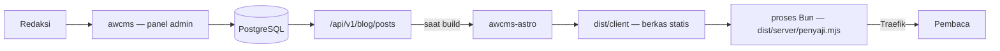

# awcms-astro

Template keluarga AWCMS untuk **situs publik statis di atas Astro**, dengan
[`ahliweb/awcms`](https://github.com/ahliweb/awcms) sebagai backend kontennya.

Pembaca mendapat berkas statis; redaksi mendapat panel admin. Tidak ada yang
menunggu basis data, dan CMS tidak pernah menghadap internet publik.

## Posisi di keluarga AWCMS

| Template          | Mode                   | Basis data | Dipakai untuk                                            | Status                |
| ----------------- | ---------------------- | ---------- | -------------------------------------------------------- | --------------------- |
| **`awcms-astro`** | Statis (SSG)           | Tidak ada  | Situs informasi publik, profil, dokumentasi, portal       | **Dikembangkan**      |
| `awcms`           | Online-first, superset | PostgreSQL | Back-office, ERP, multi-tenant — **backend repo ini**     | **Dikembangkan**      |
| `awcms-micro`     | Online penuh, ramping  | PostgreSQL | Website/e-commerce yang dinamis sejak awal                | Referensi (dibekukan) |
| `awcms-mini`      | Hybrid offline-first   | PostgreSQL | Operasional lapangan dengan koneksi tak dapat diandalkan  | Referensi (dibekukan) |

Sejak **31 Juli 2026** hanya dua repo yang dikembangkan: repo ini dan `awcms`.
`awcms-micro` dan `awcms-mini` dibekukan sebagai referensi — boleh dibaca dan
di-port keluar, tidak menerima perubahan. Konsekuensinya bagi alur kerja ada di
[`AGENTS.md`](AGENTS.md#di-mana-pekerjaan-boleh-mendarat-berlaku-31-juli-2026);
yang terpenting, jalur "fitur fondasi diuji di `awcms-mini` dulu" tidak bisa
ditempuh selama pembekuan berlaku.

Repo ini adalah **implementasi rujukan** standar `awcms-astro`. Standarnya
sendiri lahir dari `web-lalulintasmelayani.com`, situs enam bahasa yang sudah
berjalan di produksi; dokumen standarnya ikut dibawa ke sini di
[`docs/awcms-astro/`](docs/awcms-astro/README.md).

## Cara kerjanya



Konten ditarik **saat build**, bukan saat request. Konsekuensinya lugas dan
memang disengaja: situs tetap tayang saat awcms mati, tidak ada basis data dan
tidak ada panggilan ke awcms saat request, dan konten baru tayang setelah build
berikutnya — bukan seketika. Kalau butuh seketika, `awcms-micro` template yang
tepat, bukan ini.

Yang menyajikan berkas itu adalah **proses Bun**, bukan nginx (ADR-0016) — jadi
"tanpa runtime" bukan klaim repo ini; klaimnya adalah tanpa basis data dan tanpa
panggilan ke CMS saat pembaca meminta halaman. Aturan cache, tiga header
keamanan, dan kompresi tinggal di
[`server/penyaji.mjs`](server/penyaji.mjs) dan dijaga
[`tests/penyaji.test.mjs`](tests/penyaji.test.mjs).

"Build berikutnya" tidak berarti menunggu seseorang menekan tombol: awcms
memicu rebuild lewat webhook begitu sebuah post terbit, jadi jeda antara redaksi
menekan *publish* dan pembaca melihatnya adalah lama build, bukan lama seseorang
teringat. Rantainya di [`docs/deploy-coolify.md`](docs/deploy-coolify.md).

## Menjalankan

```bash
cp .env.example .env     # isi AWCMS_API_URL, token, dan tenant
bun install
bun run dev              # http://localhost:4321
```

Repo ini **Bun-only** (ADR-0015): Bun adalah runtime sekaligus package manager,
versinya dipin di `packageManager`/`engines.bun`, dan `bun.lock` adalah
satu-satunya lockfile.

| Perintah                 | Kegunaan                                                        |
| ------------------------ | --------------------------------------------------------------- |
| `bun run dev`            | Server pengembangan Astro (HMR), `http://localhost:4321`        |
| `bun run check`          | Gerbang lockfile lalu `astro check`                             |
| `bun run check:lockfile` | Hanya gerbang lockfile — murni baca berkas                      |
| `bun test`               | Renderer blok, gerbang katalog PO, dan gerbang penyajian        |
| `bun run build`          | `check` → `astro build` → bundel penyaji                        |
| `bun run build:penyaji`  | Hanya membundel penyaji ke `dist/server/penyaji.mjs`            |
| `bun run serve`          | Menjalankan penyaji produksi atas hasil build (port 8080)       |
| `bun run preview`        | Alias `serve` — pratinjau memakai penyaji yang sama dengan prod |
| `bun run start`          | Alias `serve` — perintah yang dijalankan image                  |

`bun run dev` menjalankan server pengembangan Astro, dan server itu **bukan**
penyaji produksi: ia tidak mengirim tiga header keamanan maupun aturan cache di
[`server/penyaji.mjs`](server/penyaji.mjs). Untuk melihat persis yang dilihat
pembaca — header, cache, kompresi — jalankan `bun run build && bun run serve`.
`preview` sengaja dipetakan ke penyaji yang sama supaya "sudah saya cek di
preview" berarti sesuatu.

Setelah mengubah dependency, regenerasi lockfile penuh:

```bash
rm -rf node_modules bun.lock && bun install
```

Di CI dan di dalam image, install selalu `bun install --frozen-lockfile` —
tanpanya install boleh MEMPERBARUI `bun.lock` diam-diam, dan yang dibangun
berhenti sama dengan yang di-review.

## Tenant: satu variabel, dan satu pernyataan yang diverifikasi

Satu instans awcms melayani banyak tenant; satu situs `awcms-astro` adalah satu
tenant. Sejak awcms ADR-0049, **tenant datang dari tokennya**: kredensial build
adalah kredensial mesin berbentuk `awcmsm_<32 hex tenant>_<rahasia>`, dan awcms
menurunkan tenant dari sana sebelum melihat header apa pun.

Jadi konfigurasinya satu variabel:

| Variabel | Peran |
| --- | --- |
| `AWCMS_API_TOKEN` | Kredensial **dan** tenant. Wajib kredensial mesin ber-scope `blog_content.posts.read` |
| `AWCMS_TENANT_ID` | **Opsional, dianjurkan.** Bukan pemilih — pernyataan yang diverifikasi. Build gagal bila berbeda dari tenant token |

`AWCMS_TENANT_CODE` dan `AWCMS_DEFAULT_TENANT_CODE` sudah tidak ada, dan
**ditolak** alih-alih diabaikan.

Kenapa penjagaannya berpindah, bukan hilang: rantai lama menjaga "build menebak
tenant", keadaan yang kini tidak mungkin. Yang mungkin, dan tak terlihat oleh
apa pun sebelumnya, adalah **token tenant lain terpasang di situs ini** — build
hijau, situs penuh, isinya milik orang lain. Rantai tidak bisa melihat itu;
pernyataan yang diverifikasi bisa. Rinciannya di
[`src/lib/awcms/tenant.ts`](src/lib/awcms/tenant.ts) dan
[ADR-0018](docs/adr/0018-kontrak-build-token-mesin-dan-traversal-konten.md).

## Yang membuat template ini berbeda

**Terbaca tanpa JavaScript.** Navigasi, pengalih bahasa, accordion FAQ, dan
seluruh isi halaman bekerja penuh tanpa JS. Satu-satunya yang butuh JS adalah
tombol salin tautan — dan tombol itu **disembunyikan** saat JS mati, karena
tombol yang diam saat diklik lebih buruk daripada tombol yang tidak ada.

**Multi-locale tanpa halaman pincang.** Kumpulan slug ditentukan satu locale
sumber, dan locale lain dipasangkan lewat `translationGroupId`. Setiap bahasa
selalu punya jumlah halaman yang sama, tidak pernah ada 404 antar bahasa, dan
artikel yang belum diterjemahkan tampil dalam bahasa sumber **disertai
penanda** — bukan halaman kosong dan bukan nama key mentah.

**Tanpa skrip pihak ketiga.** Tidak ada SDK, widget, piksel, atau tombol
berbagi milik penyedia sosial. Berbagi memakai tautan biasa, jadi tidak ada
data pembaca yang terkirim sebelum ia sendiri mengeklik.

**Tanpa HTML mentah dari CMS.** Blok konten dirender dari struktur, bukan dari
field HTML — [`src/lib/content-blocks.ts`](src/lib/content-blocks.ts) menyusun
setiap elemen dari teks yang sudah di-escape dan tag tetap. Editor tidak bisa
menyuntikkan markup lewat jalur mana pun, apa pun yang ia ketik.

## Struktur

```
src/
├── components/           # komponen render + views/ (badan halaman lintas locale)
├── config/site.ts        # locale, tab, identitas situs — satu-satunya berkas konfigurasi
├── layouts/              # BaseLayout (SEO, hreflang, share), ArtikelLayout
├── lib/
│   ├── awcms/client.ts   # SATU-SATUNYA berkas yang bicara ke awcms
│   ├── awcms/tenant.ts   # tenant dari token + assertion silang
│   ├── content.ts        # adapter: API → LocalizedArticle (kontrak komponen)
│   ├── content-blocks.ts # blok terstruktur → HTML, tanpa jalur HTML mentah
│   ├── po.ts             # katalog string antarmuka
│   ├── po-parse.ts       # parser PO, dipisah agar bisa diuji tanpa Vite
│   └── schema.ts         # JSON-LD
├── locales/<locale>/messages.po
├── pages/                # locale default di root, locale lain lewat [lang]/
└── styles/global.css     # design token + standar interaksi
server/penyaji.mjs        # penyaji produksi: header, cache, kompresi (ADR-0016)
tests/penyaji.test.mjs    # gerbang penyajian — aturan di atas dibuktikan, bukan diklaim
Dockerfile                # build → image Bun non-root, port 8080
```

Hasil build punya dua bagian: `dist/client/` adalah situsnya, `dist/server/`
adalah entrypoint adapter beserta penyaji yang sudah dibundel. Image produksi
hanya membawa `dist/client/` dan `dist/server/penyaji.mjs` — bundel itu yang
membuatnya tidak perlu `node_modules` sama sekali.

## Yang belum ada (backlog eksplisit, bukan kelalaian)

- **Gerbang audit konten.** Repo rujukan memilikinya dan itulah yang membuat
  standar ini punya gigi. Aturannya di sana khas domain, dan versi generiknya
  belum lengkap di sini. Satu bagiannya sudah ada:
  [`tests/katalog-po.test.mjs`](tests/katalog-po.test.mjs) menjaga paritas
  katalog dan menolak key yang dipakai kode tetapi tidak pernah ditulis — kelas
  cacat yang menerbitkan nama key mentah ke layar pembaca. Metadata SEO dan
  tautan mati di `dist/` masih menunggu.
- **Kartu share per halaman.** Generatornya di repo rujukan terikat pada seni
  dan data domainnya. Yang ada di sini hanya SATU kartu opsional lewat
  `SITE_SOCIAL_IMAGE`; tanpa itu halaman tidak memasang tag gambar sama sekali
  dan pratinjau sosial jatuh ke kartu teks. Itu keadaan yang **didukung** —
  jangan menunjuk `SITE_SOCIAL_IMAGE` ke berkas yang belum ada, karena
  pratinjau yang rusak tidak gagal di build mana pun.
- **Gambar artikel.** [`src/lib/article-images.ts`](src/lib/article-images.ts)
  mengembalikan `src: undefined` dan setiap pemanggil merender blok bertoken.
  Butuh endpoint resolusi media di sisi awcms, atau seni lokal di `src/assets/`.
  Rasionya sudah ditetapkan: seluruh bingkai memakai `--ratio-visual` (16∶9),
  dan sumber berasio lain akan **dipotong** — bukan diperkecil. Aturan isinya
  ada di [`AGENTS.md`](AGENTS.md#gambar).
- **Gerbang rasio gambar.** Repo rujukan memeriksa rasio setiap sumber (termasuk
  `viewBox` SVG) dan mencocokkan format berkas dengan isinya, bukan dengan
  ekstensinya. Di sini aturannya tertulis tetapi belum punya pemeriksa; ia ikut
  menunggu gerbang audit di butir pertama.
- **Build feed di sisi awcms.** Paginasinya sendiri sudah selesai: adapter
  menyusuri seluruh daftar dengan cursor keyset. Yang tersisa adalah bentuk
  responsnya — daftar awcms mengembalikan RINGKASAN, sehingga setiap post harus
  diambil sekali lagi lewat `/api/v1/blog/posts/{id}` (N+1 per build). Feed yang
  mengembalikan baris penuh, ber-paginasi keyset dan sadar locale, menutup itu.
  Alasan dan biayanya di
  [ADR-0018](docs/adr/0018-kontrak-build-token-mesin-dan-traversal-konten.md).
- **`translationGroupId` tidak dikembalikan endpoint baca mana pun di awcms.**
  Field itulah yang memasangkan locale, jadi situs BERBAHASA BANYAK belum bisa
  dibangun benar — dan adapter **menggagalkan build** alih-alih menerbitkan
  setiap bahasa dalam bahasa sumber dengan penanda "belum diterjemahkan". Situs
  satu-locale tidak terpengaruh.
- **`script-src` ketat.** Gaya inline sudah tidak ada — keluaran build bersih
  dari atribut `style=""` maupun blok `<style>`, dan
  [`tests/keluaran-csp.test.mjs`](tests/keluaran-csp.test.mjs) menjaganya
  begitu. Yang belum: dua `<script is:inline>` (pengalih tema dan JSON-LD),
  sehingga `script-src 'self'` tanpa `'unsafe-inline'` masih memblokir
  pengalih temanya. JSON-LD bisa pindah ke berkas eksternal; pengalih tema
  butuh keputusan tersendiri karena ia harus jalan sebelum halaman terlukis.

## Dokumentasi

| Dokumen                                                                              | Isi                                     |
| ------------------------------------------------------------------------------------ | --------------------------------------- |
| [`AGENTS.md`](AGENTS.md)                                                             | Kontrak kerja repo                      |
| [`CHANGELOG.md`](CHANGELOG.md)                                                       | Riwayat rilis, dilipat dari changeset   |
| [`.changesets/README.md`](.changesets/README.md)                                     | Cara menulis catatan perubahan          |
| [`docs/awcms-astro/README.md`](docs/awcms-astro/README.md)                           | Posisi standar di keluarga AWCMS        |
| [`docs/awcms-astro/standar-teknis.md`](docs/awcms-astro/standar-teknis.md)           | Aturan teknis yang mengikat             |
| [`docs/awcms-astro/ui-ux-design-system.md`](docs/awcms-astro/ui-ux-design-system.md) | Design token, komponen, aksesibilitas   |
| [`docs/awcms-astro/integrasi-awcms.md`](docs/awcms-astro/integrasi-awcms.md)         | Kontrak integrasi dengan awcms          |
| [`docs/deploy-coolify.md`](docs/deploy-coolify.md)                                   | Deploy dan rebuild lewat webhook        |

## Lisensi

[MIT](LICENSE).
