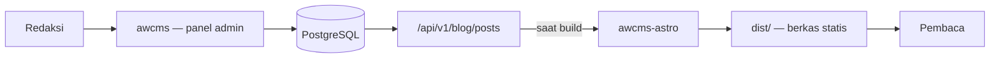

# awcms-astro

Template keluarga AWCMS untuk **situs publik statis di atas Astro**, dengan
[`ahliweb/awcms`](https://github.com/ahliweb/awcms) sebagai backend kontennya.

Pembaca mendapat berkas statis; redaksi mendapat panel admin. Tidak ada yang
menunggu basis data, dan CMS tidak pernah menghadap internet publik.

## Posisi di keluarga AWCMS

| Template          | Mode                   | Basis data | Dipakai untuk                                            |
| ----------------- | ---------------------- | ---------- | -------------------------------------------------------- |
| **`awcms-astro`** | Statis (SSG)           | Tidak ada  | Situs informasi publik, profil, dokumentasi, portal       |
| `awcms-micro`     | Online penuh, ramping  | PostgreSQL | Website/e-commerce yang dinamis sejak awal                |
| `awcms-mini`      | Hybrid offline-first   | PostgreSQL | Operasional lapangan dengan koneksi tak dapat diandalkan  |
| `awcms`           | Online-first, superset | PostgreSQL | Back-office, ERP, multi-tenant — **backend repo ini**     |

Repo ini adalah **implementasi rujukan** standar `awcms-astro`. Standarnya
sendiri lahir dari `web-lalulintasmelayani.com`, situs enam bahasa yang sudah
berjalan di produksi; dokumen standarnya ikut dibawa ke sini di
[`docs/awcms-astro/`](docs/awcms-astro/README.md).

## Cara kerjanya



Konten ditarik **saat build**, bukan saat request. Konsekuensinya lugas dan
memang disengaja: situs tetap tayang saat awcms mati, tidak ada permukaan
serangan runtime, dan konten baru tayang setelah build berikutnya — bukan
seketika. Kalau butuh seketika, `awcms-micro` template yang tepat, bukan ini.

"Build berikutnya" tidak berarti menunggu seseorang menekan tombol: awcms
memicu rebuild lewat webhook begitu sebuah post terbit, jadi jeda antara redaksi
menekan *publish* dan pembaca melihatnya adalah lama build, bukan lama seseorang
teringat. Rantainya di [`docs/deploy-coolify.md`](docs/deploy-coolify.md).

## Menjalankan

```bash
cp .env.example .env     # isi AWCMS_API_URL, token, dan tenant
npm install
npm run dev              # http://localhost:4321
```

| Perintah                 | Kegunaan                                             |
| ------------------------ | ---------------------------------------------------- |
| `npm run dev`            | Server pengembangan                                  |
| `npm run check`          | Gerbang lockfile lalu `astro check`                  |
| `npm run check:lockfile` | Hanya gerbang lockfile — murni baca berkas           |
| `npm run build`          | `npm run check` lalu `astro build` → `dist/`         |
| `npm run preview`        | Menyajikan hasil build                               |

Setelah mengubah dependency, regenerasi lockfile dengan **`npm install` penuh**:

```bash
rm -rf node_modules package-lock.json && npm install
```

Jangan memakai `npm install --package-lock-only`. Ia menghasilkan lockfile yang
kehilangan biner opsional lintas platform (`@esbuild/*`,
`@astrojs/compiler-binding-*`, `fsevents`), sehingga `npm ci` gagal di macOS dan
Windows sementara Linux tetap hijau.

## Tenant: apa yang terjadi kalau tidak disebut

Satu instans awcms melayani banyak tenant; satu situs `awcms-astro` adalah satu
tenant. Rantainya dicoba berurutan:

1. `AWCMS_TENANT_CODE` — kode tenant eksplisit. **Utamakan ini.**
2. `AWCMS_TENANT_ID` — UUID tenant eksplisit.
3. `AWCMS_DEFAULT_TENANT_CODE` — **tenant default**, jawaban untuk "situs ini
   tidak menyebut tenant sama sekali".

Kalau tidak satu pun terisi, **build gagal**. Itu keputusan, bukan kelalaian:
menebak tenant berarti berisiko menerbitkan konten satu tenant di domain tenant
lain — kegagalan terburuk yang bisa dialami CMS multi-tenant. Rinciannya di
[`src/lib/awcms/tenant.ts`](src/lib/awcms/tenant.ts).

Ini mencerminkan rantai yang sudah dijalankan awcms sendiri untuk rute publik
host-resolved-nya (`PUBLIC_DEFAULT_TENANT_ID` → `PUBLIC_DEFAULT_TENANT_CODE` →
`awcms_setup_state.tenant_id`).

## Yang membuat template ini berbeda

**Terbaca tanpa JavaScript.** Navigasi, pengalih bahasa, accordion FAQ, dan
seluruh isi halaman bekerja penuh tanpa JS. Satu-satunya yang butuh JS adalah
tombol salin tautan — dan tombol itu **disembunyikan** saat JS mati, karena
tombol yang diam saat diklik lebih buruk daripada tombol yang tidak ada.

**Multi-locale tanpa halaman pincang.** Kumpulan slug ditentukan satu locale
sumber, dan locale lain dipasangkan lewat `translationGroupId`. Setiap bahasa
selalu punya jumlah halaman yang sama, tidak pernah ada 404 antar bahasa, dan
artikel yang belum diterjemahkan tampil dalam bahasa sumber **disertai
penanda** — bukan halaman kosong dan bukan nama key mentah.

**Tanpa skrip pihak ketiga.** Tidak ada SDK, widget, piksel, atau tombol
berbagi milik penyedia sosial. Berbagi memakai tautan biasa, jadi tidak ada
data pembaca yang terkirim sebelum ia sendiri mengeklik.

**Tanpa HTML mentah dari CMS.** Blok konten dirender dari struktur, bukan dari
field HTML — [`src/lib/content-blocks.ts`](src/lib/content-blocks.ts) menyusun
setiap elemen dari teks yang sudah di-escape dan tag tetap. Editor tidak bisa
menyuntikkan markup lewat jalur mana pun, apa pun yang ia ketik.

## Struktur

```
src/
├── components/           # komponen render + views/ (badan halaman lintas locale)
├── config/site.ts        # locale, tab, identitas situs — satu-satunya berkas konfigurasi
├── layouts/              # BaseLayout (SEO, hreflang, share), ArtikelLayout
├── lib/
│   ├── awcms/client.ts   # SATU-SATUNYA berkas yang bicara ke awcms
│   ├── awcms/tenant.ts   # rantai resolusi tenant
│   ├── content.ts        # adapter: API → LocalizedArticle (kontrak komponen)
│   ├── content-blocks.ts # blok terstruktur → HTML, tanpa jalur HTML mentah
│   ├── po.ts             # katalog string antarmuka
│   └── schema.ts         # JSON-LD
├── locales/<locale>/messages.po
├── pages/                # locale default di root, locale lain lewat [lang]/
└── styles/global.css     # design token + standar interaksi
Dockerfile                # build statis → image nginx non-root, port 8080
ops/nginx-situs.conf      # penyajian keluaran statis di dalam image
```

## Yang belum ada (backlog eksplisit, bukan kelalaian)

- **Gerbang audit konten.** Repo rujukan memilikinya dan itulah yang membuat
  standar ini punya gigi. Aturannya di sana khas domain; versi generiknya
  (paritas katalog, metadata SEO, tautan mati di `dist/`) belum ditulis di sini.
- **Kartu share PNG.** Generatornya di repo rujukan terikat pada seni dan data
  domainnya.
- **Gambar artikel.** [`src/lib/article-images.ts`](src/lib/article-images.ts)
  mengembalikan `src: undefined` dan setiap pemanggil merender blok bertoken.
  Butuh endpoint resolusi media di sisi awcms, atau seni lokal di `src/assets/`.
- **Paginasi konten.** `GET /api/v1/blog/posts` membatasi 100 baris per
  permintaan; adapter **melempar** saat menyentuh batas itu alih-alih diam-diam
  memotong. Perbaikan sebenarnya adalah build feed berpaginasi di sisi awcms.
- **Atribut `style=""` inline.** Keluaran masih memuat ±50 atribut gaya inline
  yang diwarisi dari repo rujukan. Di hosting statis biasa ini tidak
  bermasalah, tetapi di belakang CSP ketat (`style-src 'self'` tanpa
  `'unsafe-inline'` — postur yang dipakai `awcms` sendiri) **semuanya diblokir
  browser** dan halaman kehilangan tata letaknya tanpa satu pun error di build.
  Memindahkannya ke kelas adalah prasyarat sebelum situs apa pun dari template
  ini disajikan di belakang CSP semacam itu.

## Dokumentasi

| Dokumen                                                                              | Isi                                     |
| ------------------------------------------------------------------------------------ | --------------------------------------- |
| [`AGENTS.md`](AGENTS.md)                                                             | Kontrak kerja repo                      |
| [`docs/awcms-astro/README.md`](docs/awcms-astro/README.md)                           | Posisi standar di keluarga AWCMS        |
| [`docs/awcms-astro/standar-teknis.md`](docs/awcms-astro/standar-teknis.md)           | Aturan teknis yang mengikat             |
| [`docs/awcms-astro/ui-ux-design-system.md`](docs/awcms-astro/ui-ux-design-system.md) | Design token, komponen, aksesibilitas   |
| [`docs/awcms-astro/integrasi-awcms.md`](docs/awcms-astro/integrasi-awcms.md)         | Kontrak integrasi dengan awcms          |
| [`docs/deploy-coolify.md`](docs/deploy-coolify.md)                                   | Deploy dan rebuild lewat webhook        |

## Lisensi

[MIT](LICENSE).
