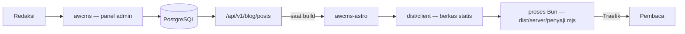

# awcms-astro

Template keluarga AWCMS untuk **situs publik statis di atas Astro**, dengan
[`ahliweb/awcms`](https://github.com/ahliweb/awcms) sebagai backend kontennya.

Pembaca mendapat berkas statis; redaksi mendapat panel admin. Tidak ada yang
menunggu basis data, dan **situs ini tidak memanggil awcms saat pembaca meminta
halaman** — klaimnya itu, bukan bahwa CMS-nya tersembunyi. awcms memang
menghadap internet: `/blog/{tenantCode}/**` adalah kosakata URL permanennya.

**Fungsi utamanya halaman publik, dan itu bawaannya.** Sebuah situs boleh
menyatakan dirinya juga membawa permukaan admin untuk **user** — penulis,
peninjau, kontributor — di sebelah halaman publiknya, lewat `permukaanAdmin` di
[`src/config/site.ts`](src/config/site.ts). Yang tidak pernah tinggal di sini
adalah **admin utama**: `owner` dan setiap layar yang mengelola sistem tetap di
`/admin/*` milik `awcms`. Aturannya, beserta gerbangnya, di
[ADR-0034](docs/adr/0034-publik-secara-bawaan-admin-hanya-bila-dinyatakan.md).

## Posisi di keluarga AWCMS

| Template          | Mode                   | Basis data | Dipakai untuk                                                                   | Status           |
| ----------------- | ---------------------- | ---------- | --------------------------------------------------------------------------------- | ---------------- |
| **`awcms-astro`** | Statis (SSG)           | Tidak ada  | **Halaman publik** (fungsi utama) + **permukaan admin USER** bila dinyatakan       | **Dikembangkan** |
| `awcms`           | Online-first, superset | PostgreSQL | Back-office, ERP, multi-tenant, seluruh layar admin SISTEM — **backend repo ini**  | **Dikembangkan** |
| `awcms-micro`     | Online penuh, ramping  | PostgreSQL | —                                                                                  | **Arsip**        |
| `awcms-mini`      | Hybrid offline-first   | PostgreSQL | —                                                                                  | **Arsip**        |

Dua baris pertama adalah seluruh keluarga yang dikembangkan, dan **pasangan
keduanya** adalah pengganti multiguna dari ketiga template lama — bukan salah
satunya sendirian. Pembagian layarnya bukan menurut audiens melainkan menurut
**apa yang dikelola**: admin SISTEM (modul, peran, tenant, jejak audit) di
`awcms`, permukaan admin USER (menulis artikel, mengajukan tinjauan, profil
sendiri) boleh di sini bila situsnya menyatakannya lewat `permukaanAdmin`
([ADR-0034](docs/adr/0034-publik-secara-bawaan-admin-hanya-bila-dinyatakan.md),
`awcms` ADR-0070). Peran `owner` ditolak gerbang di sini.

Repo ini sempat **ditahan** dari 2 sampai 4 Agustus 2026 sampai fondasi `awcms`
selesai (ADR-0021). Penahanan itu berakhir karena kedua indikator yang ia tulis
sendiri terpenuhi — tiap modul `awcms` punya layar, dan §4 `PROJECT_STATE`-nya
habis ([ADR-0027](docs/adr/0027-penahanan-adr-0021-selesai.md)). Yang
menggantikannya satu pertanyaan yang tidak akan kedaluwarsa: **apakah perubahan
ini akan ditulis ulang bila `awcms` berubah?** Bila ya, ia butuh instans `awcms`
untuk dibuktikan sebelum mendarat — dan "endpoint-nya sudah ada" bukan jawaban
"tidak" ([ADR-0023](docs/adr/0023-penahanan-dipersempit-pekerjaan-tanpa-awcms.md)).

Sejak **2 Agustus 2026** (`awcms` ADR-0055) hanya dua repo yang dikembangkan:
repo ini dan `awcms`. `awcms-micro` dan `awcms-mini` adalah **arsip** — boleh
dibaca sebagai referensi sejarah, tetapi tidak ada pekerjaan yang dijadwalkan
di-port dari sana maupun keluar ke sana, dan jalur "fitur fondasi diuji di
`awcms-mini` dulu" **dicabut**, bukan ditangguhkan. Konsekuensinya bagi alur
kerja ada di
[`AGENTS.md`](AGENTS.md#di-mana-pekerjaan-boleh-mendarat-berlaku-2-agustus-2026).

Repo ini adalah **implementasi rujukan** standar `awcms-astro`. Standarnya
sendiri lahir dari `web-lalulintasmelayani.com`, situs enam bahasa yang sudah
berjalan di produksi; dokumen standarnya ikut dibawa ke sini di
[`docs/awcms-astro/`](docs/awcms-astro/README.md).

## Cara kerjanya



Konten ditarik **saat build**, bukan saat request. Konsekuensinya lugas dan
memang disengaja: situs tetap tayang saat awcms mati, tidak ada basis data dan
tidak ada panggilan ke awcms saat request, dan konten baru tayang setelah build
berikutnya — bukan seketika. Kalau butuh seketika, yang menjawabnya adalah
permukaan publik **awcms sendiri** (`/blog/{tenantCode}/**`), yang terbit
langsung tayang tanpa rebuild. Bukan `awcms-micro`: repo itu **arsip** sejak
2 Agustus 2026 dan tidak boleh direkomendasikan kepada siapa pun.

Yang menyajikan berkas itu adalah **proses Bun**, bukan nginx (ADR-0016) — jadi
"tanpa runtime" bukan klaim repo ini; klaimnya adalah tanpa basis data dan tanpa
panggilan ke CMS saat pembaca meminta halaman. Aturan cache, lima header
keamanan — termasuk `Content-Security-Policy` ketat dan `Permissions-Policy`
sejak ADR-0019 — dan kompresi tinggal di
[`server/penyaji.mjs`](server/penyaji.mjs) dan dijaga
[`tests/penyaji.test.mjs`](tests/penyaji.test.mjs). Yang keenam,
`Strict-Transport-Security`, dikirim **hanya di produksi**
([ADR-0029](docs/adr/0029-hsts-digerbangi-produksi-tanpa-includesubdomains.md)) —
karena HSTS berlaku untuk HOST dan tidak bisa dibatalkan dari sisi situs, jadi
satu pratinjau lokal yang mengirimkannya akan mengunci setiap proyek lain di
`localhost` selama setahun. Postur lengkapnya — sepuluh celah bernomor yang
kini seluruhnya tertutup, barisnya tetap di tabel — ada di
[`docs/awcms-astro/standar-performa-dan-keamanan.md`](docs/awcms-astro/standar-performa-dan-keamanan.md).

"Build berikutnya" tidak berarti menunggu seseorang menekan tombol: awcms
memicu rebuild lewat webhook begitu sebuah post terbit, jadi jeda antara redaksi
menekan *publish* dan pembaca melihatnya adalah lama build, bukan lama seseorang
teringat. Rantainya di [`docs/deploy-coolify.md`](docs/deploy-coolify.md).

## Memulai situs baru

Repo ini adalah **template repository** GitHub. Tombol **"Use this template"**
membuat repo baru berisi seluruh kerangkanya dengan riwayat commit yang bersih —
bukan fork, jadi situsmu tidak mewarisi 4 tahun commit template.

Yang ikut terbawa dan harus dikosongkan lebih dulu — `.changesets/`,
`CHANGELOG.md`, `docs/adr/`, identitas di `package.json` — beserta urutan
langkah setelahnya ada di
[`checklist-repo-baru.md`](docs/awcms-astro/checklist-repo-baru.md). Urutannya
disengaja: kontrak lebih dulu, konten berikutnya, tampilan terakhir.

## Menjalankan

```bash
cp .env.example .env     # isi AWCMS_API_URL, token, dan tenant
bun install
bun run dev              # http://localhost:4321
```

Repo ini **Bun-only** (ADR-0015): Bun adalah runtime sekaligus package manager,
versinya dipin di `packageManager`/`engines.bun`, dan `bun.lock` adalah
satu-satunya lockfile.

| Perintah                 | Kegunaan                                                        |
| ------------------------ | --------------------------------------------------------------- |
| `bun run dev`            | Server pengembangan Astro (HMR), `http://localhost:4321`        |
| `bun run check`          | Gerbang lockfile lalu `astro check`                             |
| `bun run check:lockfile` | Hanya gerbang lockfile — murni baca berkas                      |
| `bun test`               | 19 berkas gerbang: kontrak `awcms`, peran situs, kosakata `news`, feed, penyaji, CSP keluaran |
| `bun run audit:konten`   | Gerbang audit: sumber gambar, dan keluaran build bila sudah ada |
| `bun run audit:dokumen`  | Gerbang dokumen: tautan markdown mati, indeks ADR, daftar permukaan kilau |
| `bun run audit:graf`     | Gerbang graf: artefak `graphify-out/` yang terlacak, dan nama komunitasnya |
| `bun run build`          | `check` → `astro build` → bundel penyaji                        |
| `bun run build:penyaji`  | Hanya membundel penyaji ke `dist/server/penyaji.mjs`            |
| `bun run serve`          | Menjalankan penyaji produksi atas hasil build (port 8080)       |
| `bun run preview`        | Alias `serve` — pratinjau memakai penyaji yang sama dengan prod |
| `bun run start`          | Alias `serve` — perintah yang dijalankan image                  |

`bun run dev` menjalankan server pengembangan Astro, dan server itu **bukan**
penyaji produksi: ia tidak mengirim lima header keamanan maupun aturan cache di
[`server/penyaji.mjs`](server/penyaji.mjs). Untuk melihat persis yang dilihat
pembaca — header, cache, kompresi — jalankan `bun run build && bun run serve`.
`preview` sengaja dipetakan ke penyaji yang sama supaya "sudah saya cek di
preview" berarti sesuatu.

Setelah mengubah dependency, regenerasi lockfile penuh:

```bash
rm -rf node_modules bun.lock && bun install
```

Di CI dan di dalam image, install selalu `bun install --frozen-lockfile` —
tanpanya install boleh MEMPERBARUI `bun.lock` diam-diam, dan yang dibangun
berhenti sama dengan yang di-review.

## Tenant: satu variabel, dan satu pernyataan yang diverifikasi

Satu instans awcms melayani banyak tenant; satu situs `awcms-astro` adalah satu
tenant. Sejak awcms ADR-0049, **tenant datang dari tokennya**: kredensial build
adalah kredensial mesin berbentuk `awcmsm_<32 hex tenant>_<rahasia>`, dan awcms
menurunkan tenant dari sana sebelum melihat header apa pun.

Jadi konfigurasinya satu variabel:

| Variabel | Peran |
| --- | --- |
| `AWCMS_API_TOKEN` | Kredensial **dan** tenant. Wajib kredensial mesin ber-scope **dua kunci**: `blog_content.posts.read` dan `media_library.media.read` |
| `AWCMS_TENANT_ID` | **Opsional, dianjurkan.** Bukan pemilih — pernyataan yang diverifikasi. Build gagal bila berbeda dari tenant token |

`AWCMS_TENANT_CODE` dan `AWCMS_DEFAULT_TENANT_CODE` sudah tidak ada, dan
**ditolak** alih-alih diabaikan.

**Kunci kedua bukan opsional, dan bukan untuk gambar saja.** `bun run build`
berakhir di [`scripts/asal-media.mjs`](scripts/asal-media.mjs), yang menanyakan
asal media publik kepada awcms supaya penyaji bisa mengirim `img-src` yang
mengizinkannya. Tanpa `media_library.media.read` panggilan itu dibalas 403 dan
**build GAGAL** — setelah setiap halaman selesai dirender, sehingga ia terbaca
seperti deployment yang rusak alih-alih izin yang kurang. Deployment tanpa media
publik pun tetap membutuhkannya; jawabannya lalu tercatat `configured: false`.

**Dan satu premis lama berhenti berlaku pada 13 Agustus 2026.** Sampai hari itu
"kredensial mesin tidak bisa menulis" adalah sifat KELASNYA. Sejak awcms
ADR-0092 ia bukan lagi: kelas tulis ada, dengan plafon aksi `create`/`update` di
kode, wajib terikat CIDR, ditolak bila alamat pemanggil tidak diketahui, dan
berumur maksimum 30 hari alih-alih setahun. Token build repo ini **tetap
baca-saja** — tetapi karena ia diterbitkan tanpa satu pun aksi tulis, yaitu
properti BARISNYA, bukan properti kelasnya. Menjaganya begitu kini sebuah
keputusan penerbitan yang harus dipertahankan, bukan jaminan yang diwarisi.

Kenapa penjagaannya berpindah, bukan hilang: rantai lama menjaga "build menebak
tenant", keadaan yang kini tidak mungkin. Yang mungkin, dan tak terlihat oleh
apa pun sebelumnya, adalah **token tenant lain terpasang di situs ini** — build
hijau, situs penuh, isinya milik orang lain. Rantai tidak bisa melihat itu;
pernyataan yang diverifikasi bisa. Rinciannya di
[`src/lib/awcms/tenant.ts`](src/lib/awcms/tenant.ts) dan
[ADR-0018](docs/adr/0018-kontrak-build-token-mesin-dan-traversal-konten.md).

## Yang membuat template ini berbeda

**Terbaca tanpa JavaScript.** Navigasi, pengalih bahasa, accordion FAQ, dan
seluruh isi halaman bekerja penuh tanpa JS. Satu-satunya yang butuh JS adalah
tombol salin tautan — dan tombol itu **disembunyikan** saat JS mati, karena
tombol yang diam saat diklik lebih buruk daripada tombol yang tidak ada.

**Multi-locale tanpa halaman pincang.** Kumpulan slug ditentukan satu locale
sumber, dan locale lain dipasangkan lewat `translationGroupId`. Setiap bahasa
selalu punya jumlah halaman yang sama, tidak pernah ada 404 antar bahasa, dan
artikel yang belum diterjemahkan tampil dalam bahasa sumber **disertai
penanda** — bukan halaman kosong dan bukan nama key mentah.

**Tanpa skrip pihak ketiga.** Tidak ada SDK, widget, piksel, atau tombol
berbagi milik penyedia sosial. Berbagi memakai tautan biasa, jadi tidak ada
data pembaca yang terkirim sebelum ia sendiri mengeklik.

**Tanpa HTML mentah dari CMS.** Blok konten dirender dari struktur, bukan dari
field HTML — [`src/lib/content-blocks.ts`](src/lib/content-blocks.ts) menyusun
setiap elemen dari teks yang sudah di-escape dan tag tetap. Editor tidak bisa
menyuntikkan markup lewat jalur mana pun, apa pun yang ia ketik.

**CSP ketat yang benar-benar dikirim, bukan sekadar "siap CSP".** Penyaji
memasang `default-src 'self'` dengan `script-src 'self'` dan `style-src 'self'`
tanpa `'unsafe-inline'` (ADR-0019). Yang membuatnya mungkin: tidak ada satu pun
gaya maupun skrip di dalam HTML keluaran — pengalih tema tinggal di
[`public/tema.js`](public/tema.js), dan Astro dilarang menyisipkan bundel kecil
ke halaman lewat `vite.build.assetsInlineLimit: 0`. Keduanya dijaga
[`tests/keluaran-csp.test.mjs`](tests/keluaran-csp.test.mjs), yang juga
membuktikan JS-nya tidak ikut hilang; kebijakannya sendiri dijaga
[`tests/penyaji.test.mjs`](tests/penyaji.test.mjs). JSON-LD tetap inline dan itu
bukan kelonggaran: blok data bertipe non-JavaScript tidak pernah dieksekusi,
jadi `script-src` tidak berlaku atasnya.

**Gerbang atas yang TERBIT, bukan atas yang tertulis.**
[`scripts/audit-konten.mjs`](scripts/audit-konten.mjs) membaca `dist/client/`
dan menolak enam kelas cacat yang seluruhnya lolos dari build hijau: halaman
tanpa judul atau deskripsi, kelompok hreflang yang pincang, `og:image` yang
menunjuk berkas yang tidak pernah diterbitkan build ini, tautan internal yang
mati, sitemap yang mendaftarkan halaman yang tidak dibangun, dan nama key
mentah yang tampil sebagai teks kepada pembaca. Yang terakhir bukan hipotesis —
template ini pernah menerbitkan `translation.notice.label` di kedua bahasa,
dengan `astro check` bersih. Skrip yang sama memeriksa sumber gambar: rasio
terhadap `--ratio-visual`, format dibaca dari isi berkas alih-alih ekstensinya,
XML SVG, dan ukuran teks terkecil di dalamnya.

## Struktur

```
src/
├── components/           # komponen render + views/ (badan halaman lintas locale)
├── config/site.ts        # locale, tab, identitas situs — satu-satunya berkas konfigurasi
├── layouts/              # BaseLayout (SEO, hreflang, share), ArtikelLayout
├── lib/
│   ├── awcms/client.ts   # SATU-SATUNYA berkas yang bicara ke awcms
│   ├── awcms/tenant.ts   # tenant dari token + assertion silang
│   ├── content.ts        # adapter: API → LocalizedArticle (kontrak komponen)
│   ├── content-blocks.ts # blok terstruktur → HTML, tanpa jalur HTML mentah
│   ├── po.ts             # katalog string antarmuka
│   ├── po-parse.ts       # parser PO, dipisah agar bisa diuji tanpa Vite
│   └── schema.ts         # JSON-LD
├── locales/<locale>/messages.po
├── pages/                # locale default di root, locale lain lewat [lang]/
└── styles/global.css     # design token + standar interaksi
public/tema.js            # SATU-SATUNYA JS yang harus jalan sebelum paint (ADR-0019)
server/penyaji.mjs        # penyaji produksi: header, CSP, cache, kompresi (ADR-0016/0019)
tests/penyaji.test.mjs    # gerbang penyajian — aturan di atas dibuktikan, bukan diklaim
tests/keluaran-csp.test.mjs # gerbang keluaran: nol gaya & skrip inline di HTML
Dockerfile                # build → image Bun non-root, port 8080
```

Hasil build punya dua bagian: `dist/client/` adalah situsnya, `dist/server/`
adalah entrypoint adapter beserta penyaji yang sudah dibundel. Image produksi
hanya membawa `dist/client/` dan `dist/server/penyaji.mjs` — bundel itu yang
membuatnya tidak perlu `node_modules` sama sekali.

## Yang belum ada (backlog eksplisit, bukan kelalaian)

- **Paginasi untuk seksi berita.** Seksi berita sendiri sudah ada sejak
  [ADR-0033](docs/adr/0033-seksi-berita-urutan-dari-tanggal-dan-dua-tanggal-yang-terpisah.md):
  sebuah tab menyatakan `urutanSeksi: "terbaru"`, dan seksinya terurut dari
  `publishedAt` menurun, kartunya bertanggal, artikelnya `NewsArticle`.
  **Feed-nya sudah mendarat juga** sejak
  [ADR-0035](docs/adr/0035-feed-atom-per-seksi-berita-dan-gerbang-atas-xml.md) —
  Atom 1.0 di `/{tab}/feed.xml`, beserta keluarga gerbang yang membaca setiap
  `.xml` di keluaran, yang justru merupakan alasan feed sempat ditunda. Dan sejak
  [ADR-0036](docs/adr/0036-news-adalah-kosakata-repo-ini-dan-sebuah-tab-yang-memikulnya.md)
  prefiks **`/news/` adalah kosakata repo ini** — sebuah situs berita menamai
  tabnya `news`, dan `/blog/` tetap milik `awcms`. Yang tersisa dua, dan keduanya
  ditunda dengan alasan yang diperiksa ke kode:

  **Arsip kategori/tag di `/news/`** — repo ini belum punya taksonomi sama
  sekali: tidak ada model kategori maupun tag di
  [`src/lib/content.ts`](src/lib/content.ts), dan seksi ditentukan oleh tab,
  bukan oleh term. ADR-0036 §5 menyatakannya terbuka alih-alih menjanjikan
  paritas dengan empat rute `awcms` yang kini **sudah dihapus** di sana — sejak
  8 Agustus 2026 `/news/**` di `awcms` menjawab 301 ke `/blog/{tenantCode}/**`
  (**kecuali** untuk tenant ber-`legacyTenantRouteEnabled: false`, yang sudah mematikan seluruh permukaan konten publiknya dan karena itu tetap dijawab 404 alih-alih diberi 301 menuju 404 yang pasti (`awcms` ADR-0071 §4 butir 3)),
  jadi tidak ada lagi paritas yang bisa dikejar. Situs yang benar-benar
  membutuhkan arsip kategori/tag membawanya lewat ADR-nya sendiri di sini.


  **Paginasi** — ia mengubah bentuk rute, yang menurut kriteria
  [`docs/adr/README.md`](docs/adr/README.md) sendiri adalah kelas keputusan
  yang butuh ADR. Ia juga menuntut judul berbeda per halaman (gerbang
  judul-kembar memerahkan yang sama, dan pelarian bakunya — `noindex` +
  canonical ke halaman satu — dilarang mutlak oleh gerbang "dua sinyal yang
  bertabrakan"), jumlah halaman yang identik di setiap locale agar hreflang
  tetap resiprokal, dan sampel Lighthouse yang ikut bergeser. **Sampai itu
  mendarat, indeks seksi berita merender seluruh artikelnya dalam satu
  halaman** — timbang itu sebelum menyalakan `"terbaru"` untuk situs
  bervolume tinggi.

- **Kartu share yang DIBANGKITKAN per halaman.** Kartu yang *diunggah* sudah
  bekerja: artikel memakai `seoImageMediaId` (atau `featuredMediaId`) dari
  `awcms`, lengkap dengan MIME dan ukurannya sendiri
  ([ADR-0026](docs/adr/0026-kartu-share-per-artikel-dari-media-awcms.md)). Yang
  belum ada adalah pembangkit yang menormalkan kartu ke 1200×630 dari judul dan
  seni artikel — ia menambah encoder gambar sebagai dependency build, jadi ia
  pantas mendapat ADR-nya sendiri. `SITE_SOCIAL_IMAGE` (satu kartu situs,
  opsional) tetap keadaan yang didukung, dan halaman tanpa kartu mana pun tidak
  memasang tag gambar sama sekali — pratinjau jatuh ke kartu teks yang rapi.
- **BFF portal Jualanku (ADR-0014).** `/internal/login`, sesi BFF sisi server,
  cookie portal, CSRF. Fondasi `awcms`-nya **lengkap per 4 Agustus 2026**:
  kontrak sesi (ADR-0049/0050) dan business-scope resolver yang kini punya
  penyedia (`awcms` ADR-0060 — sebelumnya NO-OP fail-closed). Tanggal itu perlu
  disebut, karena kontraknya **bertambah lagi** pada 12 Agustus 2026 dan
  tambahannya menyentuh persis mekanisme yang direncanakan di sini: login tanpa
  tenant terpilih kini dijawab `409` beserta token seleksi berumur pendek,
  pemilihan dan perpindahan tenant punya dua endpoint tersendiri yang **di luar**
  kontrak konsumen beku (`awcms` ADR-0065), dan sesi hasil serah-terima
  (`handoff`) — bentuk sesi yang ADR-0050 ciptakan untuk BFF ini —
  **dilarang** berpindah tenant (`awcms` ADR-0088). Yang menahannya bukan lagi
  kontrak yang hilang melainkan uji
  [ADR-0023](docs/adr/0023-penahanan-dipersempit-pekerjaan-tanpa-awcms.md): ia
  memanggil `awcms` **di setiap permintaan runtime**, bukan sekali per build,
  jadi bentuknya ditentukan respons `awcms` pada tiap permintaan — dan repo
  template ini tidak punya instans untuk membuktikannya. Satu prasyarat tersisa
  di sisi sana juga: bentuk scope merchant Jualanku masih butuh ADR admission-nya
  sendiri. Prasyarat di repo ini ada di
  [`04-kesiapan.md`](docs/awcms-astro/jualanku/04-kesiapan.md).
- **Filter locale di feed awcms — sudah ADA di awcms, dan justru TIDAK boleh
  dipakai template ini.** Traversal kontennya sendiri sudah selesai: satu
  `GET /api/v1/blog/posts?view=full&order=created_at`, disusuri lewat
  `nextCursor`, tanpa `?locale=` — jadi build menarik SELURUH locale lalu
  memasangkannya di sini. awcms menutup sisinya pada 2 Agustus 2026
  ([#346](https://github.com/ahliweb/awcms/pull/346)): `?locale=` cocok-persis
  (`en` tidak menyapu `en-GB`), absen berarti seluruh locale, dan nilai kosong
  dibalas 400.

  Yang berubah karena itu bukan "tinggal dipasang", melainkan **arah butirnya**.
  Template ini menyajikan dua locale (`id` + `en`) dan memasangkannya lewat
  `translationGroupId`; `?locale=id` akan membuang setiap baris `en`, dan
  `assertTranslationsArePairable` **tidak akan merah** — yang hilang bukan
  terjemahan tanpa pasangan, melainkan terjemahan yang tidak pernah ikut
  terbawa. Situs tetap terbangun hijau, setiap halaman `/en/**` jatuh ke bahasa
  Indonesia dengan penanda "belum diterjemahkan", dan itu persis pemotongan
  konten diam-diam yang [`content.ts`](src/lib/content.ts) nyatakan sebagai
  kegagalan, bukan degradasi. Filternya bernilai hanya untuk deployment yang
  benar-benar satu locale — dan karena ia menerima satu nilai, dua locale
  berarti dua traversal, bukan satu yang lebih ramping.

## Dokumentasi

| Dokumen                                                                              | Isi                                     |
| ------------------------------------------------------------------------------------ | --------------------------------------- |
| [`AGENTS.md`](AGENTS.md)                                                             | Kontrak kerja repo                      |
| [`CHANGELOG.md`](CHANGELOG.md)                                                       | Riwayat rilis, dilipat dari changeset   |
| [`.changesets/README.md`](.changesets/README.md)                                     | Cara menulis catatan perubahan          |
| [`docs/awcms-astro/README.md`](docs/awcms-astro/README.md)                           | Posisi standar di keluarga AWCMS        |
| [`docs/awcms-astro/standar-teknis.md`](docs/awcms-astro/standar-teknis.md)           | Aturan teknis yang mengikat             |
| [`docs/awcms-astro/standar-performa-dan-keamanan.md`](docs/awcms-astro/standar-performa-dan-keamanan.md) | Peta ke OWASP/ASVS/ISO 27001/SSDF + Core Web Vitals, dan sepuluh celah bernomor — seluruhnya tertutup, baris tetap di tabel |
| [`docs/awcms-astro/ui-ux-design-system.md`](docs/awcms-astro/ui-ux-design-system.md) | Design token, komponen, aksesibilitas   |
| [`docs/awcms-astro/integrasi-awcms.md`](docs/awcms-astro/integrasi-awcms.md)         | Kontrak integrasi dengan awcms          |
| [`docs/deploy-coolify.md`](docs/deploy-coolify.md)                                   | Deploy dan rebuild lewat webhook        |
| [`.claude/skills/`](.claude/skills/README.md)                                        | Skill proyek: integrasi, gerbang, situs baru, performa-keamanan |

## Lisensi

[MIT](LICENSE).
