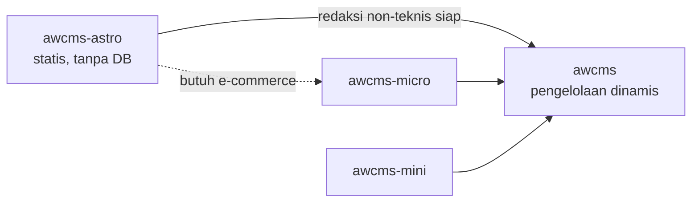

🇮🇩 Bahasa Indonesia · 🇬🇧 [English (source)](README.md)

<!-- i18n-source-hash: sha256:e6c47bf5b6847f8cf5851081bc5a335350599ca03c0d84b7fc379bc1a91f42cf -->

# awcms-astro

Standar keluarga AWCMS untuk **situs statis Astro**: situs informasi publik yang seluruh halamannya dibangun saat build, tanpa basis data dan tanpa satu pun panggilan ke CMS saat pembaca meminta halaman.

"Tanpa runtime server" bukan bagian dari klaim itu, dan pernah keliru ditulis begitu di sini: sejak [ADR-0016](../adr/0016-penyajian-bun-di-belakang-traefik-tanpa-nginx.md) keluaran build disajikan sebuah proses Bun. Yang tidak ada tetap tidak ada — basis data, dan ketergantungan pada CMS yang hidup saat request.

Repo `ahliweb/awcms-astro` adalah implementasi rujukan standar ini. Standarnya sendiri tidak lahir di atas kertas: ia diekstraksi dari `web-lalulintasmelayani.com`, situs enam bahasa yang sudah berjalan di produksi, tempat setiap aturan di bawah lebih dulu dibuktikan.

> **Satu perbedaan yang harus dibaca lebih dulu.** Repo rujukan itu menyimpan kontennya sebagai markdown di dalam repo. Template ini menariknya dari `awcms` saat build. Aturan tentang KONTEN karena itu berpindah tempat penegakannya — dari Zod dan gerbang audit di repo, ke validasi API dan quality checklist di CMS. Lihat [`integrasi-awcms.md`](integrasi-awcms.md) §"Yang paling berisiko hilang saat migrasi".

Positioning ini ditetapkan ADR-0012 repo rujukan.

> **Nomor ADR di dokumen ini.** ADR-0001 sampai ADR-0013 adalah keputusan repo rujukan dan **tidak ada di repo ini** — nomornya disebut tanpa tautan karena berkasnya memang tidak di sini. ADR repo ini dimulai dari [ADR-0014](../adr/README.md) dan seluruhnya bertautan.

## Posisi di keluarga AWCMS

| Template | Mode | Basis data | Kapan dipakai | Status |
| --- | --- | --- | --- | --- |
| **`awcms-astro`** | Statis murni (SSG) | Tidak ada | **Halaman publik** (fungsi utama) + **permukaan admin USER** bila situsnya menyatakannya | **Dikembangkan** |
| `awcms` | Online-first, superset ERP/SaaS | PostgreSQL | Back-office, ERP, multi-tenant, **seluruh layar admin SISTEM** | **Dikembangkan** |
| `awcms-micro` | Online penuh, ramping | PostgreSQL | Website/e-commerce yang butuh konten dinamis sejak awal | **Arsip** (2 Agustus 2026) |
| `awcms-mini` | Hybrid offline-first | PostgreSQL | Operasional lapangan dengan koneksi tidak dapat diandalkan | **Arsip** (2 Agustus 2026) |

**Dua baris teratas adalah seluruh keluarga yang dikembangkan, dan pasangan
keduanya adalah pengganti multiguna ketiga template lama** — bukan salah satunya
sendirian. Pembagian layarnya bukan menurut audiens melainkan menurut **apa yang
dikelola**: admin SISTEM (modul, peran, tenant, jejak audit, apa pun lintas-tenant)
di `awcms`; permukaan admin USER (menulis artikel, mengajukan tinjauan, profil
sendiri) boleh di sini bila situsnya menyatakannya lewat `permukaanAdmin`, dengan
peran `owner` ditolak gerbang ([ADR-0034](../adr/0034-publik-secara-bawaan-admin-hanya-bila-dinyatakan.md),
`awcms` ADR-0070).

Dua baris terbawah masih menyatakan **kapan sebuah template dahulu cocok
dipakai** — itu tetap benar sebagai deskripsi. Yang berubah adalah statusnya:
sejak 2 Agustus 2026 (`awcms` ADR-0055) keduanya **arsip**, bukan sekadar beku.
Boleh dibaca sebagai referensi sejarah; tidak ada pekerjaan yang dijadwalkan
di-port dari sana maupun keluar ke sana. Diagram di bawah karena itu
menggambarkan jalur perpindahan yang **pernah** tersedia, bukan repo yang aktif.

**Perpindahan bukan pembongkaran.** `awcms-astro` sengaja dirancang agar kontrak kontennya bisa dipetakan ke content model `awcms` tanpa menyentuh komponen render — lihat [`integrasi-awcms.md`](integrasi-awcms.md).

## Kapan memilih awcms-astro

Pilih bila **seluruhnya** benar:

- Konten berubah dalam hitungan minggu atau bulan, bukan menit.
- **Halaman publiknya adalah fungsi utama situs**, dan setiap halaman yang dibaca pengunjung anonim bisa dibangun saat build.
- Perubahan konten memang **seharusnya** melewati review — informasi hukum, tarif resmi, panduan prosedur.
- Pembaca berada di jaringan yang tidak dapat diandalkan.

Jangan pilih bila ada satu saja:

- Konten harus disunting non-teknis **sekarang**, bukan nanti.
- Yang dibutuhkan adalah **admin SISTEM** — `owner`, modul, peran, tenant, jejak audit, apa pun yang lintas-tenant. Itu milik `awcms`, dan tidak akan pernah pindah ke sini.
- Halaman yang dibaca pengunjung anonim butuh personalisasi, atau pencarian atas korpus yang terlalu besar untuk dijelajahi navigasi.
- Ada katalog produk dengan stok atau harga yang berubah harian.

**Yang BUKAN alasan menolak, dan sampai 8 Agustus 2026 tertulis di sini seolah
alasan:** adanya pengguna yang login. Sebuah situs yang butuh penulisnya masuk
untuk mengarang artikel, mengajukannya untuk ditinjau, dan mengurus profilnya
adalah kasus yang **didukung** — ia dinyatakan lewat `permukaanAdmin`, dan
publik tetap fungsi utamanya
([ADR-0034](../adr/0034-publik-secara-bawaan-admin-hanya-bila-dinyatakan.md),
`awcms` ADR-0070). Yang menentukan bukan apakah ada yang login melainkan **apa
yang dikelola layarnya**. Bentuk, prasyarat, dan biayanya di
[`permukaan-admin-user.md`](permukaan-admin-user.md).

Satu pertanyaan lagi yang datang **sebelum** semua itu, dan jawabannya tidak
pernah "di sini": ke mana sebuah **kebutuhan backend** pergi. Ia menjadi sebuah
**modul di `awcms`** — lewat admission modul di sana, dengan RLS, katalog izin,
jejak audit, deskriptor retensi, dan deskriptor subjek datanya
([ADR-0038](../adr/0038-kebutuhan-backend-menjadi-modul-di-awcms.md)). Sebuah
situs yang menyimpan pengiriman formulir, langganan, atau keanggotaan tetap
sepenuhnya kasus yang didukung; yang diputuskan adalah **di repo mana** ia
dibangun.

Ragu? Mulai dari `awcms-astro`. Perpindahan ke `awcms` terdokumentasi; perjalanan sebaliknya — membongkar basis data yang tidak pernah dibutuhkan — jauh lebih mahal.

## Divergence yang disengaja dari keluarga

Keluarga AWCMS bersifat **Bun-only** dan **PostgreSQL + RLS wajib**. Sejak [ADR-0015](../adr/0015-runtime-bun-menutup-divergence-keluarga.md) repo ini **tidak lagi menyimpang soal runtime** — ia Bun-only seperti sibling-nya. Yang tersisa adalah divergence yang lahir dari tidak adanya basis data, dan itu disengaja:

| Aspek | Keluarga | awcms-astro | Alasan |
| --- | --- | --- | --- |
| ~~Runtime~~ | Bun | **Bun** — divergence DITUTUP oleh [ADR-0015](../adr/0015-runtime-bun-menutup-divergence-keluarga.md) | Repo ini kini Bun-only seperti seluruh keluarga: `bun.lock`, `bun test`, `oven/bun` di image, `package-ecosystem: bun` di Dependabot |
| Basis data | PostgreSQL + RLS | **Tidak ada** | Tidak ada data tenant-scoped. Kontrol akses ditegakkan review repo, bukan RLS |
| Kontrak API | OpenAPI/AsyncAPI wajib | **Tidak berlaku** | Repo ini tidak MENYAJIKAN API — ia mengonsumsi milik `awcms`. Kontraknya `LocalizedArticle` di `src/lib/content.ts`, dijaga `tests/kontrak-awcms.test.mjs` |
| Idempotency, audit trail, outbox | Wajib pada mutation | **Tidak berlaku** | Tidak ada mutation runtime |

Divergence yang tersisa berlaku **selama repo tetap tanpa basis data DAN tanpa permukaan terautentikasi**. Dua baris terakhir tabel tidak beralasan pada basis data melainkan pada ketiadaan mutation dan ketiadaan permukaan yang disajikan — jadi begitu sebuah situs menyatakan `permukaanAdmin` atau memasang BFF, keduanya berhenti berlaku apa adanya. Dan saat situs itu mulai menyimpan data tenant-scoped sendiri, seluruh kontrol keluarga kembali berlaku penuh.

[ADR-0014](../adr/0014-rendering-campuran-dan-bff-portal.md) (Jualanku.info) memberi batas yang presisi untuk kasus pertama yang benar-benar butuh sesi: `output` **tetap** `static`, adapter dipasang, dan hanya rute portal yang menjadi on-demand. Datanya tetap milik `awcms` — kontrol keluarga (idempotency, audit, otorisasi, RLS) dijalankan di sana, **bukan** dipindahkan ke repo ini.

Yang **tidak** menyimpang dan wajib diikuti: `AGENTS.md` sebagai kontrak kerja, `docs/adr/`, Conventional Commits, changeset, Definition of Done, larangan secret di repo, dan gerbang CI.

## Isi standar ini

| Dokumen | Isi |
| --- | --- |
| [`standar-teknis.md`](standar-teknis.md) | Aturan teknis yang mengikat: stack, struktur, i18n, konten, aset, SEO, gerbang mutu |
| [`standar-performa-dan-keamanan.md`](standar-performa-dan-keamanan.md) | Peta ke OWASP Top 10 / ASVS / Secure Headers, ISO 27001 Annex A, NIST SSDF, dan Core Web Vitals — beserta sepuluh celah bernomor yang kini seluruhnya tertutup — barisnya tetap di tabel ([ADR-0028](../adr/0028-jangkar-standar-performa-dan-keamanan.md)) |
| [`ui-ux-design-system.md`](ui-ux-design-system.md) | Design token, komponen, aksesibilitas, dan pemetaannya ke kosakata AWCMS |
| [`integrasi-awcms.md`](integrasi-awcms.md) | Kontrak perpindahan ke pengelolaan dinamis: content model, adapter, batas tanggung jawab |
| [`permukaan-admin-user.md`](permukaan-admin-user.md) | Peran kedua repo ini: bentuk permukaan admin USER, cara menyatakannya, apa yang berubah begitu ia menyala, dan apa yang tidak pernah boleh dibangun di sini |
| [`checklist-repo-baru.md`](checklist-repo-baru.md) | Langkah memulai situs baru di atas standar ini |
| [`jualanku/`](jualanku/README.md) | **Blueprint** experience layer Jualanku.info: rendering campuran, BFF, peta rute/UI, kesiapan ([ADR-0014](../adr/0014-rendering-campuran-dan-bff-portal.md)) — rencana, belum diimplementasikan |

## Apa yang membuat standar ini berbeda

Tiga hal yang tidak lazim, dan justru menjadi intinya:

1. **Aturan punya penegak.** Kepatuhan yang hanya tertulis akan dilanggar — itu terbukti di repo rujukan, tempat `bun run audit` memeriksa kelengkapan sumber, konsistensi antar locale, keunikan gambar, metadata SEO, dan tautan mati, lalu menggagalkan rilis (ADR-0008 repo rujukan). Di `awcms-astro` gerbang itu kini **enam perintah**, dan tiap satunya menangkap kelas cacat yang tidak menggagalkan apa pun saat terjadi: `bun run check` (tipe + lockfile), `bun test` (katalog PO, kontrak `awcms`, **peran situs** dan **kosakata `news`**, feed Atom, header/cache penyaji, CSP atas keluaran), `bun run audit:konten` (sumber gambar + sembilan keluarga gerbang atas `dist/client`, ditambah dua gerbang anggaran performa), `bun run audit:dokumen` (tautan mati, indeks ADR dua arah, daftar permukaan kilau, jalur berkas yang disebut dokumen — termasuk yang disebut `.claude/skills/`), `bun run audit:graf` (artefak `graphify-out/` yang terlacak, dan nama komunitas yang benar-benar dipilih), dan `bun run audit:translation` (cermin Indonesia yang basi terhadap sumber Inggrisnya, dan dokumen yang belum punya cermin sama sekali — [ADR-0039](../adr/0039-english-is-the-source-language.md)). Yang **belum** digerbangi disebut terus terang di [`standar-performa-dan-keamanan.md`](standar-performa-dan-keamanan.md) §Celah, bukan dibiarkan tampak terjaga.

2. **Multi-locale tanpa halaman pincang.** Kumpulan slug ditentukan satu locale sumber; sisanya jatuh ke sana dengan penanda yang jujur. Tidak pernah ada 404 antar bahasa dan tidak pernah ada nama key mentah yang tampil. Lihat ADR-0003 repo rujukan.

3. **Batas etis ditulis sebagai aturan teknis, bukan imbauan.** Larangan skrip pihak ketiga, larangan mengumpulkan data pribadi, dan kewajiban penutur asli untuk bahasa daerah diikat di `AGENTS.md` dan diperiksa gerbang — sehingga agen AI yang bekerja di repo menolak melanggarnya, bukan menemukannya terlambat.
