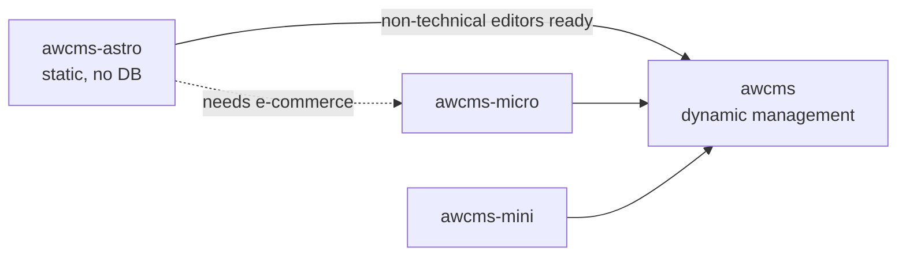

🇬🇧 English (source) · 🇮🇩 [Bahasa Indonesia](README.id.md)

# awcms-astro

The AWCMS family standard for **static Astro sites**: public information sites whose every page is built at build time, with no database and without a single call to the CMS when a reader asks for a page.

"No server runtime" is not part of that claim, and was once written here as though it were: since [ADR-0016](../adr/0016-penyajian-bun-di-belakang-traefik-tanpa-nginx.md) the build output is served by a Bun process. What is absent is still absent — a database, and any dependency on a live CMS at request time.

The `ahliweb/awcms-astro` repo is the reference implementation of this standard. The standard itself was not born on paper: it was extracted from `web-lalulintasmelayani.com`, a six-language site already running in production, where every rule below was proven first.

> **One difference to read before the rest.** That reference repo stored its content as markdown inside the repo. This template pulls it from `awcms` at build time. Rules about CONTENT therefore move to a different place of enforcement — from Zod and audit gates in the repo, to API validation and a quality checklist in the CMS. See [`integrasi-awcms.md`](integrasi-awcms.md) §"What is most at risk of being lost in migration".

This positioning was set by ADR-0012 of the reference repo.

> **ADR numbers in this document.** ADR-0001 through ADR-0013 are decisions of the reference repo and **do not exist in this repo** — their numbers are named without links because the files genuinely are not here. This repo's ADRs start at [ADR-0014](../adr/README.md) and all of them link.

## Position in the AWCMS family

| Template | Mode | Database | When to use | Status |
| --- | --- | --- | --- | --- |
| **`awcms-astro`** | Purely static (SSG) | None | **Public pages** (primary function) + a **USER admin surface** when the site declares one | **Developed** |
| `awcms` | Online-first, ERP/SaaS superset | PostgreSQL | Back-office, ERP, multi-tenant, **every SYSTEM admin screen** | **Developed** |
| `awcms-micro` | Fully online, lean | PostgreSQL | Website/e-commerce needing dynamic content from the start | **Archive** (2 August 2026) |
| `awcms-mini` | Offline-first hybrid | PostgreSQL | Field operations on connections that cannot be relied on | **Archive** (2 August 2026) |

**The top two rows are the whole developed family, and the pair of them together
replaces all three of the old templates** — not either one alone. The split of
screens is not by audience but by **what is managed**: SYSTEM admin (modules,
roles, tenants, audit trail, anything cross-tenant) in `awcms`; a USER admin
surface (writing an article, submitting it for review, one's own profile) may
live here when the site declares it through `permukaanAdmin`, with the `owner`
role refused by a gate ([ADR-0034](../adr/0034-publik-secara-bawaan-admin-hanya-bila-dinyatakan.md),
`awcms` ADR-0070).

The bottom two rows still state **when a template used to be the right fit** —
that remains true as a description. What changed is their status: since 2 August
2026 (`awcms` ADR-0055) both are **archives**, not merely frozen. They may be
read as historical reference; no work is scheduled to be ported from them or out
to them. The diagram below therefore draws migration paths that **were once**
available, not repos that are active.

**Migrating is not demolition.** `awcms-astro` is deliberately designed so its content contract can be mapped onto the `awcms` content model without touching a single render component — see [`integrasi-awcms.md`](integrasi-awcms.md).

## When to choose awcms-astro

Choose it when **all** of these hold:

- Content changes in weeks or months, not minutes.
- **Public pages are the site's primary function**, and every page an anonymous visitor reads can be built at build time.
- Content changes genuinely **should** go through review — legal information, official tariffs, procedural guides.
- Readers are on connections that cannot be relied on.

Do not choose it if even one of these holds:

- Content must be editable by non-technical people **now**, not later.
- What is needed is **SYSTEM admin** — `owner`, modules, roles, tenants, audit trail, anything cross-tenant. That belongs to `awcms`, and it will never move here.
- Pages read by anonymous visitors need personalisation, or search over a corpus too large for navigation to cover.
- There is a product catalogue with stock or prices that change daily.

**What is NOT a reason to decline, and until 8 August 2026 was written here as
though it were:** the existence of users who sign in. A site that needs its
authors to sign in to write an article, submit it for review, and manage their
own profile is a **supported** case — it is declared through `permukaanAdmin`,
and public remains its primary function
([ADR-0034](../adr/0034-publik-secara-bawaan-admin-hanya-bila-dinyatakan.md),
`awcms` ADR-0070). What decides is not whether anyone signs in but **what the
screen manages**. Its shape, prerequisites, and cost are in
[`permukaan-admin-user.md`](permukaan-admin-user.md).

One more question comes **before** all of that, and its answer is never "here":
where a **backend need** goes. It becomes a **module in `awcms`** — through
module admission there, with its RLS, permission catalogue, audit trail,
retention descriptor, and data-subject descriptor
([ADR-0038](../adr/0038-kebutuhan-backend-menjadi-modul-di-awcms.md)). A site
that stores form submissions, subscriptions, or memberships is still an entirely
supported case; what is decided is **which repo** it is built in.

Unsure? Start with `awcms-astro`. Moving to `awcms` is documented; the journey back — dismantling a database that was never needed — is far more expensive.

## Deliberate divergence from the family

The AWCMS family is **Bun-only** and **PostgreSQL + RLS mandatory**. Since [ADR-0015](../adr/0015-runtime-bun-menutup-divergence-keluarga.md) this repo **no longer diverges on runtime** — it is Bun-only like its siblings. What remains is the divergence born of having no database, and that is deliberate:

| Aspect | Family | awcms-astro | Reason |
| --- | --- | --- | --- |
| ~~Runtime~~ | Bun | **Bun** — divergence CLOSED by [ADR-0015](../adr/0015-runtime-bun-menutup-divergence-keluarga.md) | This repo is now Bun-only like the whole family: `bun.lock`, `bun test`, `oven/bun` in the image, `package-ecosystem: bun` in Dependabot |
| Database | PostgreSQL + RLS | **None** | No tenant-scoped data. Access control is enforced by repo review, not RLS |
| API contract | OpenAPI/AsyncAPI mandatory | **Not applicable** | This repo does not SERVE an API — it consumes `awcms`'s. Its contract is `LocalizedArticle` in `src/lib/content.ts`, guarded by `tests/kontrak-awcms.test.mjs` |
| Idempotency, audit trail, outbox | Mandatory on mutations | **Not applicable** | No runtime mutations |

The remaining divergence holds **as long as the repo stays without a database AND without an authenticated surface**. The last two rows of the table rest not on the database but on the absence of mutations and the absence of a served surface — so the moment a site declares `permukaanAdmin` or mounts a BFF, both stop holding as written. And once that site starts storing tenant-scoped data of its own, every family control applies again in full.

[ADR-0014](../adr/0014-rendering-campuran-dan-bff-portal.md) (Jualanku.info) gives a precise boundary for the first case that genuinely needs sessions: `output` **stays** `static`, an adapter is installed, and only the portal routes become on-demand. The data stays `awcms`'s — the family controls (idempotency, audit, authorization, RLS) run there, **not** moved into this repo.

What does **not** diverge and must be followed: `AGENTS.md` as the working contract, `docs/adr/`, Conventional Commits, changesets, the Definition of Done, the ban on secrets in the repo, and the CI gates.

## What this standard contains

| Document | Contents |
| --- | --- |
| [`standar-teknis.md`](standar-teknis.md) | The binding technical rules: stack, structure, i18n, content, assets, SEO, quality gates |
| [`standar-performa-dan-keamanan.md`](standar-performa-dan-keamanan.md) | The map to OWASP Top 10 / ASVS / Secure Headers, ISO 27001 Annex A, NIST SSDF, and Core Web Vitals — together with ten numbered gaps now all closed, their rows kept in the table ([ADR-0028](../adr/0028-jangkar-standar-performa-dan-keamanan.md)) |
| [`ui-ux-design-system.md`](ui-ux-design-system.md) | Design tokens, components, accessibility, and their mapping onto AWCMS vocabulary |
| [`integrasi-awcms.md`](integrasi-awcms.md) | The contract for moving to dynamic management: content model, adapter, responsibility boundary |
| [`permukaan-admin-user.md`](permukaan-admin-user.md) | This repo's second role: the shape of a USER admin surface, how to declare it, what changes the moment it is switched on, and what may never be built here |
| [`checklist-repo-baru.md`](checklist-repo-baru.md) | The steps for starting a new site on this standard |
| [`jualanku/`](jualanku/README.md) | The **blueprint** for the Jualanku.info experience layer: mixed rendering, BFF, route/UI map, readiness ([ADR-0014](../adr/0014-rendering-campuran-dan-bff-portal.md)) — a plan, not yet implemented |

## What makes this standard different

Three things that are unusual, and are precisely the point:

1. **Rules have enforcers.** Compliance that is only written down will be broken — that was proven in the reference repo, where `bun run audit` checked source completeness, cross-locale consistency, image uniqueness, SEO metadata, and dead links, then failed the release (ADR-0008 of the reference repo). In `awcms-astro` those gates are now **six commands**, and each catches a class of defect that fails nothing at the moment it happens: `bun run check` (types + lockfile), `bun test` (PO catalogues, the `awcms` contract, **site roles** and the **`news` vocabulary**, Atom feeds, server headers/cache, CSP over the output), `bun run audit:konten` (image sources + nine families of gate over `dist/client`, plus two performance-budget gates), `bun run audit:dokumen` (dead links, the ADR index in both directions, the shine-surface list, file paths named by documents — including those named by `.claude/skills/`), `bun run audit:graf` (the tracked `graphify-out/` artefacts, and community names that were genuinely chosen), and `bun run audit:translation` (Indonesian mirrors that have gone stale against their English source, and documents with no mirror at all — [ADR-0039](../adr/0039-english-is-the-source-language.md)). What is **not** yet gated is named plainly in [`standar-performa-dan-keamanan.md`](standar-performa-dan-keamanan.md) §Gaps, rather than left looking guarded.

2. **Multi-locale with no lame pages.** The set of slugs is decided by one source locale; the rest fall back to it with an honest marker. There is never a 404 between languages and never a raw key name on screen. See ADR-0003 of the reference repo.

3. **Ethical limits written as technical rules, not exhortations.** The ban on third-party scripts, the ban on collecting personal data, and the requirement of a native speaker for regional languages are bound in `AGENTS.md` and checked by gates — so an AI agent working in the repo refuses to break them, rather than discovering them too late.
