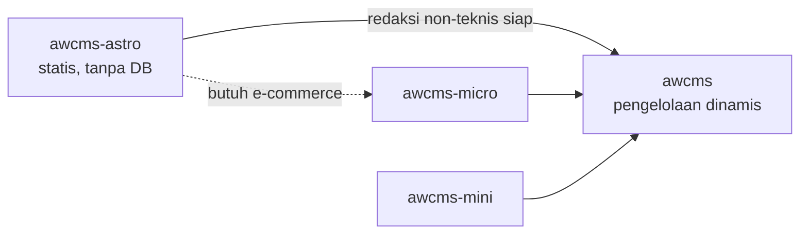

# awcms-astro

Standar keluarga AWCMS untuk **situs statis Astro**: situs informasi publik yang kontennya dikelola lewat repo, tanpa basis data dan tanpa runtime server, dengan jalur perpindahan terdokumentasi ke pengelolaan dinamis `awcms`.

Repo `ahliweb/awcms-astro` adalah implementasi rujukan standar ini. Standarnya sendiri tidak lahir di atas kertas: ia diekstraksi dari `web-lalulintasmelayani.com`, situs enam bahasa yang sudah berjalan di produksi, tempat setiap aturan di bawah lebih dulu dibuktikan.

> **Satu perbedaan yang harus dibaca lebih dulu.** Repo rujukan itu menyimpan kontennya sebagai markdown di dalam repo. Template ini menariknya dari `awcms` saat build. Aturan tentang KONTEN karena itu berpindah tempat penegakannya — dari Zod dan gerbang audit di repo, ke validasi API dan quality checklist di CMS. Lihat [`integrasi-awcms.md`](integrasi-awcms.md) §"Yang paling berisiko hilang saat migrasi".

Positioning ini ditetapkan [ADR-0012](../adr/0012-repo-sebagai-standar-awcms-astro.md).

## Posisi di keluarga AWCMS

| Template | Mode | Basis data | Kapan dipakai | Status |
| --- | --- | --- | --- | --- |
| **`awcms-astro`** | Statis murni (SSG) | Tidak ada | Situs informasi publik, profil, dokumentasi, portal panduan. Konten dikelola lewat repo dan review | **Dikembangkan** |
| `awcms` | Online-first, superset ERP/SaaS | PostgreSQL | Back-office, ERP, multi-tenant | **Dikembangkan** |
| `awcms-micro` | Online penuh, ramping | PostgreSQL | Website/e-commerce yang butuh konten dinamis sejak awal | Referensi (dibekukan 31 Juli 2026) |
| `awcms-mini` | Hybrid offline-first | PostgreSQL | Operasional lapangan dengan koneksi tidak dapat diandalkan | Referensi (dibekukan 31 Juli 2026) |

Dua baris terbawah masih menyatakan **kapan sebuah template cocok dipakai** —
itu tidak berubah. Yang berubah adalah ke mana perubahan boleh dikirim: sejak
31 Juli 2026 hanya `awcms-astro` dan `awcms` yang dikembangkan. Diagram di bawah
karena itu menggambarkan jalur perpindahan yang tersedia, bukan repo yang aktif.

**Perpindahan bukan pembongkaran.** `awcms-astro` sengaja dirancang agar kontrak kontennya bisa dipetakan ke content model `awcms` tanpa menyentuh komponen render — lihat [`integrasi-awcms.md`](integrasi-awcms.md).

## Kapan memilih awcms-astro

Pilih bila **seluruhnya** benar:

- Konten berubah dalam hitungan minggu atau bulan, bukan menit.
- Tidak ada data per-pengguna, autentikasi, atau transaksi.
- Perubahan konten memang **seharusnya** melewati review — informasi hukum, tarif resmi, panduan prosedur.
- Pembaca berada di jaringan yang tidak dapat diandalkan.

Jangan pilih bila ada satu saja:

- Konten harus disunting non-teknis **sekarang**, bukan nanti.
- Ada pencarian, komentar, form, atau personalisasi.
- Ada katalog produk dengan stok atau harga yang berubah harian.

Ragu? Mulai dari `awcms-astro`. Perpindahan ke `awcms` terdokumentasi; perjalanan sebaliknya — membongkar basis data yang tidak pernah dibutuhkan — jauh lebih mahal.

## Divergence yang disengaja dari keluarga

Keluarga AWCMS bersifat **Bun-only** dan **PostgreSQL + RLS wajib**. Sejak [ADR-0015](../adr/0015-runtime-bun-menutup-divergence-keluarga.md) repo ini **tidak lagi menyimpang soal runtime** — ia Bun-only seperti sibling-nya. Yang tersisa adalah divergence yang lahir dari tidak adanya basis data, dan itu disengaja:

| Aspek | Keluarga | awcms-astro | Alasan |
| --- | --- | --- | --- |
| ~~Runtime~~ | Bun | **Bun** — divergence DITUTUP oleh [ADR-0015](../adr/0015-runtime-bun-menutup-divergence-keluarga.md) | Repo ini kini Bun-only seperti seluruh keluarga: `bun.lock`, `bun test`, `oven/bun` di image, `package-ecosystem: bun` di Dependabot |
| Basis data | PostgreSQL + RLS | **Tidak ada** | Tidak ada data tenant-scoped. Kontrol akses ditegakkan review repo, bukan RLS |
| Kontrak API | OpenAPI/AsyncAPI wajib | **Tidak berlaku** | Tidak ada API. Kontraknya adalah frontmatter (`content.config.ts`) |
| Idempotency, audit trail, outbox | Wajib pada mutation | **Tidak berlaku** | Tidak ada mutation runtime |

Divergence yang tersisa berlaku **selama repo tetap tanpa basis data**. Saat sebuah situs di atas template ini mulai menyimpan data tenant-scoped sendiri, seluruh kontrol keluarga kembali berlaku penuh.

[ADR-0014](../adr/0014-rendering-campuran-dan-bff-portal.md) (Jualanku.info) memberi batas yang presisi untuk kasus pertama yang benar-benar butuh sesi: `output` **tetap** `static`, adapter dipasang, dan hanya rute portal yang menjadi on-demand. Datanya tetap milik `awcms` — kontrol keluarga (idempotency, audit, otorisasi, RLS) dijalankan di sana, **bukan** dipindahkan ke repo ini.

Yang **tidak** menyimpang dan wajib diikuti: `AGENTS.md` sebagai kontrak kerja, `docs/adr/`, Conventional Commits, changeset, Definition of Done, larangan secret di repo, dan gerbang CI.

## Isi standar ini

| Dokumen | Isi |
| --- | --- |
| [`standar-teknis.md`](standar-teknis.md) | Aturan teknis yang mengikat: stack, struktur, i18n, konten, aset, SEO, gerbang mutu |
| [`ui-ux-design-system.md`](ui-ux-design-system.md) | Design token, komponen, aksesibilitas, dan pemetaannya ke kosakata AWCMS |
| [`integrasi-awcms.md`](integrasi-awcms.md) | Kontrak perpindahan ke pengelolaan dinamis: content model, adapter, batas tanggung jawab |
| [`checklist-repo-baru.md`](checklist-repo-baru.md) | Langkah memulai situs baru di atas standar ini |
| [`jualanku/`](jualanku/README.md) | **Blueprint** experience layer Jualanku.info: rendering campuran, BFF, peta rute/UI, kesiapan ([ADR-0014](../adr/0014-rendering-campuran-dan-bff-portal.md)) — rencana, belum diimplementasikan |

## Apa yang membuat standar ini berbeda

Tiga hal yang tidak lazim, dan justru menjadi intinya:

1. **Aturan konten punya penegak.** Kepatuhan yang hanya tertulis akan dilanggar — itu terbukti di repo rujukan. `bun run audit` memeriksa kelengkapan sumber, konsistensi antar locale, keunikan gambar, metadata SEO, dan tautan mati, lalu menggagalkan rilis. Lihat [ADR-0008](../adr/0008-audit-konten-sebagai-gerbang-rilis.md).

2. **Multi-locale tanpa halaman pincang.** Kumpulan slug ditentukan satu locale sumber; sisanya jatuh ke sana dengan penanda yang jujur. Tidak pernah ada 404 antar bahasa dan tidak pernah ada nama key mentah yang tampil. Lihat [ADR-0003](../adr/0003-enam-locale-dengan-fallback.md).

3. **Batas etis ditulis sebagai aturan teknis, bukan imbauan.** Larangan skrip pihak ketiga, larangan mengumpulkan data pribadi, dan kewajiban penutur asli untuk bahasa daerah diikat di `AGENTS.md` dan diperiksa gerbang — sehingga agen AI yang bekerja di repo menolak melanggarnya, bukan menemukannya terlambat.
