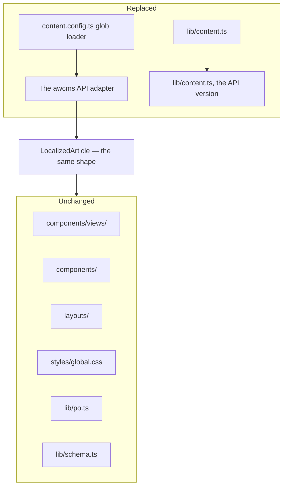
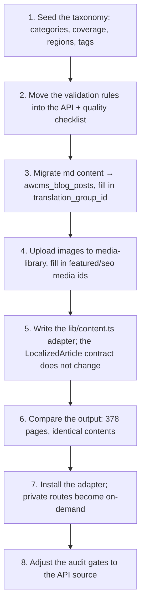

🇬🇧 English (source) · 🇮🇩 [Bahasa Indonesia](integrasi-awcms.id.md)

# awcms-astro → awcms integration

The contract for moving from markdown content in the repo to **dynamic management** through the [`ahliweb/awcms`](https://github.com/ahliweb/awcms) framework.

This document settles the data model mapping, the boundary of responsibility, and the migration order — **before** its adapter is built, so today's content structure does not close off its path. That was in fact its purpose from the reference repo's ADR-0001.

> **Status: ALREADY HAPPENED for content, still planned for the rest.** Until 4 August 2026 this line read "There is no adapter yet" — and was contradicted by this very file 120 lines below, which writes "that move has already happened in `awcms-astro`". The second is the true one:
>
> - **Already landed:** the [`src/lib/content.ts`](../../src/lib/content.ts) adapter pulls content from `awcms` at build time through the build feed ([ADR-0018](../adr/0018-kontrak-build-token-mesin-dan-traversal-konten.md)); article images and share cards from `awcms` media ([ADR-0025](../adr/0025-gambar-artikel-dari-media-awcms.md), [ADR-0026](../adr/0026-kartu-share-per-artikel-dari-media-awcms.md)); the tenant from a machine credential.
> - **Still planned:** the taxonomy mapping, and every row in §"What is most at risk of being lost in migration" — guarantees that in the reference repo were enforced by Zod and audit gates, and whose enforcement **must** live on the `awcms` side.
>
> Reading this document as "nothing exists yet" would make somebody rebuild an adapter that already exists. That is the defect class `awcms` [ADR-0062](https://github.com/ahliweb/awcms/blob/main/docs/adr/0062-skills-are-gated-against-the-code-they-describe.md) names as its reason for gating skills against their code: a "does not exist yet" sentence starts out true, then the thing gets built, and the sentence ages into a confident lie.

## When this integration is triggered

Not because the technology is interesting. Its trigger is one thing: **there is a non-technical editorial team ready to manage content and waiting**.

Supporting signals: a need for scheduled publication, per-article revision history, a multi-person review flow, or managing several sites in one tenant. As long as content is still changed by people comfortable with git, static remains the cheaper and safer choice.

## What changes and what does not



**The whole render layer is untouched.** That is the consequence of a rule in force from the start: components receive data through props and never fetch their own. What is replaced is only their data source.

| Layer | Its fate |
| --- | --- |
| `src/components/`, `views/`, `layouts/`, `styles/` | Unchanged |
| `src/lib/po.ts`, `schema.ts`, `social-image.ts` | Unchanged |
| `src/lib/content.ts` | Replaced: reads the API, not `getCollection` |
| `src/content.config.ts` | Replaced by the API contract + server-side validation |
| `src/content/*.md` | A one-way migration into `awcms_blog_posts` |
| `src/data/*.ts` | Becomes taxonomy/terms or stays static — see below |
| `astro.config.mjs` | `output: 'static'` **stays**; a server adapter is installed and only routes whose prefix is DECLARED use `prerender = false` ([ADR-0014](../adr/0014-rendering-campuran-dan-bff-portal.md) for the Jualanku BFF, [ADR-0034](../adr/0034-publik-secara-bawaan-admin-hanya-bila-dinyatakan.md) for `permukaanAdmin`). "Private" alone is no longer a sufficient condition: `tests/peran-situs.test.mjs` refuses an on-demand route whose prefix is on neither list. The runtime has been Bun since [ADR-0015](../adr/0015-runtime-bun-menutup-divergence-keluarga.md) |

## The data model mapping

The right-hand side refers to the `awcms_blog_posts` table and the `blog-content` module in awcms.

### Fields with a direct column

| `artikelSchema` | awcms column | Note |
| --- | --- | --- |
| `title` | `title` | |
| `description` | `excerpt` + `meta_description` | The 160-character limit is enforced server-side |
| the file name (slug) | `slug` | Slugs are not translated; they stay identical across locales |
| the markdown body | `content_json` + `content_text` | `content_text` is used by `search_vector` |
| `publishedDate` | `published_at` | Mandatory — the adapter refuses to build a `published` post without this column |
| `updatedDate` | `updated_at` | Moves on EVERY write, including a status transition. Read from the same row as `publishedDate` |
| `kategori` (the tab) | `awcms_blog_terms` with a category taxonomy | |
| `tags[]` | `awcms_blog_terms` + `awcms_blog_post_terms` | |
| the locale folder | `locale` | |
| the pairing between locales | `translation_group_id` | One group per slug; the `id` version stays the source of truth |
| the article image | `featured_media_id` | Through the `media-library` module |
| the share card | `seo_image_media_id` | A separate column, already existing — used as-is |
| the canonical | `canonical_url` | |

### Domain-specific fields — with no column

`cakupan`, `syaratDokumen[]`, `langkah[]`, `biaya[]`, `dasarHukum[]`, `faq[]`, `wilayah[]`, `variasiWilayah`, `estimasiWaktu`, `unitPelaksana`, `reviewDueDate`.

> **What this template actually READS** is a subset of that list:
> `urutan`, `kategori`, `syaratDokumen[]`, `langkah[]`, `biaya[]`,
> `dasarHukum[]`, `faq[]`, `estimasiWaktu`, `reviewDueDate` — exactly the
> `AwcmsAstroBlock` type in `src/lib/content.ts`. The rest (`cakupan`,
> `wilayah[]`, `variasiWilayah`, `unitPelaksana`, `tags[]`) are reference repo
> fields documented here as a mapping design, not as a rendering promise. A site
> may store them in `content_json` — but as long as `AwcmsAstroBlock` does not
> name them, not one page displays them. The article layout once read
> `variasiWilayah` and `unitPelaksana` as though both existed; both were always
> `undefined`, and `entry: any` meant the typecheck could not say so.

Two paths, and the choice decides whether that data can be searched and filtered:

| Path | For | Consequence |
| --- | --- | --- |
| **A taxonomy term** (`awcms_blog_terms`) | `cakupan`, `wilayah[]`, `tags[]` | Filterable and indexable; needs seeded terms |
| **A namespaced `content_json`** | `syaratDokumen`, `langkah`, `biaya`, `dasarHukum`, `faq`, `estimasiWaktu`, `unitPelaksana`, `reviewDueDate` | Flexible, but **not validated by the database** |

The recommended shape in `content_json`:

```json
{
  "blocks": [ /* the article body */ ],
  "awcmsAstro": {
    "schemaVersion": 1,
    "reviewDueDate": "2027-01-28",
    "estimasiWaktu": "…",
    "unitPelaksana": "…",
    "syaratDokumen": ["…"],
    "langkah": ["…"],
    "biaya": [{ "item": "…", "nominal": "…", "jenis": "pnbp", "sumber": "…" }],
    "dasarHukum": ["…"],
    "faq": [{ "q": "…", "a": "…" }]
  }
}
```

`schemaVersion` is not decoration: once data lives in jsonb it will change shape, and without a version marker its migration becomes guesswork.

### The `src/data/` reference data

`wilayah-kalteng.ts` and `unit-layanan.ts` do **not** have to move. Both change rarely and are not editorial work.

The recommendation: **regions become taxonomy terms** (so they can be filtered alongside articles), **service units stay static** until somebody genuinely manages them from an interface. Moving data that has no manager only moves the place where it goes stale.

## What is most at risk of being lost in migration

This is the most important part of this document.

In the reference repo — content as markdown, before the move — content guarantees were enforced **at build time**: Zod in `content.config.ts` refused wrong frontmatter, and `bun run audit` refused violations of the domain rules. Once content moves into a database, **the build no longer sees its contents** — articles are created through an interface, at any time, by anyone authorised.

That move has already happened in `awcms-astro`: there is no `content.config.ts`, no frontmatter, and no content audit gate. The table below is therefore not a plan waiting to happen — it is a list of guarantees that **are currently enforced by nobody on this side**, and whose enforcement has to exist in `awcms`.

Without their replacements, all of the following guarantees vanish in silence:

| Today's guarantee | Enforced by | Must move to |
| --- | --- | --- |
| `description` ≤ 160 characters | Zod | API validation |
| Every figure has a `sumber` and a `dasarHukum` | The audit | API validation + the quality checklist |
| An article tagged `pajak-daerah` may not be `nasional` | The audit | API validation |
| At least three FAQs | The audit | The quality checklist |
| Frozen fields identical across locales | The audit | Validation across `translation_group_id` |
| Figures do not change in translation | The audit | Validation across `translation_group_id` |
| Every article has a unique image | The audit | API validation |
| A missed `reviewDueDate` = content debt | The audit | A scheduled report |

awcms already provides the place: the `/api/v1/blog/posts/{id}/quality-checklist` endpoint and the `submit-review` → `publish` flow. **Mapping every rule above onto it is a prerequisite, not follow-up work.** A migration leaving even one rule without an enforcer means lowering the site's quality — and what bears the consequence is a reader at a service counter.

## The adapter contract

The shape any data source must produce, already used by `src/lib/content.ts` today:

```ts
interface LocalizedArticle {
  slug: string;
  entry: {
    id: string;
    data: ArtikelData;
    /** Rendered ONCE in the adapter from structured blocks — never from an HTML field. */
    bodyHtml: string;
  };
  /** true when this locale's article does not exist and the default version is used. */
  isFallback: boolean;
  /** The article image from awcms media, resolved once per build. `undefined` is supported. */
  gambar?: { src: string; alt: string; width: number | null; height: number | null };
  /** The article's share card, with its OWN MIME type and dimensions (ADR-0026). */
  kartuShare?: {
    src: string;
    alt: string;
    type: string;
    width: number | null;
    height: number | null;
  };
}

getArticles(tab: TabSlug, locale: Locale): Promise<LocalizedArticle[]>
```

The last three fields landed after this document was first written, and **all three
are part of the contract** — not optional extras. `bodyHtml` is what makes there be
no raw HTML path from the CMS; `gambar` and `kartuShare` are what make a component
never need to fetch its own data, because media are resolved one batch per build
rather than one request per rendered card.

Rules an API adapter must preserve:

1. **The set of slugs is decided by the default locale.** The query pulls every `locale = 'id'` article with status `published`, then finds its pairs through `translation_group_id`. Not a pull per locale — that would make the page count differ between languages and revive 404s between them.
2. **`isFallback` is computed by the adapter**, not by a component. Components only read it.
3. **Ordering comes from a DECLARED field**, not from the order the database returned — and which field belongs to its section ([ADR-0033](../adr/0033-seksi-berita-urutan-dari-tanggal-dan-dua-tanggal-yang-terpisah.md)). A section with `urutanSeksi: "manual"` reads the editors' `urutan`; a `"terbaru"` section reads `publishedAt` descending, at parity with `ORDER BY published_at DESC` on awcms's own public routes. Both end on the SOURCE slug as their tiebreaker, because the slug is the only key that is unique per article and identical in every locale.
4. **Only posts awcms itself serves publicly** enter the build: `status = 'published'`, `visibility = 'public'`, and a `published_at` that exists. Drafts and scheduled posts may not leak into the static output — and a `published` post with no `published_at` is answered 404 by awcms, so publishing it here makes two surfaces disagree about what is live.
5. **The publication date and the modification date are TWO claims, read from ONE row.** They were once folded into `publishedAt ?? updatedAt`, freezing `dateModified` at the publication date forever. Pairing the source post's publication date with its translation's modification date is equally broken: it produces a `dateModified` preceding its `datePublished` on valid content.

### The envelope and authentication

awcms uses the envelope `{ success, data }` / `{ success: false, error }`. The tenant is **always** resolved server-side from the session — never from a value the client sent. A static build pulls data through a build-time credential that may only read, never through a key embedded in the output.

"May only read" is a property of the **token we issue**, no longer a property of its class: since `awcms` ADR-0092 (13 August 2026) machine credentials may write, with an action ceiling in code, CIDR binding, and a maximum age of 30 days. This repo's build token is issued with not one write action, and keeping it that way is now a decision that has to be maintained.

### One refusal that cannot be fixed from here

`403 TENANT_SUSPENDED` (`matchedPolicy: "tenant_suspended"`) applies to a tenant with status `suspended` **or** `inactive`, and since `awcms` ADR-0073 it applies to machine credentials — not only to human sessions. It is decided **before** permissions are looked up, so widening a token's scope changes nothing; the build fails completely, zero files published.

Its difference from a defective token settles what has to be done: a defective token is fixed by issuing a new one, whereas this refusal is a state of the **tenant** and can only be resolved in `awcms`.

**`403 ENTITLEMENT_REQUIRED` cannot yet reach this build**, and that needs writing down so it is not guessed in either direction. Entitlements are decided per MODULE (`awcms` ADR-0084), and the only `awcms` module declaring `requiresEntitlement` today is `tenant_domain` — for `custom_domain`, which is in the DEFAULT package and so refuses nobody. This build only calls `blog_content` and `media_library`. It is named here because the **shape** of its refusal is identical — above the grant lookup, untouched by a token's scope — not because it can already appear in a log.

## The migration order



**Step 2 before step 3.** Moving the content first means a period during which articles can be created with not one rule guarding them — and that period is never as short as planned.

**Step 6 may not be skipped.** Compare the old and new static output page by page. A difference that cannot be explained is a migration bug, not an "improvement".

## What remains awcms-astro's responsibility

Moving the data source does not move responsibility for presentation:

- SEO metadata, hreflang, structured data, and share cards are still built on the Astro side from the data received. What they are built ABOUT is no longer the template's to decide: since awcms #596 the site's own identity — name, publisher, logo, favicon, tagline, copyright line, editorial address, contact details, social profiles — comes from `site_profile` through `src/lib/awcms/profil.ts`, and `src/lib/identitas.ts` is the one place that decides what each field falls back to when a tenant has not set it.
- The accessibility and no-JavaScript rules still apply in full.
- The PO catalogues for interface strings stay in the repo. They are not editorial content — they are part of the interface, and their translators are native speakers, not tenant admins.
- The bans on third-party scripts, collecting personal data, and using an institution's official attributes **still apply** and may not be loosened by a new capability the CMS brings.

## The relevant awcms modules

| Module | Used for |
| --- | --- |
| `blog-content` | Articles, pages, menus, revisions, scheduling, the quality checklist |
| `media-library` | Article images and share cards |
| `seo-distribution` | Redirects, 404 monitoring, per-tenant SEO settings |
| `site-profile` | Who the site IS — read once per build through `GET /api/v1/site-profile/composed`, which merges this module's half with `seo-distribution`'s so a template never learns the split exists |
| `tenant-domain` | Public domain mapping |
| `site-search` | Search — only once the number of articles exceeds what navigation can cover |
| `theming` | Per-tenant theme preferences, joining the theming chain in the [design system](ui-ux-design-system.md#theming) |
| `comments`, `form-drafts` | **Not used** — they conflict with the ban on collecting reader data. Enable them only through a new ADR |

## The awcms `/admin/*` screens — and why the list is here

[ADR-0034](../adr/0034-publik-secara-bawaan-admin-hanya-bila-dinyatakan.md) §4 requires every feature on a site's USER admin surface to **also** be manageable by an `owner` through `awcms`'s own `/admin/*`, and states plainly that this rule **cannot be machine-verified from this repo**: the permission catalogue and the screen registry live over there. What can be done here is to supply the material, so that judgement is not made from memory.

As of 15 August 2026 `awcms` serves **41 top-level `/admin/*` screen files** — one of which is `index.astro`, that is `/admin` itself — out of **43 screen files** in total; two of them are nested (`modules/[moduleKey].astro` and `tenant/domains.astro`). The one that arrived since the 13 August count is `/admin/account` (`awcms` ADR-0096), and it is the first addition in a while that lands in the table below rather than in the SYSTEM list under it. Those **relevant** as the manager of a USER admin surface — meaning the feature behind them can be switched off by an `owner` today:

| `awcms` screen | The manager for |
| --- | --- |
| `/admin/blog`, `/admin/blog-pages` | writing and editing articles/pages |
| `/admin/blog-taxonomy`, `/admin/blog-presentation`, `/admin/blog-settings` | categories/tags, section presentation, publication settings |
| `/admin/approvals` | submitting for review and approving |
| `/admin/media` | image and share card uploads |
| `/admin/profiles`, `/admin/registrations`, `/admin/invitations` | user profiles, registrations, invitations |
| `/admin/comments` | comments — only if a site enables them through an ADR of its own |
| `/admin/account` | a person's OWN account — display name, language, password, sessions, MFA (`awcms` ADR-0096) |

That last row is the odd one out, and the difference decides whether a screen you draw here works. Every other row names a screen whose feature is **permissioned**, so an `owner` switching it off is what makes ADR-0034 §4 satisfiable. `/admin/account` is the opposite by construction: its routes take no parameter that can point at anybody else, so they are deliberately NOT permissioned, and there is nothing for an `owner` to switch off. Projecting it here therefore does not need an `owner` screen to exist behind it — it needs you **not** to invent a permission for it, because an action that is not seeded denies everybody (`awcms` ADR-0058 §E). The permissioned sibling that does exist, `PATCH /api/v1/profiles/{id}`, changes SOMEBODY ELSE'S profile and is administrative; it is `/admin/profiles` in the row above, not this one.

The rest are **SYSTEM** admin and **may have no projection here**, however easy they would be to draw: `/admin/modules`, `/admin/roles`, `/admin/users`, `/admin/user-groups`, `/admin/abac-policies`, `/admin/tenants`, `/admin/audit-trail`, `/admin/domain-events`, `/admin/security`, `/admin/machine-credentials`, `/admin/partners`, `/admin/partner-registry`, `/admin/business-scope`, `/admin/subject-requests`, `/admin/email-suppression`, `/admin/idn-regions`, `/admin/data-lifecycle`, `/admin/sync`, `/admin/tenant/domains`, and every other platform screen. The measure is not who uses it but what it changes — if a screen changes something **outside one site's contents**, it belongs to `awcms` (`awcms` ADR-0070 §1).

**Two of them touch this site's operation directly**, and are therefore named rather than left as rows in a list:

- **`/admin/machine-credentials`** — issuing **and revoking** a build token is now a screen, not a `POST` somebody has to remember when a token leaks. Its plaintext appears **once**, in the issuing response; reloading that page burns a credential that then has to be revoked. Since `awcms` ADR-0092 its form has two different buttons — one minting the read class, the other the write class — and **this repo's token is always the first** ([ADR-0018](../adr/0018-kontrak-build-token-mesin-dan-traversal-konten.md), [ADR-0038](../adr/0038-kebutuhan-backend-menjadi-modul-di-awcms.md) §3).
- **`/admin/subject-requests`** — data subject requests (`awcms` ADR-0094). It is named here because a static site holds a **copy**: an erasure carried out over there touches not one already-published file until the next build. Today this template publishes no per-person data at all, so there is nothing to chase; a site that adds some also adds a rebuild to the end of its erasure path.
