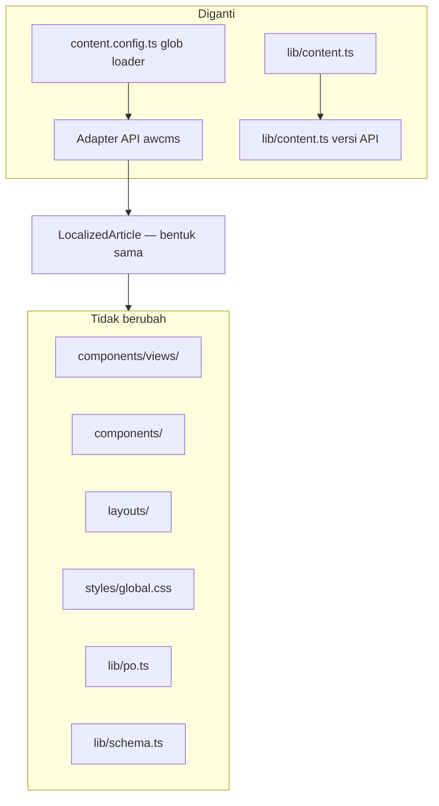
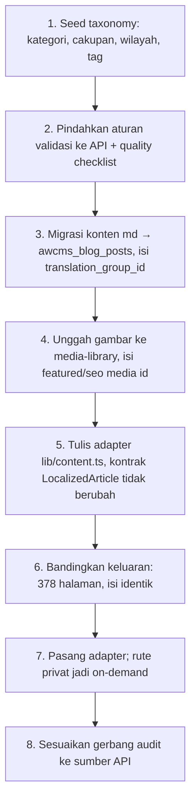

# Integrasi awcms-astro → awcms

Kontrak perpindahan dari konten markdown di repo ke **pengelolaan dinamis** lewat framework [`ahliweb/awcms`](https://github.com/ahliweb/awcms).

Dokumen ini menetapkan pemetaan model data, batas tanggung jawab, dan urutan migrasi — **sebelum** adapter-nya dibangun, supaya struktur konten hari ini tidak menutup jalannya. Itu memang tujuan aslinya sejak [ADR-0001](../adr/0001-situs-statis-astro.md).

> **Status: rencana yang mengikat, belum diimplementasikan.** Adapter belum ada. Yang sudah ada adalah kontrak yang membuatnya bisa dibangun tanpa membongkar komponen.

## Kapan integrasi ini dipicu

Bukan karena teknologinya menarik. Pemicunya satu: **ada redaksi non-teknis yang siap mengelola konten dan menunggu**.

Sinyal pendukung: kebutuhan penjadwalan terbit, riwayat revisi per artikel, alur review multi-orang, atau pengelolaan multi-situs dalam satu tenant. Selama konten masih diubah oleh orang yang nyaman dengan git, statis tetap pilihan yang lebih murah dan lebih aman.

## Yang berubah dan yang tidak



**Seluruh lapisan render tidak disentuh.** Itu konsekuensi aturan yang sudah berlaku sejak awal: komponen menerima data lewat props dan tidak pernah mengambil datanya sendiri. Yang diganti hanya sumber datanya.

| Lapisan | Nasib |
| --- | --- |
| `src/components/`, `views/`, `layouts/`, `styles/` | Tidak berubah |
| `src/lib/po.ts`, `schema.ts`, `social-image.ts` | Tidak berubah |
| `src/lib/content.ts` | Diganti: membaca API, bukan `getCollection` |
| `src/content.config.ts` | Diganti kontrak API + validasi sisi server |
| `src/content/*.md` | Migrasi sekali jalan ke `awcms_blog_posts` |
| `src/data/*.ts` | Menjadi taxonomy/term atau tetap statis — lihat di bawah |
| `astro.config.mjs` | `output: 'static'` **tetap**; adapter server dipasang dan hanya rute privat memakai `prerender = false` ([ADR-0014](../adr/0014-rendering-campuran-dan-bff-portal.md)). Runtime sudah Bun sejak [ADR-0015](../adr/0015-runtime-bun-menutup-divergence-keluarga.md) |

## Pemetaan model data

Sisi kanan mengacu tabel `awcms_blog_posts` dan modul `blog-content` di awcms.

### Field yang punya kolom langsung

| `artikelSchema` | Kolom awcms | Catatan |
| --- | --- | --- |
| `title` | `title` | |
| `description` | `excerpt` + `meta_description` | Batas 160 karakter ditegakkan sisi server |
| nama berkas (slug) | `slug` | Slug tidak diterjemahkan; tetap identik lintas locale |
| badan markdown | `content_json` + `content_text` | `content_text` dipakai `search_vector` |
| `updatedDate` | `updated_at` / `published_at` | |
| `kategori` (tab) | `awcms_blog_terms` bertaksonomi kategori | |
| `tags[]` | `awcms_blog_terms` + `awcms_blog_post_terms` | |
| locale folder | `locale` | |
| pasangan antar locale | `translation_group_id` | Satu grup per slug; versi `id` tetap sumber kebenaran |
| gambar artikel | `featured_media_id` | Lewat modul `media-library` |
| kartu share | `seo_image_media_id` | Kolom terpisah, sudah ada — dipakai apa adanya |
| canonical | `canonical_url` | |

### Field khas domain — tidak punya kolom

`cakupan`, `syaratDokumen[]`, `langkah[]`, `biaya[]`, `dasarHukum[]`, `faq[]`, `wilayah[]`, `variasiWilayah`, `estimasiWaktu`, `unitPelaksana`, `reviewDueDate`.

Dua jalur, dan pilihannya menentukan apakah data itu bisa dicari dan difilter:

| Jalur | Untuk | Konsekuensi |
| --- | --- | --- |
| **Taxonomy term** (`awcms_blog_terms`) | `cakupan`, `wilayah[]`, `tags[]` | Bisa difilter dan diindeks; butuh seed term |
| **`content_json` bernamespace** | `syaratDokumen`, `langkah`, `biaya`, `dasarHukum`, `faq`, `estimasiWaktu`, `unitPelaksana`, `reviewDueDate` | Fleksibel, tetapi **tidak divalidasi basis data** |

Bentuk yang disarankan di `content_json`:

```json
{
  "blocks": [ /* badan artikel */ ],
  "awcmsAstro": {
    "schemaVersion": 1,
    "reviewDueDate": "2027-01-28",
    "estimasiWaktu": "…",
    "unitPelaksana": "…",
    "syaratDokumen": ["…"],
    "langkah": ["…"],
    "biaya": [{ "item": "…", "nominal": "…", "jenis": "pnbp", "sumber": "…" }],
    "dasarHukum": ["…"],
    "faq": [{ "q": "…", "a": "…" }]
  }
}
```

`schemaVersion` bukan hiasan: begitu data hidup di jsonb, ia akan berubah bentuk, dan tanpa penanda versi migrasinya menjadi tebakan.

### Data referensi `src/data/`

`wilayah-kalteng.ts` dan `unit-layanan.ts` **tidak wajib** ikut pindah. Keduanya jarang berubah dan bukan pekerjaan redaksi.

Rekomendasi: **wilayah menjadi taxonomy term** (agar bisa difilter bersama artikel), **unit layanan tetap statis** sampai ada yang benar-benar mengelolanya dari antarmuka. Memindahkan data yang tidak ada pengelolanya hanya memindahkan tempat ia menjadi basi.

## Yang paling berisiko hilang saat migrasi

Ini bagian terpenting dokumen ini.

Hari ini, jaminan konten ditegakkan **saat build**: Zod di `content.config.ts` menolak frontmatter yang salah, dan `bun run audit` menolak pelanggaran aturan domain. Begitu konten pindah ke basis data, **build tidak lagi melihat isinya** — artikel dibuat lewat antarmuka, kapan saja, oleh siapa saja yang berwenang.

Tanpa penggantinya, seluruh jaminan berikut lenyap dalam senyap:

| Jaminan hari ini | Ditegakkan oleh | Wajib pindah ke |
| --- | --- | --- |
| `description` ≤ 160 karakter | Zod | Validasi API |
| Setiap nominal punya `sumber` dan `dasarHukum` | Audit | Validasi API + quality checklist |
| Artikel ber-`pajak-daerah` tidak boleh `nasional` | Audit | Validasi API |
| Minimal tiga FAQ | Audit | Quality checklist |
| Field beku identik antar locale | Audit | Validasi lintas `translation_group_id` |
| Angka nominal tidak berubah saat diterjemahkan | Audit | Validasi lintas `translation_group_id` |
| Setiap artikel punya gambar unik | Audit | Validasi API |
| `reviewDueDate` terlewat = utang konten | Audit | Laporan terjadwal |

awcms sudah menyediakan tempatnya: endpoint `/api/v1/blog/posts/{id}/quality-checklist` dan alur `submit-review` → `publish`. **Memetakan setiap aturan di atas ke sana adalah prasyarat, bukan pekerjaan susulan.** Migrasi yang menyisakan satu saja aturan tanpa penegak berarti menurunkan mutu situs — dan yang menanggung akibatnya pembaca di loket layanan.

## Kontrak adapter

Bentuk yang harus dihasilkan sumber data mana pun, sudah dipakai `src/lib/content.ts` hari ini:

```ts
interface LocalizedArticle {
  slug: string;
  entry: { id: string; data: ArtikelData };
  /** true bila artikel locale ini belum ada dan yang dipakai versi default. */
  isFallback: boolean;
}

getArticles(tab: TabSlug, locale: Locale): Promise<LocalizedArticle[]>
```

Aturan yang wajib dipertahankan adapter API:

1. **Kumpulan slug ditentukan locale default.** Query menarik seluruh artikel `locale = 'id'` berstatus `published`, lalu mencari pasangannya lewat `translation_group_id`. Bukan menarik per locale — itu akan membuat jumlah halaman berbeda antar bahasa dan menghidupkan kembali 404 antar bahasa.
2. **`isFallback` dihitung adapter**, bukan komponen. Komponen hanya membacanya.
3. **Urutan dari field urutan**, bukan dari urutan yang dikembalikan basis data.
4. **Hanya `status = 'published'`** yang masuk build. Draft dan scheduled tidak boleh bocor ke statis.

### Envelope dan autentikasi

awcms memakai envelope `{ success, data }` / `{ success: false, error }`. Tenant **selalu** diresolusi sisi server dari sesi — tidak pernah dari nilai yang dikirim klien. Build statis menarik data lewat kredensial build-time yang hanya boleh membaca, tidak pernah lewat kunci yang tertanam di keluaran.

## Urutan migrasi



**Langkah 2 sebelum langkah 3.** Memindahkan konten lebih dulu berarti ada periode ketika artikel bisa dibuat tanpa satu pun aturan menjaganya — dan periode itu tidak pernah sesingkat yang direncanakan.

**Langkah 6 tidak boleh dilewati.** Bandingkan keluaran statis lama dan baru halaman per halaman. Perbedaan yang tidak dapat dijelaskan adalah bug migrasi, bukan "perbaikan".

## Yang tetap menjadi tanggung jawab awcms-astro

Perpindahan sumber data tidak memindahkan tanggung jawab presentasi:

- Metadata SEO, hreflang, structured data, dan kartu share tetap dibangun sisi Astro dari data yang diterima.
- Aturan aksesibilitas dan tanpa-JavaScript tetap berlaku penuh.
- Katalog PO untuk string antarmuka tetap di repo. Ia bukan konten redaksi — ia bagian dari antarmuka, dan penerjemahnya penutur asli, bukan admin tenant.
- Larangan skrip pihak ketiga, pengumpulan data pribadi, dan atribut resmi instansi **tetap berlaku** dan tidak boleh dilonggarkan oleh kemampuan baru yang dibawa CMS.

## Modul awcms yang relevan

| Modul | Dipakai untuk |
| --- | --- |
| `blog-content` | Artikel, halaman, menu, revisi, penjadwalan, quality checklist |
| `media-library` | Gambar artikel dan kartu share |
| `seo-distribution` | Redirect, pemantauan 404, pengaturan SEO per tenant |
| `tenant-domain` | Pemetaan domain publik |
| `site-search` | Pencarian — hanya bila jumlah artikel sudah melampaui apa yang bisa dijelajahi navigasi |
| `theming` | Preferensi tema per tenant, menyambung rantai theming di [design system](ui-ux-design-system.md#theming) |
| `comments`, `form-drafts` | **Tidak dipakai** — bertentangan dengan larangan mengumpulkan data pembaca. Aktifkan hanya lewat ADR baru |
