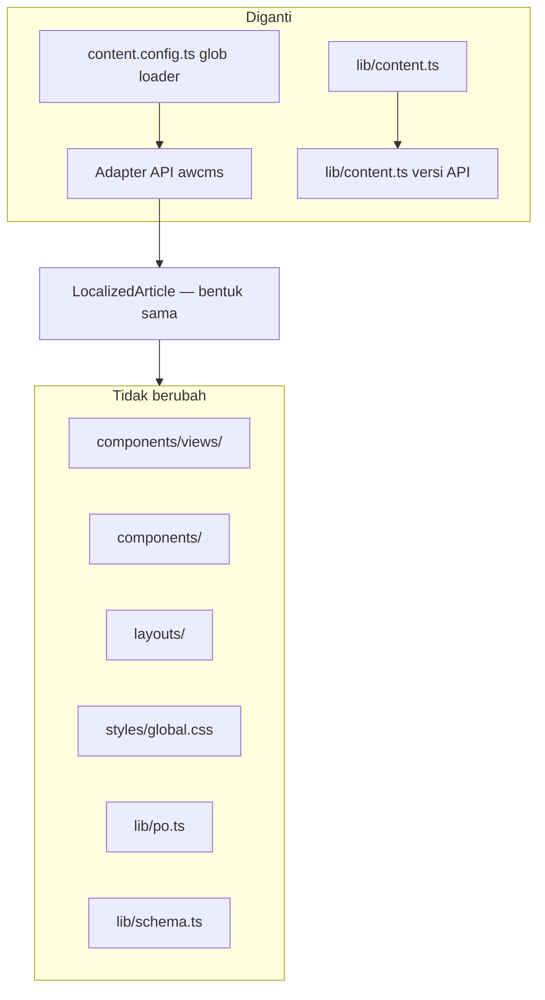
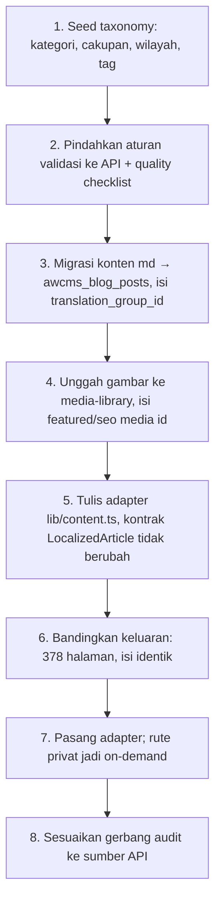

# Integrasi awcms-astro → awcms

Kontrak perpindahan dari konten markdown di repo ke **pengelolaan dinamis** lewat framework [`ahliweb/awcms`](https://github.com/ahliweb/awcms).

Dokumen ini menetapkan pemetaan model data, batas tanggung jawab, dan urutan migrasi — **sebelum** adapter-nya dibangun, supaya struktur konten hari ini tidak menutup jalannya. Itu memang tujuan aslinya sejak ADR-0001 repo rujukan.

> **Status: SUDAH TERJADI untuk konten, masih rencana untuk sisanya.** Sampai 4 Agustus 2026 baris ini berbunyi "Adapter belum ada" — dan dibantah oleh berkas ini sendiri 120 baris di bawah, yang menulis "perpindahan itu sudah terjadi di `awcms-astro`". Yang benar adalah yang kedua:
>
> - **Sudah mendarat:** adapter [`src/lib/content.ts`](../../src/lib/content.ts) menarik konten dari `awcms` saat build lewat build feed ([ADR-0018](../adr/0018-kontrak-build-token-mesin-dan-traversal-konten.md)); gambar artikel dan kartu share dari media `awcms` ([ADR-0025](../adr/0025-gambar-artikel-dari-media-awcms.md), [ADR-0026](../adr/0026-kartu-share-per-artikel-dari-media-awcms.md)); tenant dari kredensial mesin.
> - **Masih rencana:** pemetaan taxonomy, seluruh baris di §"Yang paling berisiko hilang saat migrasi" — jaminan yang di repo rujukan ditegakkan Zod dan gerbang audit, dan yang penegakannya **harus** ada di sisi `awcms`.
>
> Membaca dokumen ini sebagai "belum ada apa-apa" akan membuat seseorang membangun ulang adapter yang sudah ada. Itu kelas cacat yang `awcms` [ADR-0062](https://github.com/ahliweb/awcms/blob/main/docs/adr/0062-skills-are-gated-against-the-code-they-describe.md) tulis sebagai alasan menggerbangi skill terhadap kodenya: sebuah kalimat "belum ada" mulai benar, lalu barangnya dibangun, dan kalimat itu menua menjadi kebohongan yang percaya diri.

## Kapan integrasi ini dipicu

Bukan karena teknologinya menarik. Pemicunya satu: **ada redaksi non-teknis yang siap mengelola konten dan menunggu**.

Sinyal pendukung: kebutuhan penjadwalan terbit, riwayat revisi per artikel, alur review multi-orang, atau pengelolaan multi-situs dalam satu tenant. Selama konten masih diubah oleh orang yang nyaman dengan git, statis tetap pilihan yang lebih murah dan lebih aman.

## Yang berubah dan yang tidak



**Seluruh lapisan render tidak disentuh.** Itu konsekuensi aturan yang sudah berlaku sejak awal: komponen menerima data lewat props dan tidak pernah mengambil datanya sendiri. Yang diganti hanya sumber datanya.

| Lapisan | Nasib |
| --- | --- |
| `src/components/`, `views/`, `layouts/`, `styles/` | Tidak berubah |
| `src/lib/po.ts`, `schema.ts`, `social-image.ts` | Tidak berubah |
| `src/lib/content.ts` | Diganti: membaca API, bukan `getCollection` |
| `src/content.config.ts` | Diganti kontrak API + validasi sisi server |
| `src/content/*.md` | Migrasi sekali jalan ke `awcms_blog_posts` |
| `src/data/*.ts` | Menjadi taxonomy/term atau tetap statis — lihat di bawah |
| `astro.config.mjs` | `output: 'static'` **tetap**; adapter server dipasang dan hanya rute yang prefiksnya DINYATAKAN memakai `prerender = false` ([ADR-0014](../adr/0014-rendering-campuran-dan-bff-portal.md) untuk BFF Jualanku, [ADR-0034](../adr/0034-publik-secara-bawaan-admin-hanya-bila-dinyatakan.md) untuk `permukaanAdmin`). "Privat" saja bukan lagi syarat yang cukup: `tests/peran-situs.test.mjs` menolak rute on-demand yang prefiksnya tidak ada di salah satu dari dua daftar itu. Runtime sudah Bun sejak [ADR-0015](../adr/0015-runtime-bun-menutup-divergence-keluarga.md) |

## Pemetaan model data

Sisi kanan mengacu tabel `awcms_blog_posts` dan modul `blog-content` di awcms.

### Field yang punya kolom langsung

| `artikelSchema` | Kolom awcms | Catatan |
| --- | --- | --- |
| `title` | `title` | |
| `description` | `excerpt` + `meta_description` | Batas 160 karakter ditegakkan sisi server |
| nama berkas (slug) | `slug` | Slug tidak diterjemahkan; tetap identik lintas locale |
| badan markdown | `content_json` + `content_text` | `content_text` dipakai `search_vector` |
| `publishedDate` | `published_at` | Wajib ada — adapter menolak membangun post `published` tanpa kolom ini |
| `updatedDate` | `updated_at` | Bergerak pada SETIAP tulis, termasuk transisi status. Dibaca dari baris yang sama dengan `publishedDate` |
| `kategori` (tab) | `awcms_blog_terms` bertaksonomi kategori | |
| `tags[]` | `awcms_blog_terms` + `awcms_blog_post_terms` | |
| locale folder | `locale` | |
| pasangan antar locale | `translation_group_id` | Satu grup per slug; versi `id` tetap sumber kebenaran |
| gambar artikel | `featured_media_id` | Lewat modul `media-library` |
| kartu share | `seo_image_media_id` | Kolom terpisah, sudah ada — dipakai apa adanya |
| canonical | `canonical_url` | |

### Field khas domain — tidak punya kolom

`cakupan`, `syaratDokumen[]`, `langkah[]`, `biaya[]`, `dasarHukum[]`, `faq[]`, `wilayah[]`, `variasiWilayah`, `estimasiWaktu`, `unitPelaksana`, `reviewDueDate`.

> **Yang benar-benar DIBACA template ini** adalah bagian dari daftar itu:
> `urutan`, `kategori`, `syaratDokumen[]`, `langkah[]`, `biaya[]`,
> `dasarHukum[]`, `faq[]`, `estimasiWaktu`, `reviewDueDate` — persis tipe
> `AwcmsAstroBlock` di `src/lib/content.ts`. Sisanya (`cakupan`, `wilayah[]`,
> `variasiWilayah`, `unitPelaksana`, `tags[]`) adalah field repo rujukan yang
> didokumentasikan di sini sebagai rancangan pemetaan, bukan sebagai janji
> render. Sebuah situs boleh menyimpannya di `content_json` — tetapi selama
> `AwcmsAstroBlock` belum menyebutnya, tidak ada satu pun halaman yang
> menampilkannya. Layout artikel pernah membaca `variasiWilayah` dan
> `unitPelaksana` seolah keduanya ada; keduanya selalu `undefined`, dan
> `entry: any` membuat typecheck tidak bisa mengatakannya.

Dua jalur, dan pilihannya menentukan apakah data itu bisa dicari dan difilter:

| Jalur | Untuk | Konsekuensi |
| --- | --- | --- |
| **Taxonomy term** (`awcms_blog_terms`) | `cakupan`, `wilayah[]`, `tags[]` | Bisa difilter dan diindeks; butuh seed term |
| **`content_json` bernamespace** | `syaratDokumen`, `langkah`, `biaya`, `dasarHukum`, `faq`, `estimasiWaktu`, `unitPelaksana`, `reviewDueDate` | Fleksibel, tetapi **tidak divalidasi basis data** |

Bentuk yang disarankan di `content_json`:

```json
{
  "blocks": [ /* badan artikel */ ],
  "awcmsAstro": {
    "schemaVersion": 1,
    "reviewDueDate": "2027-01-28",
    "estimasiWaktu": "…",
    "unitPelaksana": "…",
    "syaratDokumen": ["…"],
    "langkah": ["…"],
    "biaya": [{ "item": "…", "nominal": "…", "jenis": "pnbp", "sumber": "…" }],
    "dasarHukum": ["…"],
    "faq": [{ "q": "…", "a": "…" }]
  }
}
```

`schemaVersion` bukan hiasan: begitu data hidup di jsonb, ia akan berubah bentuk, dan tanpa penanda versi migrasinya menjadi tebakan.

### Data referensi `src/data/`

`wilayah-kalteng.ts` dan `unit-layanan.ts` **tidak wajib** ikut pindah. Keduanya jarang berubah dan bukan pekerjaan redaksi.

Rekomendasi: **wilayah menjadi taxonomy term** (agar bisa difilter bersama artikel), **unit layanan tetap statis** sampai ada yang benar-benar mengelolanya dari antarmuka. Memindahkan data yang tidak ada pengelolanya hanya memindahkan tempat ia menjadi basi.

## Yang paling berisiko hilang saat migrasi

Ini bagian terpenting dokumen ini.

Di repo rujukan — konten sebagai markdown, sebelum perpindahan — jaminan konten ditegakkan **saat build**: Zod di `content.config.ts` menolak frontmatter yang salah, dan `bun run audit` menolak pelanggaran aturan domain. Begitu konten pindah ke basis data, **build tidak lagi melihat isinya** — artikel dibuat lewat antarmuka, kapan saja, oleh siapa saja yang berwenang.

Perpindahan itu sudah terjadi di `awcms-astro`: tidak ada `content.config.ts`, tidak ada frontmatter, dan tidak ada gerbang audit konten. Tabel di bawah karena itu bukan rencana yang menunggu — ia daftar jaminan yang **saat ini tidak ditegakkan siapa pun di sisi ini**, dan yang penegakannya harus ada di `awcms`.

Tanpa penggantinya, seluruh jaminan berikut lenyap dalam senyap:

| Jaminan hari ini | Ditegakkan oleh | Wajib pindah ke |
| --- | --- | --- |
| `description` ≤ 160 karakter | Zod | Validasi API |
| Setiap nominal punya `sumber` dan `dasarHukum` | Audit | Validasi API + quality checklist |
| Artikel ber-`pajak-daerah` tidak boleh `nasional` | Audit | Validasi API |
| Minimal tiga FAQ | Audit | Quality checklist |
| Field beku identik antar locale | Audit | Validasi lintas `translation_group_id` |
| Angka nominal tidak berubah saat diterjemahkan | Audit | Validasi lintas `translation_group_id` |
| Setiap artikel punya gambar unik | Audit | Validasi API |
| `reviewDueDate` terlewat = utang konten | Audit | Laporan terjadwal |

awcms sudah menyediakan tempatnya: endpoint `/api/v1/blog/posts/{id}/quality-checklist` dan alur `submit-review` → `publish`. **Memetakan setiap aturan di atas ke sana adalah prasyarat, bukan pekerjaan susulan.** Migrasi yang menyisakan satu saja aturan tanpa penegak berarti menurunkan mutu situs — dan yang menanggung akibatnya pembaca di loket layanan.

## Kontrak adapter

Bentuk yang harus dihasilkan sumber data mana pun, sudah dipakai `src/lib/content.ts` hari ini:

```ts
interface LocalizedArticle {
  slug: string;
  entry: {
    id: string;
    data: ArtikelData;
    /** Dirender SEKALI di adapter dari blok terstruktur — tidak pernah dari field HTML. */
    bodyHtml: string;
  };
  /** true bila artikel locale ini belum ada dan yang dipakai versi default. */
  isFallback: boolean;
  /** Gambar artikel dari media awcms, di-resolve sekali per build. `undefined` didukung. */
  gambar?: { src: string; alt: string; width: number | null; height: number | null };
  /** Kartu share artikel, dengan MIME dan ukurannya SENDIRI (ADR-0026). */
  kartuShare?: {
    src: string;
    alt: string;
    type: string;
    width: number | null;
    height: number | null;
  };
}

getArticles(tab: TabSlug, locale: Locale): Promise<LocalizedArticle[]>
```

Tiga field terakhir mendarat sesudah dokumen ini pertama ditulis, dan **ketiganya
bagian dari kontrak** — bukan tambahan opsional. `bodyHtml` yang membuat tidak
ada jalur HTML mentah dari CMS; `gambar` dan `kartuShare` yang membuat komponen
tidak pernah perlu mengambil datanya sendiri, karena media di-resolve satu batch
per build alih-alih satu permintaan per kartu yang dirender.

Aturan yang wajib dipertahankan adapter API:

1. **Kumpulan slug ditentukan locale default.** Query menarik seluruh artikel `locale = 'id'` berstatus `published`, lalu mencari pasangannya lewat `translation_group_id`. Bukan menarik per locale — itu akan membuat jumlah halaman berbeda antar bahasa dan menghidupkan kembali 404 antar bahasa.
2. **`isFallback` dihitung adapter**, bukan komponen. Komponen hanya membacanya.
3. **Urutan dari field yang DINYATAKAN**, bukan dari urutan yang dikembalikan basis data — dan field mana adalah milik seksinya ([ADR-0033](../adr/0033-seksi-berita-urutan-dari-tanggal-dan-dua-tanggal-yang-terpisah.md)). Seksi `urutanSeksi: "manual"` membaca `urutan` redaksi; seksi `"terbaru"` membaca `publishedAt` menurun, paritas dengan `ORDER BY published_at DESC` pada rute publik awcms sendiri. Keduanya berakhir pada slug SUMBER sebagai pemecah seri, karena slug adalah satu-satunya kunci yang unik per artikel sekaligus identik di setiap locale.
4. **Hanya post yang awcms sendiri sajikan publik** yang masuk build: `status = 'published'`, `visibility = 'public'`, dan `published_at` yang ada. Draft dan scheduled tidak boleh bocor ke statis — dan post `published` tanpa `published_at` dijawab 404 oleh awcms, jadi menerbitkannya di sini membuat dua permukaan tidak sepakat tentang apa yang sudah tayang.
5. **Tanggal terbit dan tanggal ubah adalah DUA klaim, dibaca dari SATU baris.** Keduanya pernah dilipat menjadi `publishedAt ?? updatedAt`, sehingga `dateModified` membeku di tanggal terbit selamanya. Memasangkan tanggal terbit post sumber dengan tanggal ubah terjemahannya sama rusaknya: ia menghasilkan `dateModified` yang mendahului `datePublished` pada konten yang sah.

### Envelope dan autentikasi

awcms memakai envelope `{ success, data }` / `{ success: false, error }`. Tenant **selalu** diresolusi sisi server dari sesi — tidak pernah dari nilai yang dikirim klien. Build statis menarik data lewat kredensial build-time yang hanya boleh membaca, tidak pernah lewat kunci yang tertanam di keluaran.

"Hanya boleh membaca" adalah sifat **token yang kita terbitkan**, bukan lagi sifat kelasnya: sejak `awcms` ADR-0092 (13 Agustus 2026) kredensial mesin boleh menulis, dengan plafon aksi di kode, keterikatan CIDR, dan umur maksimum 30 hari. Token build repo ini diterbitkan tanpa satu pun aksi tulis, dan menjaganya begitu kini keputusan yang harus dipertahankan.

### Satu penolakan yang tidak bisa diperbaiki dari sini

`403 TENANT_SUSPENDED` (`matchedPolicy: "tenant_suspended"`) mengenai tenant berstatus `suspended` **atau** `inactive`, dan sejak `awcms` ADR-0073 ia berlaku untuk kredensial mesin — bukan hanya sesi manusia. Ia diputuskan **sebelum** izin dicari, sehingga memperluas scope token tidak mengubah apa pun; build gagal total, nol berkas terbit.

Bedanya dengan token cacat menentukan apa yang harus dikerjakan: token cacat diperbaiki dengan menerbitkan token baru, sedangkan penolakan ini adalah keadaan **tenant** dan hanya bisa diselesaikan di `awcms`.

**`403 ENTITLEMENT_REQUIRED` belum bisa mengenai build ini**, dan itu perlu ditulis supaya tidak ditebak dua arah. Entitlement diputuskan per MODUL (`awcms` ADR-0084), dan satu-satunya modul `awcms` yang mendeklarasikan `requiresEntitlement` hari ini adalah `tenant_domain` — untuk `custom_domain`, yang ada di paket DEFAULT sehingga tidak menolak siapa pun. Build ini hanya memanggil `blog_content` dan `media_library`. Ia disebut di sini karena **bentuk** penolakannya sama persis — di atas pembacaan grant, tak tersentuh scope token — bukan karena ia sudah bisa muncul di log.

## Urutan migrasi



**Langkah 2 sebelum langkah 3.** Memindahkan konten lebih dulu berarti ada periode ketika artikel bisa dibuat tanpa satu pun aturan menjaganya — dan periode itu tidak pernah sesingkat yang direncanakan.

**Langkah 6 tidak boleh dilewati.** Bandingkan keluaran statis lama dan baru halaman per halaman. Perbedaan yang tidak dapat dijelaskan adalah bug migrasi, bukan "perbaikan".

## Yang tetap menjadi tanggung jawab awcms-astro

Perpindahan sumber data tidak memindahkan tanggung jawab presentasi:

- Metadata SEO, hreflang, structured data, dan kartu share tetap dibangun sisi Astro dari data yang diterima.
- Aturan aksesibilitas dan tanpa-JavaScript tetap berlaku penuh.
- Katalog PO untuk string antarmuka tetap di repo. Ia bukan konten redaksi — ia bagian dari antarmuka, dan penerjemahnya penutur asli, bukan admin tenant.
- Larangan skrip pihak ketiga, pengumpulan data pribadi, dan atribut resmi instansi **tetap berlaku** dan tidak boleh dilonggarkan oleh kemampuan baru yang dibawa CMS.

## Modul awcms yang relevan

| Modul | Dipakai untuk |
| --- | --- |
| `blog-content` | Artikel, halaman, menu, revisi, penjadwalan, quality checklist |
| `media-library` | Gambar artikel dan kartu share |
| `seo-distribution` | Redirect, pemantauan 404, pengaturan SEO per tenant |
| `tenant-domain` | Pemetaan domain publik |
| `site-search` | Pencarian — hanya bila jumlah artikel sudah melampaui apa yang bisa dijelajahi navigasi |
| `theming` | Preferensi tema per tenant, menyambung rantai theming di [design system](ui-ux-design-system.md#theming) |
| `comments`, `form-drafts` | **Tidak dipakai** — bertentangan dengan larangan mengumpulkan data pembaca. Aktifkan hanya lewat ADR baru |

## Layar `/admin/*` awcms — dan kenapa daftarnya ada di sini

[ADR-0034](../adr/0034-publik-secara-bawaan-admin-hanya-bila-dinyatakan.md) §4 mewajibkan setiap fitur di permukaan admin USER sebuah situs **juga** bisa dikelola `owner` lewat `/admin/*` milik `awcms`, dan menyatakan terus terang bahwa aturan itu **tidak bisa diverifikasi mesin dari repo ini**: katalog permission dan registry layarnya tinggal di sana. Yang bisa dilakukan di sini adalah menyediakan bahannya, supaya penilaiannya tidak dilakukan dari ingatan.

Per 13 Agustus 2026 `awcms` menyajikan **38 berkas layar `/admin/*` tingkat atas** — salah satunya `index.astro`, yaitu `/admin` sendiri — dari **40 berkas layar** seluruhnya; dua di antaranya bersarang (`modules/[moduleKey].astro` dan `tenant/domains.astro`). Yang **relevan** sebagai pengelola sebuah permukaan admin USER, artinya fitur di baliknya sudah bisa dimatikan `owner` hari ini:

| Layar `awcms` | Menjadi pengelola bagi |
| --- | --- |
| `/admin/blog`, `/admin/blog-pages` | menulis dan menyunting artikel/halaman |
| `/admin/blog-taxonomy`, `/admin/blog-presentation`, `/admin/blog-settings` | kategori/tag, tampilan seksi, setelan penerbitan |
| `/admin/approvals` | mengajukan tinjauan dan menyetujuinya |
| `/admin/media` | unggahan gambar dan kartu share |
| `/admin/profiles`, `/admin/registrations`, `/admin/invitations` | profil pengguna, pendaftaran, undangan |
| `/admin/comments` | komentar — hanya bila sebuah situs mengaktifkannya lewat ADR-nya sendiri |

Sisanya adalah admin **SISTEM** dan **tidak boleh punya proyeksi di sini**, seberapa pun mudahnya digambar: `/admin/modules`, `/admin/roles`, `/admin/users`, `/admin/user-groups`, `/admin/abac-policies`, `/admin/tenants`, `/admin/audit-trail`, `/admin/domain-events`, `/admin/security`, `/admin/machine-credentials`, `/admin/partners`, `/admin/partner-registry`, `/admin/idn-regions`, `/admin/data-lifecycle`, `/admin/sync`, `/admin/tenant/domains`, dan seluruh layar platform lain. Ukurannya bukan siapa yang memakainya melainkan apa yang diubahnya — bila layarnya mengubah sesuatu **di luar isi satu situs**, ia milik `awcms` (`awcms` ADR-0070 §1).
