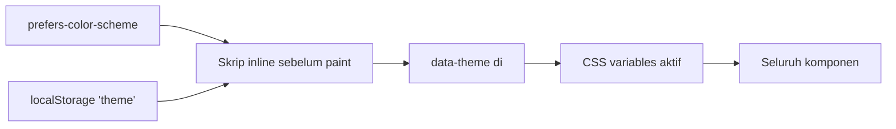
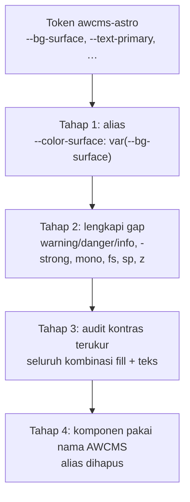

# awcms-astro — Design System

Design token, komponen, dan pola UI standar `awcms-astro`, beserta **pemetaannya ke kosakata design system AWCMS** (`docs/awcms/14_ui_ux_design_system.md` di repo [`ahliweb/awcms`](https://github.com/ahliweb/awcms)).

Pemetaan itu bukan pelengkap. Ia yang membuat perpindahan ke pengelolaan dinamis menjadi pekerjaan mekanis alih-alih penafsiran ulang: satu berkas token diganti, komponennya tidak disentuh.

## Prinsip

Prinsip AWCMS diadaptasi ke konteks situs statis publik. Yang berbeda ditandai.

1. **Terbaca tanpa JavaScript.** Seluruh fungsi inti — navigasi, pengalih bahasa, accordion FAQ, daftar wilayah — bekerja tanpa JS. Berbeda dari back-office AWCMS yang boleh mengandalkan islands.
2. **State eksplisit.** Setiap halaman punya keadaan terisi, kosong, dan fallback yang terlihat. Situs statis tidak punya loading state, tetapi punya **state fallback terjemahan** yang wajib ditandai ke pembaca.
3. **Aksesibel.** Target WCAG 2.1 AA: kontras cukup di kedua tema, fokus terlihat, navigasi keyboard penuh.
4. **Ringan.** Pembacanya di jaringan yang tidak dapat diandalkan. Anggaran gambar dan JavaScript diperlakukan sebagai batas, bukan saran.
5. **Mobile-first.** Kebalikan dari back-office AWCMS yang desktop-first. Layout dirancang dari 360px ke atas.
6. **Tidak menyamar resmi.** Tidak memakai lambang, logo, atau atribut instansi negara. Batas ini adalah **aturan desain**, bukan sekadar kepatuhan.
7. **Konsisten.** Seluruh halaman memakai token dan komponen yang sama; tidak ada gaya sekali pakai.

## Design token

Diimplementasikan sebagai CSS custom properties di `:root` pada `src/styles/global.css`, dengan override tema gelap lewat `:root[data-theme='dark']`.

### Warna

| Token awcms-astro | Terang | Fungsi | Padanan AWCMS |
| --- | --- | --- | --- |
| `--bg-primary` | `#f8fafc` | Latar halaman | `--color-bg` |
| `--bg-surface` | `#ffffff` | Kartu dan panel | `--color-surface` |
| `--bg-subtle` | `#f1f5f9` | Panel sekunder | `--color-surface-2` |
| `--border-color` | `#e2e8f0` | Garis pembatas | `--color-border` |
| `--border-focus` | `#0284c7` | Cincin fokus | `--color-focus` |
| `--text-primary` | `#0f172a` | Teks utama | `--color-text` |
| `--text-secondary` | `#334155` | Teks pendukung | — |
| `--text-muted` | `#64748b` | Teks sekunder | `--color-text-muted` |
| `--accent-primary` | `#0284c7` | Aksi utama, tautan | `--color-primary` |
| `--accent-hover` | `#0369a1` | Keadaan hover | — |
| `--accent-subtle` | `#e0f2fe` | Latar lembut aksen | — |
| `--emerald-primary` | `#059669` | Penanda keberhasilan | `--color-success` |
| `--emerald-subtle` | `#dcfce7` | Latar lembut sukses | — |

### Skala lain

| Kategori | Token | Nilai | Padanan AWCMS |
| --- | --- | --- | --- |
| Font | `--font-sans`, `--font-heading` | Inter, Outfit | `--font-sans` |
| Radius | `--radius-sm/md/lg/xl` | 6 · 8 · 12 · 16 px | `--radius-sm/md/lg` |
| Shadow | `--shadow-sm/md/lg` | elevasi kartu | `--shadow-sm/md/lg` |
| Lebar | `--max-width` | 1200px | — (kontainer) |
| Breakpoint | 480 · 640 · 768 · 900 px | media query | `sm/md/lg` |

### Kilau hover

| Token | Nilai tema terang | Nilai tema gelap | Fungsi |
| --- | --- | --- | --- |
| `--kilau-warna` | `rgba(2,132,199,.16)` | `rgba(255,255,255,.10)` | Badan pita cahaya |
| `--kilau-puncak` | `rgba(2,132,199,.34)` | `rgba(255,255,255,.26)` | Puncak pita, di tengah gradien |
| `--kilau-durasi` | `.85s` | sama | Lama satu sapuan |

Di tema terang permukaannya putih, jadi kilau putih tidak akan terlihat — dipakai rona aksen. Komponen yang latar hover-nya **sudah** pekat menimpa kedua token dengan putih: `.share-btn`, `.wilayah-filter-btn`, dan `.chip` di dalam hero. Gradien hero adalah nilai tetap, bukan token, sehingga ia gelap di tema mana pun.

### Gap terhadap kosakata AWCMS

Token berikut **belum ada** di repo ini. Bukan kelalaian — situs informasi statis tidak punya keadaan yang membutuhkannya. Wajib ditambahkan **sebelum** integrasi dinamis, karena antarmuka pengelolaan pasti memerlukannya:

| Token AWCMS | Untuk apa | Kapan dibutuhkan |
| --- | --- | --- |
| `--color-warning`, `--color-danger`, `--color-info` | Status peringatan, error, informasi | Saat ada form, aksi, atau pesan sistem |
| `--color-*-strong` | Fill solid dengan teks putih di atasnya | Saat ada tombol berisi warna semantik |
| `--font-mono` | Angka, kode, nomor referensi | Saat menampilkan kode bayar atau nomor berkas |
| `--fs-*`, `--sp-*` | Skala tipografi dan spasi bertoken | Saat komponen dibagi lintas repo |
| `--z-*` | Lapis dialog, drawer, toast | Saat ada overlay |
| `--motion-*`, `--ease-*` | Durasi dan easing | Saat ada transisi bertoken |

> **Peringatan kontras.** AWCMS mencatat bahwa token warna polos dengan teks putih di atasnya hanya mencapai 3,19–3,76∶1 pada sebagian kombinasi — di bawah AA. Karena itu keluarga menyediakan varian `-strong`. Repo ini **belum** melakukan audit kontras terukur atas tokennya sendiri. Sebelum token di sini dipakai untuk fill solid, audit itu wajib dijalankan, bukan diasumsikan lolos.

### Theming

Pilihan pengguna di `localStorage` selalu menang; tanpa itu mengikuti preferensi sistem. `data-theme` dipasang **sebelum paint pertama** untuk mencegah kedip. Tanpa JavaScript, tema mengikuti `prefers-color-scheme` lewat media query di CSS — bukan terkunci di terang.

Polanya sama dengan AWCMS, satu perbedaan: AWCMS menambahkan fallback ke preferensi tenant dari basis data. Di sini tidak ada tenant, jadi rantainya berhenti di preferensi sistem.

## Komponen

Kolom terakhir menunjukkan padanan yang harus dituju saat integrasi, agar komponen tidak dibangun dua kali dengan nama berbeda.

| Komponen | Peran | Catatan | Padanan AWCMS |
| --- | --- | --- | --- |
| `BaseLayout` | Kerangka halaman: head SEO, hreflang, JSON-LD, skip link, header, footer | Memasang skip link, structured data, dan tombol bagikan untuk **semua** halaman | Layout admin/publik |
| `TabNav` | Navigasi utama, menandai aktif dengan `aria-current` | Urutan dari `siteConfig.tabs` | Nav |
| `Breadcrumb` | Jejak navigasi + JSON-LD `BreadcrumbList` | — | Breadcrumb |
| `LangSwitcher` | Pengalih locale berbasis `
` | **Jalan tanpa JavaScript** | i18n switcher |
| `TranslationNotice` | Penanda konten yang jatuh ke locale default | Membawa `lang` yang benar untuk pembaca layar | — (khas awcms-astro) |
| `SyaratList` / `ProcedureSteps` | Render daftar terstruktur dari frontmatter | Tidak pernah menerima markup mentah | — (khas domain) |
| `BiayaTable` / `UnitLayananTable` | Tabel data + sumber | Scroll horizontal tanpa membuat `body` ikut scroll | `Table` / `DataGrid` |
| `FaqAccordion` | Accordion `
` + JSON-LD `FAQPage` | Tanpa JavaScript | Accordion |
| `WilayahFilter` | Pemilih data referensi | **Daftar penuh tetap terender tanpa JS** | `FilterBar` |
| `DisclaimerNote` | Tiga varian: footer, umum, peringatan | Peringatan kanal resmi wajib di halaman penindakan | `ActionBanner` |
| `ShareButtons` | Bagikan ke kanal sosial + salin tautan | **Tanpa SDK/widget/piksel** | — (khas awcms-astro) |

### Komponen yang belum ada dan akan dibutuhkan

`Button`, `Input`, `FormField`, `Dialog`, `Toast`, `Pagination`, `EmptyState`, `ErrorState`. Seluruhnya baru relevan saat ada antarmuka pengelolaan — bangun mengikuti kontrak AWCMS doc 14, jangan merancang ulang.

## Pola yang mengikat

### Tanpa JavaScript

| Elemen | Tanpa JS |
| --- | --- |
| Navigasi, tautan, breadcrumb | Berfungsi penuh |
| Pengalih bahasa | Terbuka lewat `
` |
| Accordion FAQ | Terbuka lewat `
` |
| Filter wilayah | Daftar penuh tetap terender |
| Tema | Mengikuti `prefers-color-scheme` |
| Tombol salin tautan | **Disembunyikan** — tombol yang diam saat diklik lebih buruk daripada tombol yang tidak ada |

### Aksesibilitas

- Skip link ke `#main-content` adalah elemen pertama di dalam `<body>`; teksnya dari katalog PO sehingga ikut berganti bahasa.
- Target sentuh minimal 44px.
- `aria-current` pada navigasi dan pengalih bahasa.
- Status yang berubah diumumkan lewat `role="status"` + `aria-live="polite"`.
- Tabel memakai `th` dengan `scope` benar.
- `prefers-reduced-motion: reduce` dihormati.
- Badan konten yang jatuh ke locale default membawa atribut `lang` yang benar, supaya pembaca layar melafalkannya dengan aturan yang tepat.

### Kilau hover — standar interaksi

Setiap tombol dan setiap tautan yang dibungkus card atau area khusus mendapat satu sapuan cahaya yang bergerak **dari pojok kiri atas ke pojok kanan bawah** saat hover maupun fokus keyboard. Sapuan berjalan sekali per interaksi, tidak berulang dan tidak berdenyut.

Daftar permukaan adalah kontrak, bukan kumpulan kebetulan. Ia ditulis satu kali di `src/styles/global.css` di antara penanda `kilau:permukaan:mulai` dan `kilau:permukaan:selesai`, dan `npm run audit` memeriksa daftar itu sama persis dengan tabel di bawah:

<!-- kilau:permukaan:mulai -->
| Permukaan | Dipakai untuk |
| --- | --- |
| `.kilau` | Class umum; komponen baru cukup menambahkannya |
| `.card` | Kartu artikel dan kartu wilayah, seluruhnya berupa `<a>` |
| `.chip` | CTA hero, filter, pengalih tema, pemicu pengalih bahasa |
| `.share-btn` | Tombol berbagi dan tombol salin tautan |
| `.wilayah-filter-btn` | Tombol kirim filter wilayah |
| `.lang-switcher-menu a` | Tautan bahasa di dalam menu |
<!-- kilau:permukaan:selesai -->

Tiga hal yang membuatnya aman, dan ketiganya wajib ikut saat permukaan baru ditambahkan:

| Aturan | Bila dilanggar |
| --- | --- |
| `overflow: hidden` pada host | Pita cahaya menonjol keluar dari sudut membulat |
| `pointer-events: none` pada lapisan sapuan | Lapisan menutupi seluruh host dan menelan klik — fatal pada kartu yang seluruhnya `<a>` |
| Dimatikan penuh saat `prefers-reduced-motion` | Animasi yang hanya dipercepat menjadi 0,01 md tetap berkedip, dan kedipan lebih mengganggu daripada gerakan |

Yang terakhir sengaja tidak menumpang aturan `*` global di blok `prefers-reduced-motion` — aturan itu memangkas durasi, bukan meniadakan animasi. Sapuan dimatikan lewat `content: none` sehingga pseudo-element-nya tidak pernah dibuat.

Sapuan ini murni CSS. Ia tidak menambah satu byte JavaScript pun dan tidak berpengaruh pada halaman tanpa JS.

### Responsif

Mobile-first dari 360px. Tabel dibungkus `.table-responsive` — otomatis untuk tabel markdown lewat rehype plugin. Kartu memakai `grid-template-columns: repeat(auto-fill, minmax(320px, 1fr))`.

### Gambar

`<Image>` dari `astro:assets`, tidak pernah `` mentah. Potongan ditetapkan lewat `width`/`height` — dipotong saat build, bukan oleh `object-fit` di browser, sehingga piksel yang tidak tampil tidak ikut diunduh. Layar pertama `loading="eager"` + `fetchpriority="high"`; sisanya `lazy`.

## Jalur adopsi token saat integrasi

Urutannya penting: **alias lebih dulu, penggantian nama terakhir.** Mengganti nama token sebelum gap-nya lengkap akan meninggalkan komponen yang merujuk token yang belum ada, dan CSS gagal secara diam-diam — tidak ada pesan error, hanya warna yang salah.
