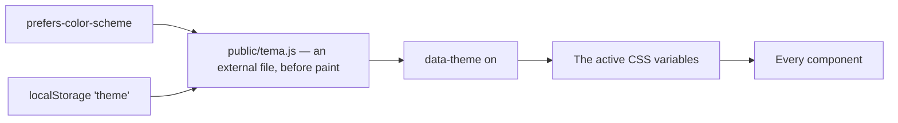
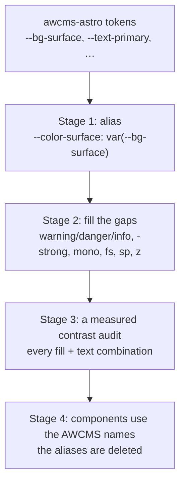

🇬🇧 English (source) · 🇮🇩 [Bahasa Indonesia](ui-ux-design-system.id.md)

# awcms-astro — Design System

The design tokens, components, and UI patterns of the `awcms-astro` standard, together with **their mapping onto the AWCMS design system vocabulary** (`docs/awcms/14_ui_ux_design_system.md` in the [`ahliweb/awcms`](https://github.com/ahliweb/awcms) repo).

That mapping is not a garnish. It is what makes moving to dynamic management mechanical work rather than reinterpretation: one token file is replaced, and the components are not touched.

## Principles

The AWCMS principles adapted to the context of a public static site. What differs is marked.

1. **Readable without JavaScript.** Every core function — navigation, the language switcher, the FAQ accordion, and the whole article body — works without JS. Different from the AWCMS back-office, which may rely on islands.
2. **Explicit states.** Every page has a filled, an empty, and a fallback state that are visible. A static site has no loading state, but it does have a **translation fallback state**, which must be marked for the reader.
3. **Accessible.** The WCAG 2.1 AA target: sufficient contrast in both themes, visible focus, full keyboard navigation.
4. **Light.** Its readers are on connections that cannot be relied on. Image and JavaScript budgets are treated as limits, not as advice.
5. **Mobile-first.** The opposite of the desktop-first AWCMS back-office. Layouts are designed from 360px up.
6. **Not impersonating officialdom.** No state institution's emblem, logo, or attributes are used. This boundary is a **design rule**, not merely compliance.
7. **Consistent.** Every page uses the same tokens and components; there are no one-off styles.
8. **No styles inside the HTML.** No `style=""` attributes, no inserted `<style>` blocks. Cross-component styles live in `src/styles/global.css`, and a component's own styles in its scoped `<style>` — which Astro emits as a separate CSS file because `build.inlineStylesheets` is set to `"never"`. This is not taste: the CSP `style-src 'self'` blocks both, and a page loses its layout with not one build error. Guarded by `tests/keluaran-csp.test.mjs`.
9. **No scripts inside the HTML.** The same rule, a different consequence: `script-src 'self'` blocks every inline `<script>`, and what is lost is not layout but function — a copy button that stays silent, a theme that does not switch. Component scripts are written as ordinary `<script>` (bundled by Astro, emitted as a file because `vite.build.assetsInlineLimit` is set to `0`); what must run before the first paint lives in `public/tema.js`. Its policy has been sent by the server since ADR-0019, so a violation here fails in production, not only in review.

## Design tokens

Implemented as CSS custom properties on `:root` in `src/styles/global.css`, with dark theme overrides through `:root[data-theme='dark']`.

### Colours

| awcms-astro token | Light | Function | AWCMS equivalent |
| --- | --- | --- | --- |
| `--bg-primary` | `#f8fafc` | The page background | `--color-bg` |
| `--bg-surface` | `#ffffff` | Cards and panels | `--color-surface` |
| `--bg-subtle` | `#f1f5f9` | Secondary panels | `--color-surface-2` |
| `--border-color` | `#e2e8f0` | Divider lines | `--color-border` |
| `--border-focus` | `#0284c7` | The focus ring | `--color-focus` |
| `--text-primary` | `#0f172a` | Main text | `--color-text` |
| `--text-secondary` | `#334155` | Supporting text | — |
| `--text-muted` | `#64748b` | Secondary text | `--color-text-muted` |
| `--accent-primary` | `#0284c7` | The main action, links | `--color-primary` |
| `--accent-hover` | `#0369a1` | The hover state | — |
| `--accent-subtle` | `#e0f2fe` | A soft accent background | — |
| `--emerald-primary` | `#059669` | The success marker | `--color-success` |
| `--emerald-subtle` | `#dcfce7` | A soft success background | — |

### Fixed dark surfaces

Three surfaces are dark in **both** themes: the utility strip above the masthead, the home page hero, and the footer. Their colours come from a separate `--gelap-*` group on `:root` that no theme block overrides.

| Token | Value | Used for |
| --- | --- | --- |
| `--gelap-bg` | `#090d16` | The footer ground |
| `--gelap-bg-lembut` | `#0b1220` | The utility strip |
| `--gelap-teks` | `#f8fafc` | Text on those surfaces |
| `--gelap-teks-lembut` | `#cbd5e1` | Links and secondary text there |
| `--gelap-teks-redup` | `#94a3b8` | Muted text there |
| `--gelap-garis` / `--gelap-garis-kuat` | `rgba(255,255,255,.13)` / `.32` | Dividers, and a divider on hover |
| `--gelap-aksen` | `#38bdf8` | Links on those surfaces |
| `--gelap-emerald` / `--gelap-emerald-teks` | `#10b981` / `#052e21` | The primary call to action and the text on it |

**This is not a group of tokens somebody forgot to theme.** The hero gradient in this repo has been a fixed value since the first version of `global.css`, for one reason: a masthead and a footer that change colour halfway down a page make the top and bottom of the site flicker on every navigation. The `--gelap-*` group only gives that decision a name, so the strip and the footer stop copying the value one at a time.

What comes with it is a rule with no exception: **every colour used inside those surfaces has to come from this group too.** Half a surface converted is `--text-primary` — `#0f172a` in the light theme — sitting on `#090d16`: present, passed by every gate, and literally unreadable. That is not hypothetical, it happened twice while this redesign was being built. The footer's own text and headings are set in `BaseLayout.astro`'s scoped block; components that only ever render **inside** the footer (`DisclaimerNote` in its `footer` variant, `FormBuletin`) are converted by descendant rules under `footer` in `global.css`, so "this footer is dark" stays one fact in one place.

One trap is worth naming because it survived the first pass: `.disclaimer-footer` is a wrapper around two `
` elements, and the element rule `p { color: var(--text-secondary) }` **targets those paragraphs directly**, so it beats any colour inherited from the wrapper. Converting the wrapper alone changes nothing on screen.

### The other scales

| Category | Token | Value | AWCMS equivalent |
| --- | --- | --- | --- |
| Font | `--font-sans`, `--font-heading` | `system-ui, -apple-system, …` — `--font-heading` is an alias of `var(--font-sans)`. **No webfonts**: zero `@font-face`, zero font origins | `--font-sans` |
| Radius | `--radius-sm/md/lg/xl` | 6 · 8 · 12 · 16 px | `--radius-sm/md/lg` |
| Shadow | `--shadow-sm/md/lg` | card elevation | `--shadow-sm/md/lg` |
| Width | `--max-width` | 1200px | — (the container) |
| Breakpoints | 400 · 480 · 640 · 768 · 900 px | media queries | `sm/md/lg` |

### The hover shine

| Token | Light theme value | Dark theme value | Function |
| --- | --- | --- | --- |
| `--kilau-warna` | `rgba(2,132,199,.16)` | `rgba(255,255,255,.10)` | The body of the light band |
| `--kilau-puncak` | `rgba(2,132,199,.34)` | `rgba(255,255,255,.26)` | The band's peak, at the centre of the gradient |
| `--kilau-durasi` | `.85s` | the same | The length of one sweep |

In the light theme the surface is white, so a white shine would not be visible — an accent tint is used instead. Components whose hover background is **already** dark override both tokens with white: `.share-btn` and `.chip` inside the hero. The hero gradient is a fixed value rather than a token, so it is dark in either theme.

> Until 4 August 2026 that sentence named `.wilayah-filter-btn` as the third — a reference repo surface that **never existed in this template**. The `bun run audit:dokumen` gate compares the table in §The hover shine with the markers in `src/styles/global.css` and had already removed it from there; it does **not** read prose, so this one copy survived a day longer. That is the gate's boundary, and it is named so it is not assumed to be wider than what it checks.

### Gaps against the AWCMS vocabulary

The following tokens **do not exist** in this repo. Not an oversight — a static information site has no state that needs them. They must be added **before** dynamic integration, because a management interface will certainly need them:

| AWCMS token | What for | When it is needed |
| --- | --- | --- |
| `--color-warning`, `--color-danger`, `--color-info` | Warning, error, and information states | When there are forms, actions, or system messages |
| `--color-*-strong` | A solid fill with white text on it | When there are buttons filled with a semantic colour |
| `--font-mono` | Numbers, code, reference numbers | When displaying a payment code or a file number |
| `--fs-*`, `--sp-*` | Tokenised typography and spacing scales | When components are shared across repos |
| `--z-*` | Dialog, drawer, and toast layers | When there are overlays |
| `--motion-*`, `--ease-*` | Durations and easings | When there are tokenised transitions |

> **A contrast warning.** AWCMS records that plain colour tokens with white text on them reach only 3.19–3.76∶1 in some combinations — below AA. That is why the family provides `-strong` variants. This repo has **not** run a measured contrast audit over its own tokens. Before a token here is used for a solid fill, that audit must be run, not assumed to pass.

### Theming

A user's choice in `localStorage` always wins; without one it follows the system preference. `data-theme` is set **before the first paint** to prevent a flash. Without JavaScript, the theme follows `prefers-color-scheme` through a media query in CSS — it is not locked to light.

**It is NOT an inline script, and that difference decides whether the page is alive.** Since [ADR-0019](../adr/0019-csp-ketat-dikirim-penyaji.md) the server sends `script-src 'self'` without `'unsafe-inline'`, so a `<script is:inline>` contains code that is dead in a reader's browser. This script lives in `public/tema.js` and is loaded by a **classic** `<script src>` — not an Astro bundle, because an Astro bundle is always `type="module"` and modules are always deferred, so it could not run before the first paint.

The pattern is the same as AWCMS's, with one difference: AWCMS adds a fallback to the tenant's preference from the database. There is no tenant here, so the chain stops at the system preference.

## Components

The last column shows the equivalent to aim for at integration, so a component is not built twice under two names.

| Component | Role | Note | AWCMS equivalent |
| --- | --- | --- | --- |
| `BaseLayout` | The page skeleton: the SEO head, hreflang, JSON-LD, the skip link, header, footer | Installs the skip link, structured data, and share buttons for **every** page | The admin/public layout |
| `TabNav` | The main navigation, marking the active item with `aria-current` | Its order from `siteConfig.tabs`. **A pill, not an underlined tab**: a 3px bottom border only reads as "this one is open" while the bar has a row to itself, and it now shares the masthead row — where the same line reads as a divider. A pill carries its state inside itself, so it is right in both positions, and `aria-current` is still what states it for a screen reader | Nav |
| `Breadcrumb` | The navigation trail + `BreadcrumbList` JSON-LD | — | Breadcrumb |
| `LangSwitcher` | A `
`-based locale switcher | **Works without JavaScript** | The i18n switcher |
| `TranslationNotice` | A marker for content that fell back to the default locale | Carries the correct `lang` for screen readers | — (specific to awcms-astro) |
| `SyaratList` / `ProcedureSteps` | Render structured lists from the `awcmsAstro` blocks in `contentJson` | Never accept raw markup | — (domain-specific) |
| `BiayaTable` | A data table + its source | Scrolls horizontally without making `body` scroll too | `Table` / `DataGrid` |
| `FaqAccordion` | A `
` accordion + `FAQPage` JSON-LD | Without JavaScript | Accordion |
| `DisclaimerNote` | Three variants: footer, general, warning | The official-channel warning is mandatory on an enforcement page | `ActionBanner` |
| `ShareButtons` | Share to social channels + copy link | **No SDK/widget/pixel** | — (specific to awcms-astro) |
| `Ilustrasi` | A tokenised image frame | `src: undefined` is a SUPPORTED state — it renders `.visual-placeholder`, not a zero-height frame | — (specific to awcms-astro) |
| `LangFlag`, `TabNav`, `Breadcrumb`, `TranslationNotice` | See their own rows above | — | — |

**`UnitLayananTable` and `WilayahFilter` were deleted from this table, not marked "not built yet".** Both are reference repo components that never came to this template, and `WilayahFilter` even had a row of its own in the "Without JavaScript" table below promising the behaviour of a component that does not exist. A component table listing a component that does not exist is the same defect class as `.wilayah-filter-btn` in §The hover shine — and both came from the same repo.

### The page frame

Every page opens with three bands, and which band a control belongs in is decided by what it does, not by how much room is left.

| Band | Holds | Why there |
| --- | --- | --- |
| The utility strip | The site tagline, the language switcher, the theme toggle | None of the three is content navigation. It is deliberately **outside** the sticky `<header>`: a status strip that stuck too would eat 38px of screen for the whole scroll, on a site whose readers are mostly on phones |
| The masthead (sticky) | The site name, the section bar, the search link | One row, not two. A second row carrying only the section bar means every page opens with two rows of chrome before a single word of content — a third of the first fold at 360px |
| The footer | Identity, sections, site links, contact, the newsletter form, the disclaimer, the closing bar | Unchanged in structure; it is now a fixed dark surface (see §Fixed dark surfaces) |

The section bar shares the masthead row down to 20rem of remaining space and drops to a row of its own below that. Below 720px it also takes `order: 1`, so the row reads **site name · search** and the section bar sits under it, rather than the section bar taking the whole second row and pushing search onto a third.

That `order` is the one place in this repo where visual order and DOM order differ, and the trade is stated rather than left to be discovered: keyboard focus still runs name → sections → search while the eye reads name → search → sections. One element moves, and it moves to directly below the other two — not across the page — which is what keeps it inside WCAG 2.4.3. A fourth element on that row is not a free addition; it is a decision to re-read this paragraph.

The search control is a **link shaped like a search box** — the magnifier, the recessed field, the fixed width — and not an `<input>`. The shape is what a reader's eye looks for at the top of a page; the behaviour is refused for the reason in §Without JavaScript, because a box that swallows typing and then does nothing is worse than no box.

### Home page surfaces

The redesigned home page carries two surfaces that show the site's actual content, which the previous version did not: a reader landing on it could not see a single article title without first guessing which section to open.

| Surface | What it shows | Where it stops |
| --- | --- | --- |
| The latest panel, inside the hero | The three most recent articles across every section — section name, date, title | Renders only when there are articles to list. The hero collapses to one column otherwise |
| The trust strip | Section count, article count, the most recent `updatedDate` on the site | Renders only when the site has at least one article. The date cell is dropped when there is no date |
| The highlight | The single newest article, with its own image, description, and the "updated" line only when it was really edited after publication ([ADR-0033](../adr/0033-seksi-berita-urutan-dari-tanggal-dan-dua-tanggal-yang-terpisah.md)) | Renders only when there is an article |

Both read one list and never show the same article twice: the highlight takes the first, the panel takes the next three. Their order has a **tiebreak on slug**, because two articles published in the same second would otherwise swap places between builds — a different static output with nothing changed.

**The strip carries only numbers this build can count.** The design this was worked from had a fourth: "Lighthouse score 100". It is not here. Nothing in the build measures it, so it would be a claim printed on every page and checked by nobody — the same defect class as the `og:image` pointing at a card no generator ever produced, which this repo already refused once.

The home page hero is the one frame in the repo that renders **no placeholder** when its artwork is missing. Everywhere else an empty frame holds up a layout that would otherwise collapse; here the panel beneath it already carries the latest articles, so what an empty frame holds is not the layout but the reader's attention — a striped rectangle the width of the panel, in the first fold, directly above the only real content the home page has. The `hero` naming convention under `src/assets/` still works, and the artwork is still shown when a site ships it.

### Where a component's styles live, and what enforces it

`src/styles/global.css` is for what more than one component uses; a component's own styles go in its scoped `<style>`. That was already the rule in §Principles, and `bun run audit:aset` is what turned it into something with teeth.

The hero was in `global.css` while `Home.astro` was its only user. Every reader of every article page, section page, and the search page therefore downloaded hero styles their page never rendered — and adding the redesign's grid and glow layers pushed `/cari/` past the 36,000 B page ceiling on the strength of an element that is not on it. Moving the block returned 1,853 B to **every** page, not only to the one that went red.

The same gate then recorded what is still wrong and was not fixed here: `BaseLayout.css` is 22,577 B and still carries article-body styles (`.content-body`, `.galeri`, `.video-berita`), the fee table, and the accordion to every page that has none of them. That is work of its own, with its own risk to article bodies, and it is named in `scripts/audit-aset.mjs` so it does not quietly become the status quo.

### Components that do not exist yet and will be needed

`Button`, `Input`, `FormField`, `Dialog`, `Toast`, `Pagination`, `EmptyState`, `ErrorState`. All of them only become relevant once there is a management interface — build them following the AWCMS doc 14 contract, do not redesign them.

## Binding patterns

### Without JavaScript

| Element | Without JS |
| --- | --- |
| Navigation, links, breadcrumbs | Fully functional |
| The language switcher | Opens through `
` |
| The FAQ accordion | Opens through `
` |
| The whole article body — requirements, steps, fees, legal basis | Fully rendered; it is static HTML, not the result of client rendering |
| The theme | Follows `prefers-color-scheme` |
| The copy-link button | **Hidden** — a button that stays silent when clicked is worse than a button that is not there |

### Accessibility

- The skip link to `#main-content` is the first element inside `<body>`; its text comes from the PO catalogue so it changes language too.
- A minimum touch target of 44px.
- `aria-current` on the navigation and the language switcher.
- A changed status is announced through `role="status"` + `aria-live="polite"`.
- Tables use `th` with a correct `scope`.
- `prefers-reduced-motion: reduce` is honoured.
- Content that falls back to the default locale carries the correct `lang` attribute, so a screen reader pronounces it by the right rules.

The target is **WCAG 2.1 AA** for public surfaces and **WCAG 2.2 AA** for any AUTHENTICATED surface if one ever exists — not only Jualanku ([ADR-0014](../adr/0014-rendering-campuran-dan-bff-portal.md)), but also a USER admin surface a site declares through `permukaanAdmin` ([ADR-0034](../adr/0034-publik-secara-bawaan-admin-hanya-bila-dinyatakan.md)). Both bring controls, forms, and moving focus; that is what settles the target, not the surface's name. The two 2.2 criteria most likely to bite first in any interface carrying controls: **2.4.11 Focus Not Obscured** and **2.5.8 Target Size (Minimum)** — the second is already met here through the 44px touch target rule above, the first has never been tested because this repo has no floating element at all.

The contrast of this repo's colour tokens has **never been audited with measurements** (see the warning in §Gaps against the AWCMS vocabulary). It is the only WCAG item in this document that cannot be answered "done" — and it is written that way rather than left to look guarded.

### The hover shine — an interaction standard

Every button and every link wrapped in a card or a special area gets one sweep of light moving **from the top-left corner to the bottom-right** on hover and on keyboard focus. The sweep runs once per interaction; it neither repeats nor pulses.

The list of surfaces is a contract, not a collection of coincidences. It is written once in `src/styles/global.css` between the `kilau:permukaan:mulai` and `kilau:permukaan:selesai` markers. **`bun run audit:dokumen` now compares it with the table below, in both directions.**

Before that gate existed, this paragraph read "that checker does not exist yet, so its correspondence is guarded by a code reader's eye — and that means it will drift". It had indeed already drifted: this table listed `.wilayah-filter-btn`, a region filter button belonging to the reference repo that **never existed in this template** — not in the CSS, not in a single component. A row promising a shining surface on a button that does not exist would never look wrong to anyone reading only the document.

<!-- kilau:permukaan:mulai -->
| Surface | Used for |
| --- | --- |
| `.kilau` | The general class; a new component need only add it |
| `.card` | Article cards and region cards, all of them `<a>` elements |
| `.chip` | The hero CTA, filters, the theme switcher, the language switcher trigger |
| `.share-btn` | The share buttons and the copy-link button |
| `.lang-switcher-menu a` | Language links inside the menu |
<!-- kilau:permukaan:selesai -->

Three things make it safe, and all three must come along when a new surface is added:

| Rule | If it is broken |
| --- | --- |
| `overflow: hidden` on the host | The light band protrudes past the rounded corners |
| `pointer-events: none` on the sweep layer | The layer covers the whole host and swallows clicks — fatal on a card that is entirely an `<a>` |
| Switched off entirely under `prefers-reduced-motion` | An animation merely sped up to 0.01 ms still flickers, and a flicker is more disturbing than the movement |

The last deliberately does not ride on the global `*` rule in the `prefers-reduced-motion` block — that rule trims durations, it does not abolish animations. The sweep is switched off through `content: none`, so its pseudo-element is never created at all.

This sweep is pure CSS. It adds not one byte of JavaScript and has no effect on a page without JS.

### Responsive

Mobile-first from 360px. Cards use `grid-template-columns: repeat(auto-fill, minmax(320px, 1fr))`. How the masthead reflows at that width is in §The page frame.

**A `padding` shorthand on an element that also carries `.container` silently deletes the container's side padding**, and the failure is invisible on a desktop screen. `.header-top` wrote `padding: 0.85rem 0` for months: at any width above `--max-width` the container is already inset by its own auto margins, so nothing looked wrong; at 360px, where the container is the full screen, the site name sat **flush against the left edge of the glass** — measured at `x=0`, not guessed from a screenshot. It is `padding-block` now. Check any other element that carries `.container` together with a class of its own.

**A table in an article body scrolls itself, not through a wrapper.** An earlier version of this paragraph named a `.table-responsive` "inserted by a rehype plugin"; that markdown pipeline no longer exists in this repo, and what was left of that recipe was a `min-width: 34rem` table with no scrolling wrapper — exactly the cause of horizontal scrolling at 360px. `src/styles/global.css` therefore uses `display: block` + `overflow-x: auto` directly on `.content-body table`, with no `min-width`. (`renderContentBlocks()` itself does not emit a table at all yet — `awcms` has no table block type — so that rule waits for that type to exist.)

### Images

**In `awcms-astro` these are plain ``, not `<Image>` from `astro:assets`** — and that is a decision, not an oversight ([ADR-0024](../adr/0024-seni-lokal-di-src-assets.md)). Local artwork is resolved by `import.meta.glob` with `query: "?url"` into URL strings; `astro:assets` returns `ImageMetadata`, which changes the shape of `ArticleVisual` and all four frames at once, and treats SVG differently from raster — while SVG is exactly the format this repo's gates were written to read. The accepted consequence: rasters are not re-encoded and there is no `srcset`.

Cropping does not disappear because of that. Frames crop through `object-fit: cover` in CSS, and `bun run audit:konten` refuses a source that is not `--ratio-visual` before it can be published — so what would be cropped is prevented, not merely not downloaded. A large above-the-fold image is loaded `eager`, the rest `lazy`; both are set once in [`Ilustrasi.astro`](../../src/components/Ilustrasi.astro), not at every call site.

**One ratio for the whole site, used by frames and sources alike.** In this repo, 16∶9. Frames use `object-fit: cover`, so a source at another ratio is not scaled down — it is cropped, silently, at every screen size. A 1∶1 source in a 16∶9 frame loses its top 22%, and an image's title is almost always there.

Text inside an image shrinks along with its image. On a card 328px wide — a 360px viewport — an 800px canvas appears at a scale of 0.41: 12px text becomes 5px. Set your typography threshold from the narrowest card width, not from how it looks on a desktop screen.

An image's contents are subject to the reference repo's ADR-0013: no institutional emblems, no mock data, text only as a topic label.

## The token adoption path at integration

The order matters: **aliases first, renaming last.** Renaming tokens before their gaps are filled leaves components referring to tokens that do not exist, and CSS fails silently — no error message, only the wrong colours.
