🇮🇩 Bahasa Indonesia · 🇬🇧 [English (source)](deploy-coolify.md)

<!-- i18n-source-hash: sha256:1122a0757929a0e6284d9b6f75e874855e7a418816225bd84a9324602dc608cf -->

# Deploy dan rebuild lewat webhook (Coolify)

Cara sebuah situs dari template ini tayang, dan cara konten baru di awcms sampai
ke pembaca tanpa siapa pun menekan tombol.

Server rujukan yang dipakai di sini adalah server Coolify yang dicatat di
[`ahliweb/serv-dinkesdocker`](https://github.com/ahliweb/serv-dinkesdocker).
Yang tetap benar dari sana adalah **polanya** — Coolify **Application**
(git-build) di belakang Traefik — bukan daftar aplikasi yang dulu
membuktikannya: `awcms-micro` dan `awcms-mini` adalah **arsip** sejak 2 Agustus
2026 (`awcms` ADR-0055) dan tidak lagi dipakai sebagai contoh hidup. Situs dari
template ini mengikuti pola yang sama dengan `awcms`.

## Rantainya

```mermaid
flowchart LR
  Redaksi["Redaksi menerbitkan post"] --> Awcms["awcms"]
  Awcms -->|"baris antrean, se-transaksi"| Antrean["antrean rebuild"]
  Antrean -->|"worker, di luar transaksi"| Coolify["Coolify"]
  Coolify -->|"GET /api/v1/deploy?uuid=…<br/>git pull + docker build"| Build["astro build<br/>menarik konten dari awcms"]
  Build --> Image["image Bun — menyajikan dist/client"]
  Image -->|"Traefik"| Pembaca["Pembaca"]
```



**GitHub tidak ada di jalur konten.** Repo tidak berubah saat sebuah artikel
terbit — yang berubah isinya adalah awcms. Coolify membangun ulang commit yang
sama dan menarik konten terbaru saat build, dan itu memang yang dibutuhkan.

Perhatikan siapa memanggil apa: **`/api/v1/deploy`, bukan `/restart`.**
`/restart` hanya membuat ulang container dari image yang sudah ada — tidak ada
git pull, tidak ada build, jadi konten baru tidak pernah masuk. Jebakan ini
sudah didokumentasikan di
[`serv-dinkesdocker` docs/17](https://github.com/ahliweb/serv-dinkesdocker/blob/main/docs/17-simfar-autodeploy.md).

## Konten ditarik saat BUILD, bukan saat runtime

Ini satu hal yang paling sering salah pada deploy pertama, jadi ia ditulis
lebih dulu.

Template ini `output: 'static'`. Konten dari awcms masuk ke HTML saat
`astro build` berjalan — yaitu di dalam `docker build`. Container yang sudah
jadi **tidak pernah menghubungi awcms lagi**; ia hanya menyajikan berkas.

Sejak [ADR-0016](adr/0016-penyajian-bun-di-belakang-traefik-tanpa-nginx.md) yang
menyajikan berkas itu adalah **proses Bun**, bukan nginx. Yang berubah bagi
operator hanya dua hal, dan keduanya kecil: perintah start image sekarang
`bun dist/server/penyaji.mjs`, dan variabel runtime `PORT`/`HOST` dikenali
(bawaannya `8080`/`0.0.0.0`, dan Coolify tidak perlu mengubahnya). Port,
healthcheck, dan seluruh konfigurasi aplikasi di Coolify tetap sama.

Konsekuensinya: di Coolify, setiap variabel awcms wajib dicentang sebagai
**Build Variable**. Tanpa centang itu ia hanya masuk ke container yang sudah
jadi, tidak pernah sampai ke `astro build`, dan build gagal dengan
`AWCMS_API_URL is not set` — bukan menghasilkan situs yang diam-diam kosong.
Kegagalan itu disengaja; lihat [`src/lib/awcms/client.ts`](../src/lib/awcms/client.ts).

## Menyiapkan aplikasi di Coolify

Buat resource **Application** (git-build), bukan Service:

| Kolom | Nilai |
| --- | --- |
| Source | repo situs ini, branch `main` |
| Build pack | `dockerfile` |
| Dockerfile location | `/Dockerfile` |
| Base directory | `/` |
| Port | `8080` |
| Domains | domain situs, mis. `https://contoh.example.com` |
| Health check | **boleh `true`** — lihat catatan di bawah |

Variabel (semua **Build Variable**, kecuali yang ditandai):

| Variabel | Catatan |
| --- | --- |
| `SITE_URL` | Origin absolut. Salah isi tidak menggagalkan build — ia menerbitkan situs yang menunjuk crawler ke tempat lain |
| `SITE_NAME`, `SITE_DESCRIPTION` | Identitas situs — CADANGANNYA, sejak `awcms` #596: tenant yang mengisi `site_profile` menimpa keduanya, berikut logo, favicon, tagline, baris hak cipta, blok kontak, dan tautan sosial |
| `SITE_POSTS_PER_PAGE` | Opsional, bawaan 12. Kartu artikel per halaman seksi; seksi yang melewati batas itu berlanjut di `/<seksi>/halaman/2/` |
| `SITE_LOCALES` | Prefix locale selain locale default, dipisah koma |
| `AWCMS_API_URL` | Origin instans awcms |
| `AWCMS_API_TOKEN` | **Secret.** Kredensial mesin (`awcmsm_…`), scope `blog_content.posts.read` **dan** `media_library.media.read` — yang kedua dipakai `build:asal-media`, dan tanpanya build gagal 403 setelah seluruh halaman selesai dirender. Ia juga yang menentukan tenant |
| `AWCMS_TENANT_ID` | Opsional, dianjurkan. Bukan pemilih tenant — pernyataan yang diverifikasi terhadap token; build gagal bila berbeda |

Seluruhnya dijelaskan di [`.env.example`](../.env.example).

### Health check boleh menyala di sini

Dua aplikasi lain di server itu terpaksa mematikan `health_check_enabled`:
awcms-micro karena image-nya tidak punya `curl`/`wget`, dan SIMFAR karena Django
menolak probe ber-`Host: localhost` dengan `400 DisallowedHost`.

Image ini tidak kena keduanya — `wget` ada di dalam image `oven/bun` berbasis
alpine, dan penyaji Bun tidak punya padanan `ALLOWED_HOSTS` yang menolak probe
ber-`Host: localhost`. Image juga membawa `HEALTHCHECK` sendiri. Biarkan
menyala.

### Token dan riwayat image

`AWCMS_API_TOKEN` masuk sebagai `ARG` yang hanya hidup di stage `build`. Stage
akhir hanya menyalin `dist/client/` dan `dist/server/penyaji.mjs`, jadi token
tidak ikut ke image yang dijalankan. Ini diverifikasi, bukan diasumsikan — build
uji dengan token `token-uji` menghasilkan image yang bersih pada ketiga
pemeriksaan: `docker history` tidak memuatnya, tidak ada berkas dalam image yang
memuatnya, dan container runtime tidak punya satu pun variabel `AWCMS_*`.

Perlu diperiksa ulang setiap kali stage runtime berubah, karena kali ini yang
disalin bukan hanya berkas statis: `dist/server/penyaji.mjs` adalah bundel
JavaScript, dan bundel dibuat dari sumber yang dibangun di stage `build`. Yang
menjaganya tetap bersih adalah bahwa penyaji tidak pernah membaca satu pun
variabel `AWCMS_*` — ia hanya membaca `PORT` dan `HOST`.

Yang tetap benar: token masih terbaca di cache builder pada mesin build. Karena
itu terbitkan token dengan role tersempit yang bisa membaca konten published
satu tenant, dan tidak lebih.

## Menyiapkan pemicu di awcms

> **Status: kontrak yang disepakati, belum diimplementasikan di awcms.**
> Sisi `awcms-astro` sudah lengkap dan bisa dipicu hari ini lewat
> `workflow_dispatch`, jadwal harian, atau `curl` ke endpoint deploy. Yang
> belum ada adalah pengirimnya di awcms.

Pemicu di awcms wajib mengikuti pola dua bagian yang sudah dipakai modul
`email`, **bukan** consumer `domain-event-runtime`:

1. **Baris antrean ditulis di dalam transaksi publish.** Persis seperti
   `enqueueModuleContentPurge` yang sudah dipanggil di jalur publish hari ini —
   antrean dan perubahan konten commit bersama, sehingga publish yang
   di-rollback tidak pernah memicu rebuild dan publish yang berhasil tidak
   pernah kehilangan pemicunya.
2. **Worker terpisah menguras antrean dan memanggil webhook.** Panggilan HTTP-nya
   terjadi di luar transaksi, dengan backoff dan dead-letter.

**Pola itu kini punya preseden ber-ADR di `awcms`, dan namanya sendiri.** Pada
10 Agustus 2026 `awcms` ADR-0074 memutuskan push notification mendapat outbox
KEDUA-nya sendiri alih-alih menjadi consumer domain-event — dengan alasan yang
sama persis dengan alasan di bawah, dan dengan pola lease yang di sana sudah
terbukti tiga kali: klaim `FOR UPDATE SKIP LOCKED`, lease memakai ulang
`next_attempt_at` tanpa kolom baru, kirim **di luar** transaksi, finalize per
baris. Implementasi pemicu rebuild sebaiknya menyalin bentuk itu, bukan
menemukannya ulang.

**Dan satu syarat baru berlaku sejak hari yang sama:** sebuah tabel antrean baru
di `awcms` wajib membawa **deskriptor retensi sejak hari pertama** (`awcms`
ADR-0076). Registry mana yang menampungnya tidak ditentukan penilaian
penulisnya melainkan oleh siapa yang MENULIS tabel itu — modul atau
infrastruktur — dan gerbang di sana yang memutuskannya. Sebuah antrean tanpa
deskriptor retensi akan ditolak review di sisi sana, jadi ia bagian dari
pekerjaan, bukan pekerjaan susulan.

Pemisahan itu bukan selera. Consumer `domain-event-runtime` menerima `tx` — ia
berjalan **di dalam** transaksi klaim/finalisasi delivery, dan tipenya menyatakan
kontrak itu terus terang: aman untuk handler same-process yang DB-only, dan
consumer out-of-transaction/broker-backed "not built speculatively here".
Memanggil `fetch` dari sana menahan transaksi basis data terbuka selama
permintaan jaringan ke Coolify — satu instans awcms yang lambat merespons akan
menahan koneksi DB, bukan hanya menunda rebuild.

Beberapa post yang terbit berdekatan harus **melebur jadi satu rebuild**. Antrean
per-tenant, bukan per-post: sepuluh artikel yang terbit dalam satu menit adalah
satu build, bukan sepuluh.

Variabel yang dibaca worker di sisi awcms:

| Variabel | Isi |
| --- | --- |
| `STATIC_SITE_REBUILD_URL` | URL deploy Coolify lengkap dengan `uuid`, mis. `https://coolify.example.com/api/v1/deploy?uuid=<uuid>` |
| `STATIC_SITE_REBUILD_TOKEN` | Token API Coolify |

Kosongkan keduanya dan worker menjadi no-op — sebuah deployment awcms yang tidak
melayani situs statis apa pun berperilaku persis seperti sebelum fitur ini ada.
Ini pola yang sama dengan penjagaan `EDGE_CACHE_MODE` pada antrean purge: tanpa
penjaga, setiap publish di setiap deployment menambah baris ke antrean yang tidak
pernah dikuras siapa pun.

### Sampai pengirimnya ada

Situs tetap segar tanpa perubahan apa pun di awcms — jadwal harian di
`rebuild.yml` sudah menutup kasus terburuk, dan `workflow_dispatch` menutup
kasus mendesak. Yang belum ada hanyalah kesegaran dalam hitungan menit.

## Jaring pengaman dan tombol manual

[`.github/workflows/rebuild.yml`](../.github/workflows/rebuild.yml) memanggil
endpoint deploy yang sama, untuk dua hal yang tidak dijawab jalur utama:

- **`workflow_dispatch`** — tombol "rebuild sekarang" tanpa menerbitkan apa pun.
- **`schedule`** (harian, 02:10 WIB) — jaring pengaman. Webhook bisa hilang:
  awcms mati saat dispatcher mencoba, token dicabut, consumer di-pause dan lupa
  dilanjutkan. Tanpa jaring ini situs bisa basi berhari-hari **tanpa satu pun
  sinyal**, karena tidak ada yang gagal — yang terjadi justru tidak ada yang
  terjadi.

Workflow ini butuh repository variables `COOLIFY_API_URL` dan `COOLIFY_APP_UUID`
plus secret `COOLIFY_API_TOKEN`. Tanpa itu ia melewati dirinya sendiri dan
mengatakannya di ringkasan run — sama seperti gerbang build di `ci.yml`.

`repository_dispatch` bertipe `awcms-content-published` juga diterima, untuk
deployment yang lebih memilih GitHub sebagai perantara daripada memberi awcms
kredensial Coolify.

## Kalau build gagal

Coolify mempertahankan container sebelumnya saat build baru gagal — situs tetap
tayang dengan konten lama. Ini sudah terbukti di server itu, pada regresi
health-check SIMFAR 2026-07-27: deploy gagal 10/10 percobaan dan produksi tidak
pernah benar-benar mati.

Artinya kegagalan rebuild **sunyi bagi pembaca**, dan karena itu perlu dilihat
di tempat lain: dasbor Coolify untuk log build, dan jejak audit awcms untuk
apakah consumer-nya berhasil mengirim atau masuk dead-letter.

**Tiga sebab yang paling mudah salah didiagnosis**, karena ketiganya sama-sama
403 dan sama-sama terbaca seperti token yang dicabut — padahal yang harus
dikerjakan berbeda-beda:

| Yang terlihat di log build | Sebabnya | Diperbaiki di mana |
| --- | --- | --- |
| `403 TENANT_SUSPENDED` | Tenant berstatus `suspended` **atau** `inactive` di awcms. Sejak `awcms` ADR-0073 penolakannya mengenai kredensial mesin juga, dan ia diputuskan **sebelum** izin dicari — memperluas scope token tidak mengubah apa pun | **Di `awcms`.** Ini keadaan tenant; tidak ada yang bisa dilakukan dari repo situs |
| `403 PARTNER_SUSPENDED` | Token build diterbitkan atas akun layanan yang merupakan **tenant user terdelegasi** milik sebuah partner, dan kemitraan itu kini tidak `active` (`awcms` ADR-0093). Penolakannya di chokepoint, per permintaan, dan grant yang memberi akses **tetap ada** — jadi tidak ada yang tampak hilang saat dilihat | **Di `awcms`**, dua jalan: pulihkan partnernya, atau — yang benar untuk situs yang bukan milik agensi — terbitkan ulang token atas akun layanan milik tenant SITUS lewat `/admin/machine-credentials` |
| `403` pada langkah TERAKHIR build, setelah setiap halaman selesai dirender | Token kurang `media_library.media.read`. `scripts/asal-media.mjs` berjalan paling akhir, jadi kegagalannya terbaca seperti deployment rusak alih-alih izin kurang | **Di repo situs.** Terbitkan ulang token dengan **dua** kunci — lihat `.env.example` |

Ketiganya menghasilkan build gagal **total** — nol berkas terbit — sehingga
situs tetap tayang dengan konten lama, dan itulah yang membuatnya sunyi.

**Menerbitkan dan MENCABUT token itu kini sebuah layar**, bukan panggilan API
yang harus diingat seseorang di bawah tekanan: `/admin/machine-credentials` di
awcms (sejak 13 Agustus 2026). Plaintext token hanya muncul **sekali**, pada
respons penerbitannya — memuat ulang halamannya menghanguskan kredensial yang
lalu harus dicabut. Yang perlu diketahui operator situs: token bocor dicabut di
sana dalam satu tindakan, dan build berikutnya gagal seketika alih-alih diam.

## Pengalihan — lapis mana memegang yang mana

Ini pertanyaan yang dijawab `awcms` ADR-0114 tentang repo ini tanpa repo ini
menjawab balik. [ADR-0047](adr/0047-this-origin-answers-its-own-content-redirects-and-the-edge-keeps-the-rest.id.md)
membelahnya, dan operator harus tahu kedua separuhnya:

| Pengalihan | Pemilik | Ditulis di mana |
| --- | --- | --- |
| Slug yang diganti, seksi yang digabung, halaman yang pindah | **origin ini** | `src/config/pengalihan.mjs`, dijawab `server/penyaji.mjs` sebagai `301` |
| `http` → `https`, `www` → apex | **edge** (Coolify/Traefik) | konfigurasi proxy Anda; tidak di repo ini |
| Memindahkan seluruh domain terindeks ke domain baru | **edge** | sama |

Pembelahannya tidak sembarangan. Separuh milik origin tinggal di repositori ini
karena ia ditinjau, diversikan, dan **digerbangi** (`tests/pengalihan.test.mjs`
menolak rantai, putaran, dan target non-kanonik). Separuh milik edge adalah
satu-satunya tempat yang bisa meruntuhkan protokol + host + path menjadi satu
lompatan yang dituntut PRD §9.2 keluarga ini — sebuah origin tidak bisa melihat
protokol yang dipakai untuk mencapainya.

Sebuah aturan di `pengalihan.mjs` adalah **jalur persis**, lengkap dengan garis
miring penutupnya, dan prefiks locale-nya ditulis. Tidak ada pola, dan itu
disengaja: sebuah pola bisa mengalihkan halaman yang masih hidup dan penulisnya
tidak akan tahu sampai ada pembaca yang gagal sampai.

Peta template ini kosong dan harus tetap begitu di template — sebuah situs
mengisi miliknya sendiri.

## Rollback

1. Cari tag image sebelumnya di riwayat build aplikasi ini di Coolify, lalu
   deploy tag itu. Mekanisme yang sama sudah dipakai untuk
   awcms-micro/awcms/awcms-mini.
2. Bila penyebabnya konten, bukan kode: perbaiki di awcms lalu terbitkan ulang.
   Rebuild berikutnya memakai commit yang sama dan konten yang sudah benar.
3. Pause consumer-nya di awcms bila rebuild berulang justru memperburuk keadaan.

## Verifikasi setelah deploy

```sh
curl -sI https://<domain>/ | head -1                    # 200
curl -s  https://<domain>/sitemap-index.xml | head -3   # sitemap terbangun
curl -sI https://<domain>/_astro/<berkas>.css | grep -i cache-control
#   -> public, max-age=31536000, immutable
curl -sI https://<domain>/ | grep -i cache-control
#   -> public, max-age=0, must-revalidate  (HTML tidak boleh di-cache lama,
#      atau rebuild yang sukses tetap terlihat seperti belum jalan)
curl -sI https://<domain>/ | grep -iE 'x-content-type-options|x-frame-options|referrer-policy'
#   -> nosniff / DENY / strict-origin-when-cross-origin
curl -sI https://<domain>/ | grep -iE 'content-security-policy|permissions-policy'
#   -> default-src 'self'; script-src 'self'; … base-uri 'none'; … (ADR-0019)
#   -> geolocation=(), camera=(), microphone=(), payment=()
curl -sI https://<domain>/tema.js | head -1             # 200 — pengalih tema terbit
curl -sI https://<domain>/tidak-ada/ | head -1          # 404, bukan 200
```

Dua butir CSP yang layak diperiksa dengan mata setelah deploy pertama sebuah
situs, karena keduanya gagal tanpa mengubah status HTTP apa pun:

- **`Content-Security-Policy` muncul sekali, bukan dua kali.** Header kedua dari
  Traefik tidak menimpa yang pertama — browser menegakkan IRISAN keduanya, dan
  irisan dua kebijakan yang berbeda hampir selalu lebih ketat daripada yang
  dimaksudkan siapa pun. Kebijakan situs ini hidup di `server/penyaji.mjs`.
- **Buka satu halaman artikel dan periksa console browser.** Pelanggaran CSP
  tidak pernah muncul di `curl`: yang terlihat hanya tombol salin yang diam atau
  tema yang tidak berganti. `bun test` setelah `bun run build` menangkap kelas
  ini lebih awal lewat `tests/keluaran-csp.test.mjs`.

`curl -sI` mengirim **HEAD**, dan itu sengaja dipakai di sini: penyaji menetapkan
`Cache-Control` sebelum berkasnya dibuka, jadi HEAD dan GET wajib menjawab hal
yang sama. Kalau suatu saat HEAD melaporkan `max-age=0` untuk `/_astro/`
sementara GET melaporkan `immutable`, yang rusak bukan perintah di atas
melainkan penyajinya — `tests/penyaji.test.mjs` menjaga persis selisih itu.
