🇬🇧 English (source) · 🇮🇩 [Bahasa Indonesia](deploy-coolify.id.md)

# Deploying and rebuilding by webhook (Coolify)

How a site from this template goes live, and how new content in awcms reaches
readers without anybody pressing a button.

The reference server used here is the Coolify server recorded in
[`ahliweb/serv-dinkesdocker`](https://github.com/ahliweb/serv-dinkesdocker).
What stays true from there is the **pattern** — a Coolify **Application**
(git-build) behind Traefik — not the list of applications that once proved it:
`awcms-micro` and `awcms-mini` are **archives** since 2 August 2026
(`awcms` ADR-0055) and are no longer used as living examples. A site from this
template follows the same pattern as `awcms`.

## The chain

```mermaid
flowchart LR
  Redaksi["The editors publish a post"] --> Awcms["awcms"]
  Awcms -->|"a queue row, in the same transaction"| Antrean["the rebuild queue"]
  Antrean -->|"a worker, outside the transaction"| Coolify["Coolify"]
  Coolify -->|"GET /api/v1/deploy?uuid=…<br/>git pull + docker build"| Build["astro build<br/>pulling content from awcms"]
  Build --> Image["a Bun image — serving dist/client"]
  Image -->|"Traefik"| Pembaca["The reader"]
```



**GitHub is not in the content path.** The repo does not change when an article
is published — what changes contents is awcms. Coolify rebuilds the same commit
and pulls the latest content at build time, and that is exactly what is needed.

Note who calls what: **`/api/v1/deploy`, not `/restart`.** `/restart` only
recreates the container from an existing image — no git pull, no build, so new
content never enters. This trap is already documented in
[`serv-dinkesdocker` docs/17](https://github.com/ahliweb/serv-dinkesdocker/blob/main/docs/17-simfar-autodeploy.md).

## Content is pulled at BUILD time, not at runtime

This is the single thing most often got wrong on a first deploy, so it is written
first.

This template is `output: 'static'`. Content from awcms enters the HTML while
`astro build` runs — that is, inside `docker build`. The finished container
**never contacts awcms again**; it only serves files.

Since [ADR-0016](adr/0016-penyajian-bun-di-belakang-traefik-tanpa-nginx.md) what
serves those files is a **Bun process**, not nginx. What changes for an operator
is only two things, and both are small: the image's start command is now
`bun dist/server/penyaji.mjs`, and the runtime variables `PORT`/`HOST` are
recognised (defaulting to `8080`/`0.0.0.0`, which Coolify need not change). The
port, the healthcheck, and the whole application configuration in Coolify stay
the same.

Its consequence: in Coolify, every awcms variable must be ticked as a **Build
Variable**. Without that tick it only enters the finished container, never
reaches `astro build`, and the build fails with `AWCMS_API_URL is not set` —
rather than producing a site that is silently empty. That failure is deliberate;
see [`src/lib/awcms/client.ts`](../src/lib/awcms/client.ts).

## Setting up the application in Coolify

Create an **Application** resource (git-build), not a Service:

| Field | Value |
| --- | --- |
| Source | this site's repo, branch `main` |
| Build pack | `dockerfile` |
| Dockerfile location | `/Dockerfile` |
| Base directory | `/` |
| Port | `8080` |
| Domains | the site's domain, e.g. `https://contoh.example.com` |
| Health check | **may be `true`** — see the note below |

The variables (all **Build Variables**, except where marked):

| Variable | Note |
| --- | --- |
| `SITE_URL` | The absolute origin. Filling it in wrongly does not fail the build — it publishes a site pointing crawlers somewhere else |
| `SITE_NAME`, `SITE_DESCRIPTION` | The site's identity — the FALLBACK, since awcms #596: a tenant that fills its `site_profile` in overrides both, along with the logo, favicon, tagline, copyright line, contact block and social links |
| `SITE_POSTS_PER_PAGE` | Optional, default 12. Article cards per section page; a section past that bound continues at `/<section>/halaman/2/` |
| `SITE_LOCALES` | The locale prefixes other than the default locale, comma-separated |
| `AWCMS_API_URL` | The awcms instance's origin |
| `AWCMS_API_TOKEN` | **A secret.** A machine credential (`awcmsm_…`), scoped `blog_content.posts.read` **and** `media_library.media.read` — the second is used by `build:asal-media`, and without it the build fails with a 403 after every page has finished rendering. It is also what decides the tenant |
| `AWCMS_TENANT_ID` | Optional, recommended. Not a tenant selector — a statement verified against the token; the build fails if they differ |

All of them are explained in [`.env.example`](../.env.example).

### The health check may be on here

Two other applications on that server had to switch `health_check_enabled` off:
awcms-micro because its image has no `curl`/`wget`, and SIMFAR because Django
refuses a probe with `Host: localhost` with `400 DisallowedHost`.

This image hits neither — `wget` is present inside the alpine-based `oven/bun`
image, and the Bun server has no `ALLOWED_HOSTS` equivalent refusing a
`Host: localhost` probe. The image also carries its own `HEALTHCHECK`. Leave it
on.

### The token and the image history

`AWCMS_API_TOKEN` enters as an `ARG` that lives only in the `build` stage. The
final stage copies only `dist/client/` and `dist/server/penyaji.mjs`, so the token
does not travel into the image that runs. This is verified rather than assumed —
a test build with the token `token-uji` produced an image that was clean on all
three checks: `docker history` does not contain it, no file inside the image
contains it, and the runtime container has not one `AWCMS_*` variable.

It needs re-checking whenever the runtime stage changes, because this time what is
copied is not only static files: `dist/server/penyaji.mjs` is a JavaScript bundle,
and a bundle is made from sources built in the `build` stage. What keeps it clean
is that the server never reads a single `AWCMS_*` variable — it only reads `PORT`
and `HOST`.

What stays true: the token is still readable in the builder cache on the build
machine. So issue a token with the narrowest role that can read one tenant's
published content, and no more.

## Setting up the trigger in awcms

> **Status: an agreed contract, not yet implemented in awcms.**
> The `awcms-astro` side is complete and can be triggered today through
> `workflow_dispatch`, the daily schedule, or a `curl` to the deploy endpoint.
> What does not exist is its sender in awcms.

The trigger in awcms must follow the two-part pattern the `email` module already
uses, **not** a `domain-event-runtime` consumer:

1. **The queue row is written inside the publish transaction.** Exactly like
   `enqueueModuleContentPurge`, which is already called on the publish path today
   — the queue and the content change commit together, so a rolled-back publish
   never triggers a rebuild and a successful publish never loses its trigger.
2. **A separate worker drains the queue and calls the webhook.** Its HTTP call
   happens outside the transaction, with backoff and a dead-letter.

**That pattern now has an ADR precedent in `awcms`, and a name of its own.** On
10 August 2026 `awcms` ADR-0074 decided that push notifications get a SECOND
outbox of their own rather than becoming a domain-event consumer — with exactly
the same reasoning as below, and with a lease pattern already proven three times
over there: a `FOR UPDATE SKIP LOCKED` claim, a lease reusing `next_attempt_at`
with no new column, sending **outside** the transaction, finalising per row. The
rebuild trigger implementation should copy that shape rather than rediscover it.

**And one new condition applies from the same day:** a new queue table in `awcms`
must carry a **retention descriptor from day one** (`awcms` ADR-0076). Which
registry holds it is not decided by its author's judgement but by who WRITES that
table — a module or the infrastructure — and the gate over there decides it. A
queue with no retention descriptor will be refused at review on that side, so it
is part of the work, not follow-up work.

That separation is not a matter of taste. A `domain-event-runtime` consumer
receives a `tx` — it runs **inside** the delivery claim/finalise transaction, and
its type states that contract plainly: safe for same-process DB-only handlers, and
out-of-transaction/broker-backed consumers "not built speculatively here". Calling
`fetch` from there holds a database transaction open for the duration of a network
request to Coolify — one slow-responding awcms instance would hold a DB connection,
not merely delay a rebuild.

Several posts published close together must **coalesce into one rebuild**. The
queue is per tenant, not per post: ten articles published within one minute are
one build, not ten.

The variables the worker reads on the awcms side:

| Variable | Contents |
| --- | --- |
| `STATIC_SITE_REBUILD_URL` | The full Coolify deploy URL including its `uuid`, e.g. `https://coolify.example.com/api/v1/deploy?uuid=<uuid>` |
| `STATIC_SITE_REBUILD_TOKEN` | The Coolify API token |

Leave both empty and the worker becomes a no-op — an awcms deployment serving no
static site at all behaves exactly as it did before this feature existed. This is
the same pattern as the `EDGE_CACHE_MODE` guard on the purge queue: without a
guard, every publish on every deployment adds a row to a queue nobody ever drains.

### Until its sender exists

The site stays fresh with no change at all in awcms — the daily schedule in
`rebuild.yml` already covers the worst case, and `workflow_dispatch` covers the
urgent one. What is missing is only freshness within minutes.

## The safety net and the manual button

[`.github/workflows/rebuild.yml`](../.github/workflows/rebuild.yml) calls the same
deploy endpoint, for two things the main path does not answer:

- **`workflow_dispatch`** — a "rebuild now" button without publishing anything.
- **`schedule`** (daily, 02:10 WIB) — the safety net. A webhook can be lost: awcms
  down when the dispatcher tries, a revoked token, a consumer paused and forgotten.
  Without this net a site can go stale for days **with not one signal**, because
  nothing fails — what happens is that nothing happens.

This workflow needs the repository variables `COOLIFY_API_URL` and
`COOLIFY_APP_UUID` plus the secret `COOLIFY_API_TOKEN`. Without them it skips
itself and says so in its run summary — just like the build gate in `ci.yml`.

A `repository_dispatch` of type `awcms-content-published` is also accepted, for a
deployment that prefers GitHub as the intermediary over giving awcms Coolify
credentials.

## If the build fails

Coolify keeps the previous container when a new build fails — the site stays live
with its old content. This is already proven on that server, in the SIMFAR
health-check regression of 2026-07-27: the deploy failed 10 out of 10 attempts and
production never actually went down.

That means a failed rebuild is **silent to readers**, and therefore has to be
looked for elsewhere: the Coolify dashboard for the build log, and the awcms audit
trail for whether its consumer sent successfully or went to the dead-letter.

**Three causes that are easiest to misdiagnose**, because all three are a 403 and
all three read like a revoked token — while what has to be done differs:

| What appears in the build log | Its cause | Where it is fixed |
| --- | --- | --- |
| `403 TENANT_SUSPENDED` | The tenant has status `suspended` **or** `inactive` in awcms. Since `awcms` ADR-0073 its refusal reaches machine credentials too, and it is decided **before** permissions are looked up — widening a token's scope changes nothing | **In `awcms`.** This is a tenant state; nothing can be done from the site's repo |
| `403 PARTNER_SUSPENDED` | The build token was issued on a service account that is a **delegated tenant user** of a partner, and that partnership is no longer `active` (`awcms` ADR-0093). Its refusal is at the chokepoint, per request, and the grant giving access **still exists** — so nothing appears to be missing when you look | **In `awcms`**, two ways: restore the partner, or — the right answer for a site that does not belong to an agency — reissue the token on a service account belonging to the SITE's tenant through `/admin/machine-credentials` |
| A `403` on the LAST build step, after every page has finished rendering | The token lacks `media_library.media.read`. `scripts/asal-media.mjs` runs last, so its failure reads like a broken deployment rather than a missing permission | **In the site's repo.** Reissue the token with **two** keys — see `.env.example` |

All three produce a **total** build failure — zero files published — so the site
stays live with its old content, and that is what makes it silent.

### A `bun install --frozen-lockfile` that names a lockfile, not a Bun version

A fourth build failure, unrelated to the three above and worth its own heading
because its message points nowhere near its actual cause:

```
error: Unknown lockfile version  at bun.lock:2:22
error: lockfile had changes, but lockfile is frozen
```

**Cause:** this template repo raised its own Bun pin from `1.3.14` to `1.4.2`
on 5 September 2026, and `bun.lock` was regenerated in full — Bun 1.4 writes
`bun.lock` as `lockfileVersion: 2`, a format a Bun that only satisfies
`>=1.3.0` cannot parse **at all**. A site derived from this template before
that date, or one that has not yet followed it, carries a `bun.lock` in the
OLD format; nothing breaks until the moment somebody — a contributor
regenerating it locally, a teammate's PR, Dependabot — writes a fresh
`bun.lock` with a newer Bun already installed on their machine. The commit
that results reads exactly like any other lockfile update, and nothing about
it says "this now needs Bun 1.4". The failure surfaces later and elsewhere:
in CI's `bun install --frozen-lockfile` step, or in `RUN bun install
--frozen-lockfile` inside `docker build` — both running whatever Bun version
this site's OWN `bun-version`/image tag still says, which may still be
`1.3.x`. The error names the file (`bun.lock`) and a byte offset, never the
word "Bun" or a version number, so it reads like lockfile corruption rather
than a toolchain that has fallen behind.

**Fix:** raise this site's own Bun pin to match — the same five-values-plus-
digest rule this repo documents for itself
([`AGENTS.md`](../AGENTS.md#configuration),
[`checklist-repo-baru.md`](awcms-astro/checklist-repo-baru.md) step 2): bump
`packageManager` **and** `engines.bun` in `package.json`, `bun-version` in
BOTH jobs of `.github/workflows/ci.yml`, and the image tag **and** its digest
in BOTH stages of `Dockerfile`. Raising only the value that produced the new
lockfile (typically a contributor's local Bun) while leaving the other four
at `1.3.x` reproduces this exact failure in whichever of them runs next.

**Issuing and REVOKING that token is now a screen**, not an API call somebody has
to remember under pressure: `/admin/machine-credentials` in awcms (since 13 August
2026). A token's plaintext appears **once**, in its issuing response — reloading
that page burns a credential that then has to be revoked. What a site operator
needs to know: a leaked token is revoked over there in one action, and the next
build fails immediately rather than staying silent.

## Redirects — which layer owns which

This is the question `awcms` ADR-0114 answered about this repo without this repo
saying anything back. [ADR-0047](adr/0047-this-origin-answers-its-own-content-redirects-and-the-edge-keeps-the-rest.md)
splits it, and an operator has to know both halves:

| Redirect | Owner | Where it is written |
| --- | --- | --- |
| A renamed slug, a merged section, a moved page | **this origin** | `src/config/pengalihan.mjs`, answered by `server/penyaji.mjs` as a `301` |
| `http` → `https`, `www` → apex | **the edge** (Coolify/Traefik) | your proxy config; not in this repo |
| Moving an entire indexed domain onto a new one | **the edge** | same |

The split is not arbitrary. The origin's half lives in this repository because it
is reviewed, versioned and **gated** (`tests/pengalihan.test.mjs` refuses chains,
loops and non-canonical targets). The edge's half is the only place that can
collapse protocol + host + path into the single hop the family's PRD §9.2
demands — an origin cannot see the protocol it was reached over.

A rule in `pengalihan.mjs` is an **exact path**, with its trailing slash, and its
locale prefix written out. There are no patterns, on purpose: a pattern can
redirect a page that is still alive and its author will not find out until a
reader fails to arrive.

The template's map is empty and must stay that way in the template — a site fills
in its own.

## Rollback

1. Find the previous image tag in this application's build history in Coolify, and
   deploy that tag. The same mechanism has already been used for
   awcms-micro/awcms/awcms-mini.
2. If the cause is content rather than code: fix it in awcms and republish. The
   next rebuild uses the same commit and the now-correct content.
3. Pause its consumer in awcms if repeated rebuilds are making things worse.

## Verification after a deploy

```sh
curl -sI https://<domain>/ | head -1                    # 200
curl -s  https://<domain>/sitemap-index.xml | head -3   # the sitemap was built
curl -sI https://<domain>/_astro/<file>.css | grep -i cache-control
#   -> public, max-age=31536000, immutable
curl -sI https://<domain>/ | grep -i cache-control
#   -> public, max-age=0, must-revalidate  (HTML must not be cached long,
#      or a successful rebuild still looks like it never ran)
curl -sI https://<domain>/ | grep -iE 'x-content-type-options|x-frame-options|referrer-policy'
#   -> nosniff / DENY / strict-origin-when-cross-origin
curl -sI https://<domain>/ | grep -iE 'content-security-policy|permissions-policy'
#   -> default-src 'self'; script-src 'self'; … base-uri 'none'; … (ADR-0019)
#   -> geolocation=(), camera=(), microphone=(), payment=()
curl -sI https://<domain>/tema.js | head -1             # 200 — the theme switcher is published
curl -sI https://<domain>/tidak-ada/ | head -1          # 404, not 200
```

Two CSP items worth checking by eye after a site's first deploy, because both fail
without changing any HTTP status:

- **`Content-Security-Policy` appears once, not twice.** A second header from
  Traefik does not overwrite the first — the browser enforces the INTERSECTION of
  the two, and the intersection of two different policies is almost always
  stricter than anyone intended. This site's policy lives in
  `server/penyaji.mjs`.
- **Open one article page and check the browser console.** A CSP violation never
  appears in `curl`: what is visible is only a copy button that stays silent or a
  theme that does not switch. `bun test` after `bun run build` catches this class
  earlier through `tests/keluaran-csp.test.mjs`.

`curl -sI` sends a **HEAD**, and that is used here deliberately: the server sets
`Cache-Control` before the file is opened, so HEAD and GET must answer the same
thing. If HEAD ever reports `max-age=0` for `/_astro/` while GET reports
`immutable`, what is broken is not the command above but the server —
`tests/penyaji.test.mjs` guards exactly that difference.
